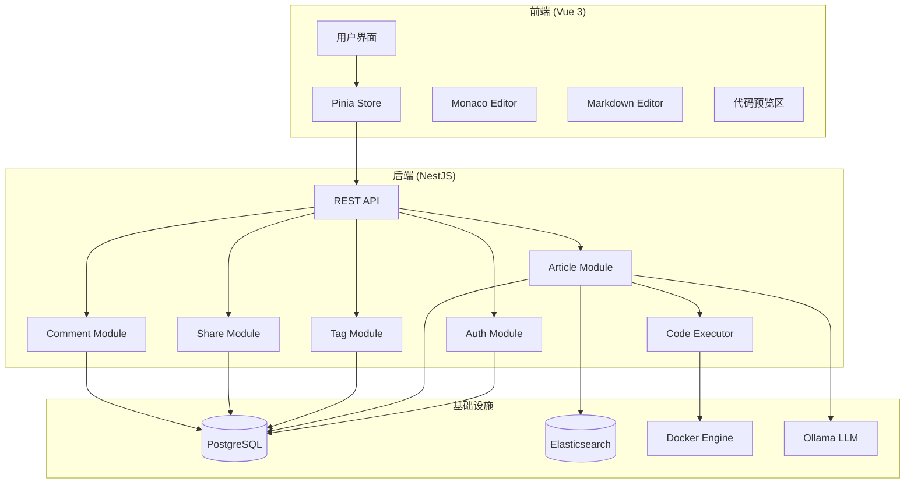
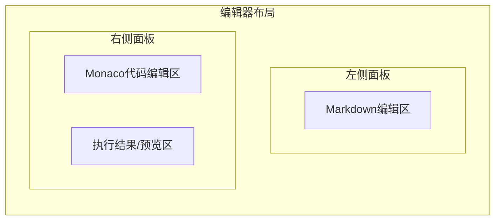
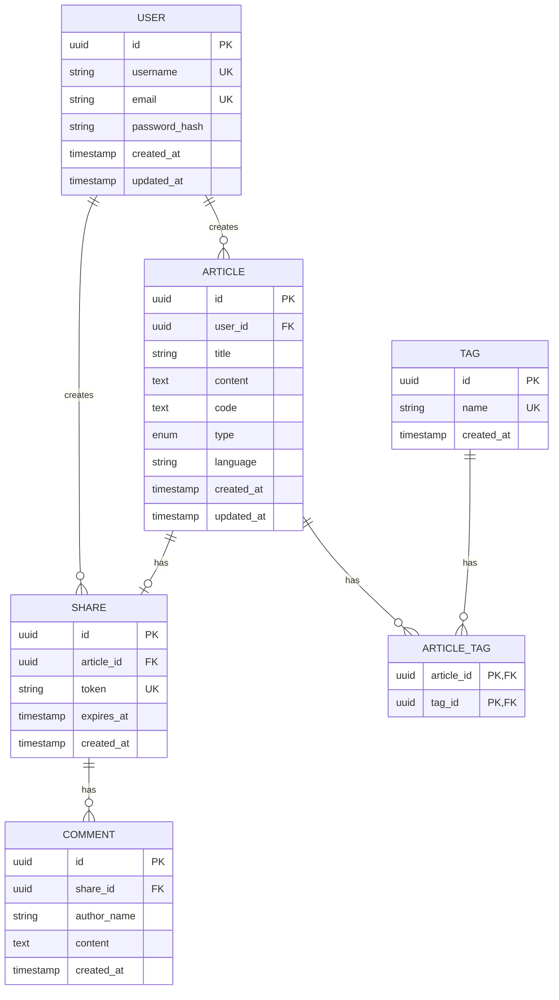

# Design Document

## Overview

本设计文档描述网页互动编辑代码片段系统的技术架构和实现方案。系统采用前后端分离架构，前端使用Vue 3 + Pinia + Monaco Editor，后端使用NestJS + TypeORM + PostgreSQL，支持Prod/Dev双模式运行。

## Architecture

### 系统架构图



### 前端页面布局



## Components and Interfaces

### 前端组件结构

```
src/
├── components/
│   ├── layout/
│   │   ├── AppHeader.vue          # 顶部导航栏
│   │   ├── AppSidebar.vue         # 侧边栏（文章列表）
│   │   └── AppLayout.vue          # 主布局容器
│   ├── editor/
│   │   ├── MarkdownEditor.vue     # Markdown编辑器
│   │   ├── CodeEditor.vue         # Monaco代码编辑器
│   │   ├── CodePreview.vue        # 代码执行结果预览
│   │   └── HtmlPreview.vue        # HTML/Vue页面预览
│   ├── article/
│   │   ├── ArticleList.vue        # 文章列表
│   │   ├── ArticleCard.vue        # 文章卡片
│   │   ├── ArticleForm.vue        # 文章表单
│   │   └── ArticleDetail.vue      # 文章详情
│   ├── tag/
│   │   ├── TagSelector.vue        # 标签选择器
│   │   └── TagCloud.vue           # 标签云
│   ├── share/
│   │   ├── ShareDialog.vue        # 分享对话框
│   │   └── ShareView.vue          # 分享页面
│   └── comment/
│       ├── CommentList.vue        # 评论列表
│       └── CommentForm.vue        # 评论表单
├── views/
│   ├── HomeView.vue               # 首页
│   ├── LoginView.vue              # 登录页
│   ├── RegisterView.vue           # 注册页
│   ├── EditorView.vue             # 编辑器页面
│   ├── ArticleView.vue            # 文章详情页
│   ├── SearchView.vue             # 搜索页
│   └── SharePageView.vue          # 分享访问页
├── stores/
│   ├── auth.js                    # 认证状态
│   ├── article.js                 # 文章状态
│   ├── tag.js                     # 标签状态
│   └── ui.js                      # UI状态
├── services/
│   ├── api.js                     # Axios实例配置
│   ├── authService.js             # 认证API
│   ├── articleService.js          # 文章API
│   ├── tagService.js              # 标签API
│   ├── shareService.js            # 分享API
│   └── commentService.js          # 评论API
├── router/
│   └── index.js                   # 路由配置
└── utils/
    ├── codeExecutor.js            # 前端代码执行器
    └── validators.js              # 表单验证
```

### 后端模块结构

```
src/
├── modules/
│   ├── auth/
│   │   ├── auth.module.ts
│   │   ├── auth.controller.ts
│   │   ├── auth.service.ts
│   │   ├── jwt.strategy.ts
│   │   └── dto/
│   │       ├── login.dto.ts
│   │       └── register.dto.ts
│   ├── article/
│   │   ├── article.module.ts
│   │   ├── article.controller.ts
│   │   ├── article.service.ts
│   │   └── dto/
│   │       ├── create-article.dto.ts
│   │       └── update-article.dto.ts
│   ├── tag/
│   │   ├── tag.module.ts
│   │   ├── tag.controller.ts
│   │   └── tag.service.ts
│   ├── share/
│   │   ├── share.module.ts
│   │   ├── share.controller.ts
│   │   └── share.service.ts
│   ├── comment/
│   │   ├── comment.module.ts
│   │   ├── comment.controller.ts
│   │   └── comment.service.ts
│   └── executor/
│       ├── executor.module.ts
│       ├── executor.service.ts
│       ├── sandbox.executor.ts    # Prod模式沙箱执行
│       └── docker.executor.ts     # Dev模式Docker执行
├── entities/
│   ├── user.entity.ts
│   ├── article.entity.ts
│   ├── tag.entity.ts
│   ├── article-tag.entity.ts
│   ├── share.entity.ts
│   └── comment.entity.ts
├── common/
│   ├── guards/
│   │   └── jwt-auth.guard.ts
│   ├── filters/
│   │   └── http-exception.filter.ts
│   ├── interceptors/
│   │   └── transform.interceptor.ts
│   └── constants/
│       └── error-codes.ts
└── config/
    ├── database.config.ts
    ├── jwt.config.ts
    └── app.config.ts
```

### API接口设计

#### 认证模块
| Method | Endpoint | Description |
|--------|----------|-------------|
| POST | /api/auth/register | 用户注册 |
| POST | /api/auth/login | 用户登录 |
| GET | /api/auth/profile | 获取当前用户信息 |

#### 文章模块
| Method | Endpoint | Description |
|--------|----------|-------------|
| GET | /api/articles | 获取文章列表 |
| GET | /api/articles/:id | 获取文章详情 |
| POST | /api/articles | 创建文章 |
| PUT | /api/articles/:id | 更新文章 |
| DELETE | /api/articles/:id | 删除文章 |
| POST | /api/articles/:id/execute | 执行文章代码 |

#### 标签模块
| Method | Endpoint | Description |
|--------|----------|-------------|
| GET | /api/tags | 获取所有标签 |
| GET | /api/tags/:id/articles | 获取标签下的文章 |
| POST | /api/tags | 创建标签 |

#### 分享模块
| Method | Endpoint | Description |
|--------|----------|-------------|
| POST | /api/shares | 创建分享链接 |
| GET | /api/shares/:token | 通过token访问分享 |
| GET | /api/shares | 获取用户的分享列表 |
| DELETE | /api/shares/:id | 删除分享链接 |

#### 评论模块
| Method | Endpoint | Description |
|--------|----------|-------------|
| GET | /api/shares/:token/comments | 获取分享文章的评论 |
| POST | /api/shares/:token/comments | 添加评论 |

#### 搜索模块
| Method | Endpoint | Description |
|--------|----------|-------------|
| GET | /api/search | 搜索文章 |
| GET | /api/search/recommend | 获取推荐文章(Dev模式) |

## Data Models

### ER图



### 实体定义

#### User Entity
```typescript
interface User {
  id: string;           // UUID
  username: string;     // 唯一用户名
  email: string;        // 唯一邮箱
  passwordHash: string; // bcrypt加密密码
  createdAt: Date;
  updatedAt: Date;
}
```

#### Article Entity
```typescript
interface Article {
  id: string;           // UUID
  userId: string;       // 关联用户
  title: string;        // 文章标题
  content: string;      // Markdown内容
  code: string;         // 代码内容
  type: ArticleType;    // 'algorithm' | 'snippet' | 'html'
  language: string;     // 代码语言
  tags: Tag[];          // 关联标签
  createdAt: Date;
  updatedAt: Date;
}

enum ArticleType {
  ALGORITHM = 'algorithm',
  SNIPPET = 'snippet',
  HTML = 'html'
}
```

#### Tag Entity
```typescript
interface Tag {
  id: string;           // UUID
  name: string;         // 标签名称（唯一）
  articles: Article[];  // 关联文章
  createdAt: Date;
}
```

#### Share Entity
```typescript
interface Share {
  id: string;           // UUID
  articleId: string;    // 关联文章
  token: string;        // 分享token（唯一）
  expiresAt: Date;      // 过期时间
  createdAt: Date;
}
```

#### Comment Entity
```typescript
interface Comment {
  id: string;           // UUID
  shareId: string;      // 关联分享
  authorName: string;   // 评论者名称
  content: string;      // 评论内容
  createdAt: Date;
}
```

## Error Handling

### 错误码定义

```typescript
enum ErrorCode {
  // 成功
  SUCCESS = 0,
  
  // 认证错误 (1xxx)
  AUTH_FAILED = 1001,
  TOKEN_EXPIRED = 1002,
  PERMISSION_DENIED = 1003,
  USER_EXISTS = 1004,
  INVALID_CREDENTIALS = 1005,
  
  // 文章错误 (2xxx)
  ARTICLE_NOT_FOUND = 2001,
  ARTICLE_CREATE_FAILED = 2002,
  ARTICLE_UPDATE_FAILED = 2003,
  
  // 执行错误 (3xxx)
  EXEC_ERROR = 3001,
  EXEC_TIMEOUT = 3002,
  EXEC_NOT_SUPPORTED = 3003,
  
  // 分享错误 (4xxx)
  SHARE_NOT_FOUND = 4001,
  SHARE_EXPIRED = 4002,
  
  // 标签错误 (5xxx)
  TAG_NOT_FOUND = 5001,
  TAG_EXISTS = 5002,
  
  // 系统错误 (9xxx)
  INTERNAL_ERROR = 9001,
  SERVICE_UNAVAILABLE = 9002
}
```

### 统一响应格式

```typescript
interface ApiResponse<T> {
  code: number;         // 错误码
  message: string;      // 错误信息
  data: T | null;       // 响应数据
  timestamp: number;    // 时间戳
}
```

### 前端错误处理

```typescript
// Axios拦截器处理
axios.interceptors.response.use(
  response => response.data,
  error => {
    const { code, message } = error.response?.data || {};
    
    if (code === ErrorCode.TOKEN_EXPIRED) {
      // 跳转登录页
      router.push('/login');
    }
    
    // 显示错误提示
    showToast(message || '请求失败');
    return Promise.reject(error);
  }
);
```

## Code Execution Design

### Prod模式 - 沙箱执行

```typescript
class SandboxExecutor {
  async execute(code: string, language: string): Promise<ExecutionResult> {
    if (!['javascript', 'typescript'].includes(language)) {
      throw new Error('Prod模式仅支持JS/TS');
    }
    
    // 使用AsyncFunction创建沙箱
    const sandbox = {
      console: this.createSafeConsole(),
      // 禁止危险API
      fetch: undefined,
      XMLHttpRequest: undefined,
      require: undefined,
      process: undefined,
    };
    
    const fn = new AsyncFunction(...Object.keys(sandbox), code);
    
    // 设置超时
    const result = await Promise.race([
      fn(...Object.values(sandbox)),
      this.timeout(10000)
    ]);
    
    return { output: this.logs, error: null };
  }
}
```

### Dev模式 - Docker执行

```typescript
class DockerExecutor {
  async execute(code: string, language: string): Promise<ExecutionResult> {
    const container = await this.docker.createContainer({
      Image: this.getImage(language),
      Cmd: this.getCommand(language, code),
      NetworkDisabled: true,
      Memory: 128 * 1024 * 1024, // 128MB
      CpuPeriod: 100000,
      CpuQuota: 50000, // 50% CPU
    });
    
    await container.start();
    
    // 设置超时
    const timeout = setTimeout(() => container.kill(), 10000);
    
    const output = await container.logs({ stdout: true, stderr: true });
    clearTimeout(timeout);
    
    await container.remove();
    
    return { output: output.toString(), error: null };
  }
  
  private getImage(language: string): string {
    const images = {
      javascript: 'node:18-alpine',
      typescript: 'node:18-alpine',
      python: 'python:3.11-alpine',
      java: 'openjdk:17-alpine',
    };
    return images[language] || 'node:18-alpine';
  }
}
```

## Testing Strategy

### 单元测试

- 使用Vitest进行前端组件测试
- 使用Jest进行后端服务测试
- 覆盖核心业务逻辑

### 集成测试

- API端点测试
- 数据库操作测试
- 代码执行器测试

### E2E测试

- 使用Playwright进行端到端测试
- 覆盖主要用户流程

### 测试覆盖目标

| 模块 | 覆盖率目标 |
|------|-----------|
| 认证服务 | 80% |
| 文章服务 | 80% |
| 代码执行器 | 90% |
| 前端组件 | 70% |
