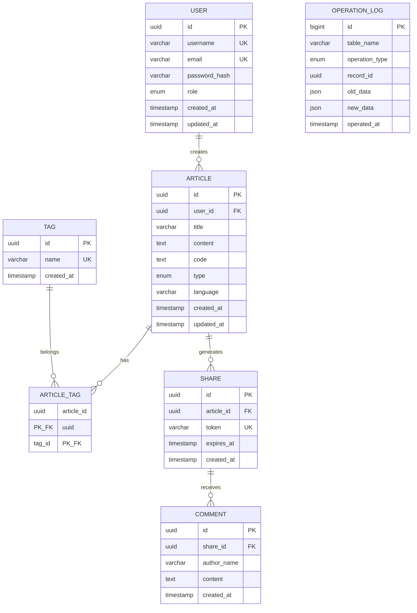

```markdown
# QuillCode 代码笔记系统 - 数据库课程设计报告

> **课程名称**：数据库系统原理与应用  
> **项目名称**：QuillCode 代码笔记系统  
> **完成日期**：2025年12月

---

## 目录

- [第一部分、开发前的设计和思考](#第一部分开发前的设计和思考)
  - [一、项目背景](#一项目背景)
  - [二、需求分析](#二需求分析)
  - [三、概念结构设计](#三概念结构设计)
  - [四、逻辑结构设计](#四逻辑结构设计)
  - [五、数据库实施](#五数据库实施)
  - [六、系统总体设计](#六系统总体设计)
- [第二部分、开发编码与调试](#第二部分开发编码与调试)
  - [一、开发环境与技术](#一开发环境与技术)
  - [二、源代码目录讲解](#二源代码目录讲解)
  - [三、示例代码讲解](#三示例代码讲解)
  - [四、API接口说明](#四api接口说明)
- [第三部分、系统演示和说明](#第三部分系统演示和说明)
  - [一、用户登录与注册](#一用户登录与注册)
  - [二、笔记管理](#二笔记管理)
  - [三、智能推荐](#三智能推荐)
  - [四、模糊搜索](#四模糊搜索)
  - [五、分享与评论](#五分享与评论)
  - [六、管理员功能](#六管理员功能)
- [第四部分、总结与反思](#第四部分总结与反思)

---

# 第一部分、开发前的设计和思考

## 一、项目背景

### 1.1 项目概述

QuillCode 是一个面向程序员的在线代码笔记系统，旨在提供一个"随写、随存、随运行"的代码学习与管理环境。系统支持 Markdown 文档编写、多语言代码编辑与在线执行、标签分类管理、文章分享与评论等功能。

### 1.2 开发背景

随着编程学习的普及，程序员需要一个能够同时管理文档笔记和代码片段的工具。传统的笔记软件无法执行代码，而 IDE 又不适合做笔记管理。QuillCode 填补了这一空白，将 Markdown 文档与可执行代码完美结合。

### 1.3 项目目标

1. 提供 Markdown + 代码的统一管理平台
2. 支持 JavaScript、Python、Java 等多语言代码在线执行
3. 实现基于 Elasticsearch 的全文模糊搜索
4. 提供基于标签和 AI 的智能推荐功能
5. 支持文章分享与访客评论功能
6. 提供管理员统计与维护功能

---

## 二、需求分析

### 2.1 功能需求

#### 2.1.1 用户管理模块
- 用户注册：支持用户名、邮箱、密码注册
- 用户登录：JWT Token 认证机制
- 角色区分：普通用户与管理员

#### 2.1.2 文章管理模块
- 创建文章：支持标题、Markdown 内容、代码、类型、语言、标签
- 文章类型：算法题解(algorithm)、代码片段(snippet)、HTML页面(html)
- 编辑更新：支持实时保存和更新
- 删除文章：级联删除相关分享和标签关联

#### 2.1.3 标签管理模块
- 标签创建：支持自定义标签
- 标签关联：多对多关系，一篇文章可有多个标签
- 标签筛选：按标签查看文章列表

#### 2.1.4 搜索模块
- 全文搜索：基于 Elasticsearch 的模糊搜索
- 搜索范围：标题、内容、代码、标签
- 高亮显示：搜索结果关键词高亮

#### 2.1.5 推荐模块
- 标签推荐：基于共同标签的相似文章推荐
- AI 增强：集成 Ollama 本地大模型进行推荐理由生成

#### 2.1.6 分享模块
- 生成分享链接：带过期时间的唯一 Token
- 访客访问：无需登录即可查看分享内容
- 评论功能：访客可对分享内容进行评论

#### 2.1.7 管理员模块
- 全站统计：用户数、文章数、标签数等
- 用户管理：查看用户统计信息
- 操作日志：自动记录增删改操作
- 维护功能：清理过期分享

### 2.2 非功能需求

| 需求类型 | 描述 |
|---------|------|
| 性能 | 搜索响应时间 < 500ms |
| 安全 | 密码 bcrypt 加密，JWT 认证 |
| 可用性 | 支持 Docker 容器化部署 |
| 可扩展性 | 模块化设计，易于扩展 |

### 2.3 数据流图

#### 2.3.1 顶层数据流图 (0层)

```
                    ┌─────────────────────────────────────┐
                    │         QuillCode 系统              │
                    └─────────────────────────────────────┘
                           ↑                    ↑
        注册/登录/CRUD     │                    │    统计/管理
        ┌──────────────────┘                    └──────────────────┐
        │                                                          │
   ┌─────────┐                                               ┌─────────┐
   │  用户   │                                               │ 管理员  │
   └─────────┘                                               └─────────┘
        │                                                          │
        │  查看分享/评论                                           │
        └──────────────────┐                    ┌──────────────────┘
                           ↓                    ↓
                    ┌─────────────────────────────────────┐
                    │            访客                      │
                    └─────────────────────────────────────┘
```

#### 2.3.2 一层数据流图

```
┌─────────┐     注册/登录      ┌─────────────┐
│  用户   │ ───────────────→  │  认证模块   │
└─────────┘                    └─────────────┘
     │                               │
     │ CRUD操作                      │ JWT Token
     ↓                               ↓
┌─────────────┐              ┌─────────────┐
│  文章模块   │ ←──────────→ │  数据库     │
└─────────────┘              │  (MySQL)    │
     │                       └─────────────┘
     │ 索引/搜索                     ↑
     ↓                               │
┌─────────────┐              ┌─────────────┐
│ Elasticsearch│             │  触发器     │
│  搜索引擎   │              │  日志记录   │
└─────────────┘              └─────────────┘
```

#### 2.3.3 二层数据流图 - 文章管理子系统

```
                              ┌───────────────┐
                              │   用户请求    │
                              └───────┬───────┘
                                      │
                    ┌─────────────────┼─────────────────┐
                    ↓                 ↓                 ↓
             ┌───────────┐     ┌───────────┐     ┌───────────┐
             │ 创建文章  │     │ 编辑文章  │     │ 删除文章  │
             └─────┬─────┘     └─────┬─────┘     └─────┬─────┘
                   │                 │                 │
                   ↓                 ↓                 ↓
             ┌───────────┐     ┌───────────┐     ┌───────────┐
             │ 标签关联  │     │ 更新索引  │     │ 级联删除  │
             └─────┬─────┘     └─────┬─────┘     └─────┬─────┘
                   │                 │                 │
                   └─────────────────┼─────────────────┘
                                     ↓
                              ┌───────────────┐
                              │  MySQL数据库  │
                              └───────┬───────┘
                                      │
                                      ↓
                              ┌───────────────┐
                              │ Elasticsearch │
                              │  (同步索引)   │
                              └───────────────┘
```

---

## 三、概念结构设计

### 3.1 实体识别

通过需求分析，识别出以下核心实体：

| 实体名称 | 说明 | 主要属性 |
|---------|------|----------|
| User (用户) | 系统用户，包含普通用户和管理员 | id, username, email, password_hash, role |
| Article (文章) | 代码笔记文章 | id, title, content, code, type, language |
| Tag (标签) | 文章分类标签 | id, name |
| Share (分享) | 文章分享链接 | id, token, expires_at |
| Comment (评论) | 分享页面的访客评论 | id, author_name, content |
| OperationLog (操作日志) | 系统操作记录 | id, table_name, operation_type, record_id |

### 3.2 实体属性详细设计

#### 3.2.1 User 实体
| 属性名 | 数据类型 | 约束 | 说明 |
|--------|---------|------|------|
| id | CHAR(36) | PRIMARY KEY | 用户UUID，主键 |
| username | VARCHAR(50) | NOT NULL, UNIQUE | 用户名，唯一 |
| email | VARCHAR(100) | NOT NULL, UNIQUE | 邮箱，唯一 |
| password_hash | VARCHAR(255) | NOT NULL | 密码哈希值(bcrypt) |
| role | ENUM | DEFAULT 'user' | 角色 (user/admin) |
| created_at | TIMESTAMP | DEFAULT CURRENT_TIMESTAMP | 创建时间 |
| updated_at | TIMESTAMP | ON UPDATE CURRENT_TIMESTAMP | 更新时间 |

#### 3.2.2 Article 实体
| 属性名 | 数据类型 | 约束 | 说明 |
|--------|---------|------|------|
| id | CHAR(36) | PRIMARY KEY | 文章UUID，主键 |
| user_id | CHAR(36) | FOREIGN KEY | 所属用户外键 |
| title | VARCHAR(255) | NOT NULL | 标题 |
| content | TEXT | NULLABLE | Markdown 内容 |
| code | TEXT | NULLABLE | 代码内容 |
| type | ENUM | DEFAULT 'snippet' | 类型 (algorithm/snippet/html) |
| language | VARCHAR(50) | DEFAULT 'javascript' | 编程语言 |
| created_at | TIMESTAMP | DEFAULT CURRENT_TIMESTAMP | 创建时间 |
| updated_at | TIMESTAMP | ON UPDATE CURRENT_TIMESTAMP | 更新时间 |

#### 3.2.3 Tag 实体
| 属性名 | 数据类型 | 约束 | 说明 |
|--------|---------|------|------|
| id | CHAR(36) | PRIMARY KEY | 标签UUID，主键 |
| name | VARCHAR(50) | NOT NULL, UNIQUE | 标签名称，唯一 |
| created_at | TIMESTAMP | DEFAULT CURRENT_TIMESTAMP | 创建时间 |

#### 3.2.4 Share 实体
| 属性名 | 数据类型 | 约束 | 说明 |
|--------|---------|------|------|
| id | CHAR(36) | PRIMARY KEY | 分享UUID，主键 |
| article_id | CHAR(36) | FOREIGN KEY | 关联文章外键 |
| token | VARCHAR(64) | NOT NULL, UNIQUE | 分享令牌，唯一 |
| expires_at | TIMESTAMP | NOT NULL | 过期时间 |
| created_at | TIMESTAMP | DEFAULT CURRENT_TIMESTAMP | 创建时间 |

#### 3.2.5 Comment 实体
| 属性名 | 数据类型 | 约束 | 说明 |
|--------|---------|------|------|
| id | CHAR(36) | PRIMARY KEY | 评论UUID，主键 |
| share_id | CHAR(36) | FOREIGN KEY | 关联分享外键 |
| author_name | VARCHAR(50) | NOT NULL | 评论者名称 |
| content | TEXT | NOT NULL | 评论内容 |
| created_at | TIMESTAMP | DEFAULT CURRENT_TIMESTAMP | 创建时间 |

#### 3.2.6 OperationLog 实体
| 属性名 | 数据类型 | 约束 | 说明 |
|--------|---------|------|------|
| id | BIGINT | PRIMARY KEY, AUTO_INCREMENT | 日志ID，自增主键 |
| table_name | VARCHAR(50) | NOT NULL | 操作的表名 |
| operation_type | ENUM | NOT NULL | 操作类型 (INSERT/UPDATE/DELETE) |
| record_id | CHAR(36) | NOT NULL | 被操作记录的ID |
| old_data | JSON | NULLABLE | 旧数据(JSON格式) |
| new_data | JSON | NULLABLE | 新数据(JSON格式) |
| operated_at | TIMESTAMP | DEFAULT CURRENT_TIMESTAMP | 操作时间 |

### 3.3 实体间关系分析

| 关系 | 类型 | 基数 | 说明 |
|-----|------|------|------|
| User - Article | 1:N | 1个用户对应0..N篇文章 | 用户拥有文章，级联删除 |
| Article - Tag | M:N | 1篇文章对应0..N个标签，1个标签对应0..N篇文章 | 通过article_tags中间表实现 |
| Article - Share | 1:N | 1篇文章对应0..N个分享链接 | 文章可被多次分享 |
| Share - Comment | 1:N | 1个分享对应0..N条评论 | 访客可对分享内容评论 |

### 3.4 E-R 图 (Chen 表示法)

```
┌─────────────────┐
│      User       │
├─────────────────┤
│ ● id (PK)       │
│ ○ username (UK) │
│ ○ email (UK)    │
│ ○ password_hash │
│ ○ role          │
│ ○ created_at    │
│ ○ updated_at    │
└────────┬────────┘
         │
         │ 1
         │
    ◇ 拥有 (creates)
         │
         │ N
         ↓
┌─────────────────┐         ┌─────────────────┐
│    Article      │         │      Tag        │
├─────────────────┤         ├─────────────────┤
│ ● id (PK)       │         │ ● id (PK)       │
│ ○ user_id (FK)  │←── M:N ─│ ○ name (UK)     │
│ ○ title         │    │    │ ○ created_at    │
│ ○ content       │    │    └─────────────────┘
│ ○ code          │    │
│ ○ type          │    ↓
│ ○ language      │ ┌──────────────┐
│ ○ created_at    │ │ Article_Tag  │
│ ○ updated_at    │ ├──────────────┤
└────────┬────────┘ │ ● article_id │
         │          │ ● tag_id     │
         │ 1        └──────────────┘
         │
    ◇ 生成 (generates)
         │
         │ N
         ↓
┌─────────────────┐
│     Share       │
├─────────────────┤
│ ● id (PK)       │
│ ○ article_id(FK)│
│ ○ token (UK)    │
│ ○ expires_at    │
│ ○ created_at    │
└────────┬────────┘
         │
         │ 1
         │
    ◇ 包含 (receives)
         │
         │ N
         ↓
┌─────────────────┐
│    Comment      │
├─────────────────┤
│ ● id (PK)       │
│ ○ share_id (FK) │
│ ○ author_name   │
│ ○ content       │
│ ○ created_at    │
└─────────────────┘


┌─────────────────┐
│ OperationLog    │
├─────────────────┤
│ ● id (PK,AUTO)  │
│ ○ table_name    │
│ ○ operation_type│
│ ○ record_id     │
│ ○ old_data      │
│ ○ new_data      │
│ ○ operated_at   │
└─────────────────┘

图例: ● = 主键属性  ○ = 普通属性  ◇ = 联系
```

### 3.5 完整 E-R 图 (Mermaid 格式)



---

## 四、逻辑结构设计

### 4.1 E-R图向关系模式的转换

根据E-R图，按照以下规则进行转换：

**转换规则：**
1. **1:1联系**：将联系并入任一端实体
2. **1:N联系**：将联系并入N端实体，添加外键
3. **M:N联系**：创建独立的关系模式（中间表）
4. **实体转换**：每个实体转换为一个关系模式

### 4.2 关系模式定义

#### 4.2.1 用户关系模式 (users)
```
R_users = (id, username, email, password_hash, role, created_at, updated_at)

主键: id
候选键: username, email
函数依赖:
  id → username, email, password_hash, role, created_at, updated_at
  username → id, email, password_hash, role, created_at, updated_at
  email → id, username, password_hash, role, created_at, updated_at
```

#### 4.2.2 文章关系模式 (articles)
```
R_articles = (id, user_id, title, content, code, type, language, created_at, updated_at)

主键: id
外键: user_id → users(id)
函数依赖:
  id → user_id, title, content, code, type, language, created_at, updated_at
```

#### 4.2.3 标签关系模式 (tags)
```
R_tags = (id, name, created_at)

主键: id
候选键: name
函数依赖:
  id → name, created_at
  name → id, created_at
```

#### 4.2.4 文章-标签关联关系模式 (article_tags)
```
R_article_tags = (article_id, tag_id)

主键: (article_id, tag_id) -- 联合主键
外键: 
  article_id → articles(id)
  tag_id → tags(id)
```

#### 4.2.5 分享关系模式 (shares)
```
R_shares = (id, article_id, token, expires_at, created_at)

主键: id
候选键: token
外键: article_id → articles(id)
函数依赖:
  id → article_id, token, expires_at, created_at
  token → id, article_id, expires_at, created_at
```

#### 4.2.6 评论关系模式 (comments)
```
R_comments = (id, share_id, author_name, content, created_at)

主键: id
外键: share_id → shares(id)
函数依赖:
  id → share_id, author_name, content, created_at
```

#### 4.2.7 操作日志关系模式 (operation_logs)
```
R_operation_logs = (id, table_name, operation_type, record_id, old_data, new_data, operated_at)

主键: id (自增)
函数依赖:
  id → table_name, operation_type, record_id, old_data, new_data, operated_at
```

### 4.3 关系模式规范化分析

#### 4.3.1 第一范式 (1NF) 验证

**定义**：关系模式R的所有属性都是不可再分的基本数据项。

| 关系模式       | 验证结果  | 说明                                  |
| -------------- | --------- | ------------------------------------- |
| users          | ✅ 满足1NF | 所有字段都是原子值                    |
| articles       | ✅ 满足1NF | content和code虽为TEXT，但作为整体存储 |
| tags           | ✅ 满足1NF | name是单值属性                        |
| article_tags   | ✅ 满足1NF | 联合主键，无其他属性                  |
| shares         | ✅ 满足1NF | 所有字段都是原子值                    |
| comments       | ✅ 满足1NF | 所有字段都是原子值                    |
| operation_logs | ✅ 满足1NF | JSON字段作为整体存储                  |

#### 4.3.2 第二范式 (2NF) 验证

**定义**：在满足1NF的基础上，消除非主属性对候选键的部分函数依赖。

| 关系模式       | 验证结果  | 说明                                     |
| -------------- | --------- | ---------------------------------------- |
| users          | ✅ 满足2NF | 单一主键，不存在部分依赖                 |
| articles       | ✅ 满足2NF | 单一主键，不存在部分依赖                 |
| tags           | ✅ 满足2NF | 单一主键，不存在部分依赖                 |
| article_tags   | ✅ 满足2NF | 联合主键(article_id, tag_id)，无非主属性 |
| shares         | ✅ 满足2NF | 单一主键，不存在部分依赖                 |
| comments       | ✅ 满足2NF | 单一主键，不存在部分依赖                 |
| operation_logs | ✅ 满足2NF | 单一主键，不存在部分依赖                 |

#### 4.3.3 第三范式 (3NF) 验证

**定义**：在满足2NF的基础上，消除非主属性对候选键的传递函数依赖。

| 关系模式       | 验证结果  | 说明                                             |
| -------------- | --------- | ------------------------------------------------ |
| users          | ✅ 满足3NF | 所有非主属性直接依赖于主键                       |
| articles       | ✅ 满足3NF | user_id → username 的传递依赖通过外键关联消除    |
| tags           | ✅ 满足3NF | 所有非主属性直接依赖于主键                       |
| article_tags   | ✅ 满足3NF | 无非主属性，自然满足                             |
| shares         | ✅ 满足3NF | article_id → title 的传递依赖通过外键关联消除    |
| comments       | ✅ 满足3NF | share_id → article_id 的传递依赖通过外键关联消除 |
| operation_logs | ✅ 满足3NF | 所有非主属性直接依赖于主键                       |

#### 4.3.4 BCNF 验证

**定义**：在满足3NF的基础上，对于每个非平凡函数依赖X→Y，X都是超键。

所有关系模式均满足BCNF，因为：
- 每个函数依赖的决定因素都是候选键或超键
- 不存在主属性对非主属性的依赖

### 4.4 索引设计

| 表名           | 索引名             | 索引字段             | 索引类型 | 用途                     |
| -------------- | ------------------ | -------------------- | -------- | ------------------------ |
| users          | PRIMARY            | id                   | PRIMARY  | 主键索引                 |
| users          | uk_username        | username             | UNIQUE   | 用户名唯一约束，登录查询 |
| users          | uk_email           | email                | UNIQUE   | 邮箱唯一约束，注册验证   |
| articles       | PRIMARY            | id                   | PRIMARY  | 主键索引                 |
| articles       | idx_user_id        | user_id              | INDEX    | 按用户查询文章           |
| articles       | idx_type           | type                 | INDEX    | 按类型筛选               |
| articles       | idx_language       | language             | INDEX    | 按语言筛选               |
| articles       | idx_created_at     | created_at           | INDEX    | 按时间排序               |
| tags           | PRIMARY            | id                   | PRIMARY  | 主键索引                 |
| tags           | uk_name            | name                 | UNIQUE   | 标签名唯一约束           |
| article_tags   | PRIMARY            | (article_id, tag_id) | PRIMARY  | 联合主键                 |
| article_tags   | idx_tag_id         | tag_id               | INDEX    | 按标签查询文章           |
| shares         | PRIMARY            | id                   | PRIMARY  | 主键索引                 |
| shares         | uk_token           | token                | UNIQUE   | 分享令牌唯一，访问查询   |
| shares         | idx_article_id     | article_id           | INDEX    | 按文章查询分享           |
| shares         | idx_expires_at     | expires_at           | INDEX    | 过期时间查询，清理任务   |
| comments       | PRIMARY            | id                   | PRIMARY  | 主键索引                 |
| comments       | idx_share_id       | share_id             | INDEX    | 按分享查询评论           |
| comments       | idx_created_at     | created_at           | INDEX    | 评论时间排序             |
| operation_logs | PRIMARY            | id                   | PRIMARY  | 主键索引（自增）         |
| operation_logs | idx_table_name     | table_name           | INDEX    | 按表名查询日志           |
| operation_logs | idx_operation_type | operation_type       | INDEX    | 按操作类型筛选           |
| operation_logs | idx_operated_at    | operated_at          | INDEX    | 按时间查询日志           |

### 4.5 完整性约束设计

#### 4.5.1 实体完整性
- 所有表的主键不允许为NULL
- UUID主键保证全局唯一性
- operation_logs使用AUTO_INCREMENT保证唯一性

#### 4.5.2 参照完整性
| 外键约束                | 父表     | 子表         | 删除规则 | 更新规则 |
| ----------------------- | -------- | ------------ | -------- | -------- |
| fk_articles_user        | users    | articles     | CASCADE  | CASCADE  |
| fk_article_tags_article | articles | article_tags | CASCADE  | CASCADE  |
| fk_article_tags_tag     | tags     | article_tags | CASCADE  | CASCADE  |
| fk_shares_article       | articles | shares       | CASCADE  | CASCADE  |
| fk_comments_share       | shares   | comments     | CASCADE  | CASCADE  |

#### 4.5.3 用户自定义完整性
| 约束     | 表             | 字段                           | 规则                                |
| -------- | -------------- | ------------------------------ | ----------------------------------- |
| CHECK    | users          | role                           | IN ('user', 'admin')                |
| CHECK    | articles       | type                           | IN ('algorithm', 'snippet', 'html') |
| CHECK    | operation_logs | operation_type                 | IN ('INSERT', 'UPDATE', 'DELETE')   |
| NOT NULL | users          | username, email, password_hash | 必填字段                            |
| NOT NULL | articles       | title                          | 标题必填                            |
| NOT NULL | comments       | author_name, content           | 评论必填                            |

---

## 五、数据库实施

### 5.1 数据库创建

```sql
-- 创建数据库
CREATE DATABASE IF NOT EXISTS `code_notebook` 
  CHARACTER SET utf8mb4 
  COLLATE utf8mb4_unicode_ci;

USE `code_notebook`;
```

### 5.2 表创建语句

#### 5.2.1 用户表 (users)
```sql
CREATE TABLE IF NOT EXISTS `users` (
  `id` CHAR(36) NOT NULL COMMENT '用户UUID',
  `username` VARCHAR(50) NOT NULL COMMENT '用户名',
  `email` VARCHAR(100) NOT NULL COMMENT '邮箱',
  `password_hash` VARCHAR(255) NOT NULL COMMENT '密码哈希',
  `role` ENUM('user', 'admin') DEFAULT 'user' COMMENT '用户角色',
  `created_at` TIMESTAMP DEFAULT CURRENT_TIMESTAMP COMMENT '创建时间',
  `updated_at` TIMESTAMP DEFAULT CURRENT_TIMESTAMP ON UPDATE CURRENT_TIMESTAMP COMMENT '更新时间',
  PRIMARY KEY (`id`),
  UNIQUE KEY `uk_username` (`username`),
  UNIQUE KEY `uk_email` (`email`)
) ENGINE=InnoDB DEFAULT CHARSET=utf8mb4 COLLATE=utf8mb4_unicode_ci COMMENT='用户表';
```

#### 5.2.2 文章表 (articles)
```sql
CREATE TABLE IF NOT EXISTS `articles` (
  `id` CHAR(36) NOT NULL COMMENT '文章UUID',
  `user_id` CHAR(36) NOT NULL COMMENT '用户ID',
  `title` VARCHAR(255) NOT NULL COMMENT '标题',
  `content` TEXT COMMENT 'Markdown内容',
  `code` TEXT COMMENT '代码内容',
  `type` ENUM('algorithm', 'snippet', 'html') DEFAULT 'snippet' COMMENT '文章类型',
  `language` VARCHAR(50) DEFAULT 'javascript' COMMENT '编程语言',
  `created_at` TIMESTAMP DEFAULT CURRENT_TIMESTAMP COMMENT '创建时间',
  `updated_at` TIMESTAMP DEFAULT CURRENT_TIMESTAMP ON UPDATE CURRENT_TIMESTAMP COMMENT '更新时间',
  PRIMARY KEY (`id`),
  KEY `idx_user_id` (`user_id`),
  KEY `idx_type` (`type`),
  KEY `idx_language` (`language`),
  KEY `idx_created_at` (`created_at`),
  CONSTRAINT `fk_articles_user` FOREIGN KEY (`user_id`) REFERENCES `users` (`id`) ON DELETE CASCADE
) ENGINE=InnoDB DEFAULT CHARSET=utf8mb4 COLLATE=utf8mb4_unicode_ci COMMENT='文章表';
```

#### 5.2.3 标签表 (tags)
```sql
CREATE TABLE IF NOT EXISTS `tags` (
  `id` CHAR(36) NOT NULL COMMENT '标签UUID',
  `name` VARCHAR(50) NOT NULL COMMENT '标签名称',
  `created_at` TIMESTAMP DEFAULT CURRENT_TIMESTAMP COMMENT '创建时间',
  PRIMARY KEY (`id`),
  UNIQUE KEY `uk_name` (`name`)
) ENGINE=InnoDB DEFAULT CHARSET=utf8mb4 COLLATE=utf8mb4_unicode_ci COMMENT='标签表';
```

#### 5.2.4 文章-标签关联表 (article_tags)
```sql
CREATE TABLE IF NOT EXISTS `article_tags` (
  `article_id` CHAR(36) NOT NULL COMMENT '文章ID',
  `tag_id` CHAR(36) NOT NULL COMMENT '标签ID',
  PRIMARY KEY (`article_id`, `tag_id`),
  KEY `idx_tag_id` (`tag_id`),
  CONSTRAINT `fk_article_tags_article` FOREIGN KEY (`article_id`) REFERENCES `articles` (`id`) ON DELETE CASCADE,
  CONSTRAINT `fk_article_tags_tag` FOREIGN KEY (`tag_id`) REFERENCES `tags` (`id`) ON DELETE CASCADE
) ENGINE=InnoDB DEFAULT CHARSET=utf8mb4 COLLATE=utf8mb4_unicode_ci COMMENT='文章标签关联表';
```

#### 5.2.5 分享表 (shares)
```sql
CREATE TABLE IF NOT EXISTS `shares` (
  `id` CHAR(36) NOT NULL COMMENT '分享UUID',
  `article_id` CHAR(36) NOT NULL COMMENT '文章ID',
  `token` VARCHAR(64) NOT NULL COMMENT '分享令牌',
  `expires_at` TIMESTAMP NOT NULL COMMENT '过期时间',
  `created_at` TIMESTAMP DEFAULT CURRENT_TIMESTAMP COMMENT '创建时间',
  PRIMARY KEY (`id`),
  UNIQUE KEY `uk_token` (`token`),
  KEY `idx_article_id` (`article_id`),
  KEY `idx_expires_at` (`expires_at`),
  CONSTRAINT `fk_shares_article` FOREIGN KEY (`article_id`) REFERENCES `articles` (`id`) ON DELETE CASCADE
) ENGINE=InnoDB DEFAULT CHARSET=utf8mb4 COLLATE=utf8mb4_unicode_ci COMMENT='分享表';
```

#### 5.2.6 评论表 (comments)
```sql
CREATE TABLE IF NOT EXISTS `comments` (
  `id` CHAR(36) NOT NULL COMMENT '评论UUID',
  `share_id` CHAR(36) NOT NULL COMMENT '分享ID',
  `author_name` VARCHAR(50) NOT NULL COMMENT '评论者名称',
  `content` TEXT NOT NULL COMMENT '评论内容',
  `created_at` TIMESTAMP DEFAULT CURRENT_TIMESTAMP COMMENT '创建时间',
  PRIMARY KEY (`id`),
  KEY `idx_share_id` (`share_id`),
  KEY `idx_created_at` (`created_at`),
  CONSTRAINT `fk_comments_share` FOREIGN KEY (`share_id`) REFERENCES `shares` (`id`) ON DELETE CASCADE
) ENGINE=InnoDB DEFAULT CHARSET=utf8mb4 COLLATE=utf8mb4_unicode_ci COMMENT='评论表';
```

#### 5.2.7 操作日志表 (operation_logs)
```sql
CREATE TABLE IF NOT EXISTS `operation_logs` (
  `id` BIGINT AUTO_INCREMENT NOT NULL COMMENT '日志ID',
  `table_name` VARCHAR(50) NOT NULL COMMENT '操作的表名',
  `operation_type` ENUM('INSERT', 'UPDATE', 'DELETE') NOT NULL COMMENT '操作类型',
  `record_id` CHAR(36) NOT NULL COMMENT '记录ID',
  `old_data` JSON COMMENT '旧数据',
  `new_data` JSON COMMENT '新数据',
  `operated_at` TIMESTAMP DEFAULT CURRENT_TIMESTAMP COMMENT '操作时间',
  PRIMARY KEY (`id`),
  KEY `idx_table_name` (`table_name`),
  KEY `idx_operation_type` (`operation_type`),
  KEY `idx_operated_at` (`operated_at`)
) ENGINE=InnoDB DEFAULT CHARSET=utf8mb4 COLLATE=utf8mb4_unicode_ci COMMENT='操作日志表';
```

### 5.3 视图设计

#### 5.3.1 文章详情视图 (v_article_details)

**用途**：管理员查看文章详情列表，包含作者信息、分享数量和标签名称。

```sql
CREATE VIEW `v_article_details` AS
SELECT 
  a.id AS article_id,
  a.title,
  a.content,
  a.code,
  a.type,
  a.language,
  a.created_at,
  a.updated_at,
  u.id AS user_id,
  u.username AS author_name,
  u.email AS author_email,
  (SELECT COUNT(*) FROM shares s WHERE s.article_id = a.id) AS share_count,
  (SELECT GROUP_CONCAT(t.name SEPARATOR ', ') 
   FROM article_tags at 
   JOIN tags t ON at.tag_id = t.id 
   WHERE at.article_id = a.id) AS tag_names
FROM articles a
JOIN users u ON a.user_id = u.id;
```

#### 5.3.2 用户统计视图 (v_user_statistics)

**用途**：管理员查看每个用户的文章统计，包括各类型文章数量和分享数量。

```sql
CREATE VIEW `v_user_statistics` AS
SELECT 
  u.id AS user_id,
  u.username,
  u.email,
  u.created_at AS registered_at,
  COUNT(DISTINCT a.id) AS article_count,
  COUNT(DISTINCT CASE WHEN a.type = 'algorithm' THEN a.id END) AS algorithm_count,
  COUNT(DISTINCT CASE WHEN a.type = 'snippet' THEN a.id END) AS snippet_count,
  COUNT(DISTINCT CASE WHEN a.type = 'html' THEN a.id END) AS html_count,
  COUNT(DISTINCT s.id) AS total_shares
FROM users u
LEFT JOIN articles a ON u.id = a.user_id
LEFT JOIN shares s ON a.id = s.article_id
GROUP BY u.id, u.username, u.email, u.created_at;
```

#### 5.3.3 热门标签视图 (v_popular_tags)

**用途**：展示热门标签排行，按使用次数降序排列。

```sql
CREATE VIEW `v_popular_tags` AS
SELECT 
  t.id AS tag_id,
  t.name AS tag_name,
  COUNT(at.article_id) AS usage_count,
  t.created_at
FROM tags t
LEFT JOIN article_tags at ON t.id = at.tag_id
GROUP BY t.id, t.name, t.created_at
ORDER BY usage_count DESC;
```

### 5.4 存储过程设计

#### 5.4.1 获取用户文章列表 (sp_get_user_articles)

**用途**：分页获取指定用户的文章列表，支持按类型筛选。

```sql
DELIMITER //
CREATE PROCEDURE `sp_get_user_articles`(
  IN p_user_id CHAR(36),
  IN p_page INT,
  IN p_page_size INT,
  IN p_type VARCHAR(20)
)
BEGIN
  DECLARE v_offset INT;
  SET v_offset = (p_page - 1) * p_page_size;
  
  SELECT 
    a.id,
    a.title,
    a.type,
    a.language,
    a.created_at,
    a.updated_at,
    (SELECT GROUP_CONCAT(t.name) FROM article_tags at 
     JOIN tags t ON at.tag_id = t.id 
     WHERE at.article_id = a.id) AS tags
  FROM articles a
  WHERE a.user_id = p_user_id
    AND (p_type IS NULL OR p_type = '' OR a.type = p_type)
  ORDER BY a.updated_at DESC
  LIMIT v_offset, p_page_size;
END //
DELIMITER ;
```

**调用示例**：
```sql
CALL sp_get_user_articles('user-uuid-here', 1, 10, 'algorithm');
```

#### 5.4.2 创建文章并关联标签 (sp_create_article_with_tags)

**用途**：事务性地创建文章并关联多个标签，保证数据一致性。

```sql
DELIMITER //
CREATE PROCEDURE `sp_create_article_with_tags`(
  IN p_article_id CHAR(36),
  IN p_user_id CHAR(36),
  IN p_title VARCHAR(255),
  IN p_content TEXT,
  IN p_code TEXT,
  IN p_type VARCHAR(20),
  IN p_language VARCHAR(50),
  IN p_tag_ids TEXT  -- 逗号分隔的标签ID
)
BEGIN
  DECLARE v_tag_id CHAR(36);
  DECLARE v_pos INT;
  DECLARE v_remaining TEXT;
  
  DECLARE EXIT HANDLER FOR SQLEXCEPTION
  BEGIN
    ROLLBACK;
    RESIGNAL;
  END;
  
  START TRANSACTION;
  
  -- 插入文章
  INSERT INTO articles (id, user_id, title, content, code, type, language)
  VALUES (p_article_id, p_user_id, p_title, p_content, p_code, p_type, p_language);
  
  -- 解析并插入标签关联
  IF p_tag_ids IS NOT NULL AND p_tag_ids != '' THEN
    SET v_remaining = p_tag_ids;
    
    WHILE LENGTH(v_remaining) > 0 DO
      SET v_pos = LOCATE(',', v_remaining);
      
      IF v_pos > 0 THEN
        SET v_tag_id = TRIM(SUBSTRING(v_remaining, 1, v_pos - 1));
        SET v_remaining = SUBSTRING(v_remaining, v_pos + 1);
      ELSE
        SET v_tag_id = TRIM(v_remaining);
        SET v_remaining = '';
      END IF;
      
      IF v_tag_id != '' THEN
        INSERT IGNORE INTO article_tags (article_id, tag_id) VALUES (p_article_id, v_tag_id);
      END IF;
    END WHILE;
  END IF;
  
  COMMIT;
  
  SELECT 'SUCCESS' AS result, p_article_id AS article_id;
END //
DELIMITER ;
```

#### 5.4.3 获取用户统计数据 (sp_get_user_stats)

**用途**：获取指定用户的综合统计数据。

```sql
DELIMITER //
CREATE PROCEDURE `sp_get_user_stats`(
  IN p_user_id CHAR(36)
)
BEGIN
  SELECT 
    u.username,
    COUNT(DISTINCT a.id) AS total_articles,
    COUNT(DISTINCT s.id) AS total_shares,
    COUNT(DISTINCT c.id) AS total_comments,
    (SELECT COUNT(DISTINCT at.tag_id) FROM articles a2 
     JOIN article_tags at ON a2.id = at.article_id 
     WHERE a2.user_id = p_user_id) AS tags_used
  FROM users u
  LEFT JOIN articles a ON u.id = a.user_id
  LEFT JOIN shares s ON a.id = s.article_id
  LEFT JOIN comments c ON s.id = c.share_id
  WHERE u.id = p_user_id
  GROUP BY u.id, u.username;
END //
DELIMITER ;
```

#### 5.4.4 清理过期分享 (sp_cleanup_expired_shares)

**用途**：定期清理过期的分享链接，评论会级联删除。

```sql
DELIMITER //
CREATE PROCEDURE `sp_cleanup_expired_shares`()
BEGIN
  DECLARE v_deleted_count INT DEFAULT 0;
  
  -- 删除过期的分享（评论会级联删除）
  DELETE FROM shares WHERE expires_at < NOW();
  
  SET v_deleted_count = ROW_COUNT();
  
  SELECT v_deleted_count AS deleted_shares, NOW() AS cleanup_time;
END //
DELIMITER ;
```

### 5.5 触发器设计

#### 5.5.1 文章插入后记录日志

```sql
DELIMITER //
CREATE TRIGGER `tr_article_after_insert`
AFTER INSERT ON `articles`
FOR EACH ROW
BEGIN
  INSERT INTO operation_logs (table_name, operation_type, record_id, new_data)
  VALUES ('articles', 'INSERT', NEW.id, 
    JSON_OBJECT(
      'title', NEW.title,
      'type', NEW.type,
      'language', NEW.language,
      'user_id', NEW.user_id
    )
  );
END //
DELIMITER ;
```

#### 5.5.2 文章更新后记录日志

```sql
DELIMITER //
CREATE TRIGGER `tr_article_after_update`
AFTER UPDATE ON `articles`
FOR EACH ROW
BEGIN
  INSERT INTO operation_logs (table_name, operation_type, record_id, old_data, new_data)
  VALUES ('articles', 'UPDATE', NEW.id,
    JSON_OBJECT(
      'title', OLD.title,
      'type', OLD.type,
      'language', OLD.language
    ),
    JSON_OBJECT(
      'title', NEW.title,
      'type', NEW.type,
      'language', NEW.language
    )
  );
END //
DELIMITER ;
```

#### 5.5.3 文章删除前记录日志

```sql
DELIMITER //
CREATE TRIGGER `tr_article_before_delete`
BEFORE DELETE ON `articles`
FOR EACH ROW
BEGIN
  INSERT INTO operation_logs (table_name, operation_type, record_id, old_data)
  VALUES ('articles', 'DELETE', OLD.id,
    JSON_OBJECT(
      'title', OLD.title,
      'type', OLD.type,
      'language', OLD.language,
      'user_id', OLD.user_id
    )
  );
END //
DELIMITER ;
```

#### 5.5.4 用户注册后记录日志

```sql
DELIMITER //
CREATE TRIGGER `tr_user_after_insert`
AFTER INSERT ON `users`
FOR EACH ROW
BEGIN
  INSERT INTO operation_logs (table_name, operation_type, record_id, new_data)
  VALUES ('users', 'INSERT', NEW.id,
    JSON_OBJECT(
      'username', NEW.username,
      'email', NEW.email
    )
  );
END //
DELIMITER ;
```

### 5.6 初始数据

```sql
-- 插入默认标签
INSERT INTO `tags` (`id`, `name`) VALUES
  (UUID(), 'JavaScript'),
  (UUID(), 'TypeScript'),
  (UUID(), 'Python'),
  (UUID(), 'Java'),
  (UUID(), 'Algorithm'),
  (UUID(), 'Data Structure'),
  (UUID(), 'Vue'),
  (UUID(), 'React'),
  (UUID(), 'Node.js'),
  (UUID(), 'CSS'),
  (UUID(), 'HTML'),
  (UUID(), 'Database'),
  (UUID(), 'API'),
  (UUID(), 'Tutorial')
ON DUPLICATE KEY UPDATE `name` = VALUES(`name`);
```

### 5.7 数据库备份方案

#### Windows 自动备份脚本 (backup.bat)

```batch
@echo off
set BACKUP_DIR=C:\mysql_backups
set DATE=%date:~0,4%%date:~5,2%%date:~8,2%_%time:~0,2%%time:~3,2%
set DATE=%DATE: =0%

if not exist %BACKUP_DIR% mkdir %BACKUP_DIR%

mysqldump -u root -psjblp code_notebook > %BACKUP_DIR%\code_notebook_%DATE%.sql

REM 删除7天前的备份
forfiles /p %BACKUP_DIR% /s /m *.sql /d -7 /c "cmd /c del @path" 2>nul

echo Backup completed: %BACKUP_DIR%\code_notebook_%DATE%.sql
```

---

## 六、系统总体设计

### 6.1 系统架构图

```
┌─────────────────────────────────────────────────────────────────┐
│                        客户端层 (Client Layer)                   │
│  ┌─────────────────────────────────────────────────────────┐   │
│  │                    Vue 3 前端应用                        │   │
│  │  ┌─────────┐ ┌─────────┐ ┌─────────┐ ┌─────────┐       │   │
│  │  │ 首页    │ │ 编辑器  │ │ 搜索    │ │ 管理面板│       │   │
│  │  └─────────┘ └─────────┘ └─────────┘ └─────────┘       │   │
│  │  ┌─────────────────────────────────────────────┐       │   │
│  │  │ Monaco Editor │ Markdown Preview │ CodeRunner│       │   │
│  │  └─────────────────────────────────────────────┘       │   │
│  └─────────────────────────────────────────────────────────┘   │
└─────────────────────────────────────────────────────────────────┘
                              │
                              │ HTTP/REST API
                              ↓
┌─────────────────────────────────────────────────────────────────┐
│                       服务端层 (Server Layer)                    │
│  ┌─────────────────────────────────────────────────────────┐   │
│  │                   NestJS 后端服务                        │   │
│  │  ┌──────────────────────────────────────────────────┐  │   │
│  │  │                  API Gateway                      │  │   │
│  │  │     JWT认证 │ 请求验证 │ 响应转换 │ 异常处理      │  │   │
│  │  └──────────────────────────────────────────────────┘  │   │
│  │  ┌─────────┐ ┌─────────┐ ┌─────────┐ ┌─────────┐      │   │
│  │  │ Auth    │ │ Article │ │ Search  │ │ Admin   │      │   │
│  │  │ Module  │ │ Module  │ │ Module  │ │ Module  │      │   │
│  │  └─────────┘ └─────────┘ └─────────┘ └─────────┘      │   │
│  │  ┌─────────┐ ┌─────────┐ ┌─────────┐ ┌─────────┐      │   │
│  │  │ Tag     │ │ Share   │ │ Comment │ │ Executor│      │   │
│  │  │ Module  │ │ Module  │ │ Module  │ │ Module  │      │   │
│  │  └─────────┘ └─────────┘ └─────────┘ └─────────┘      │   │
│  └─────────────────────────────────────────────────────────┘   │
└─────────────────────────────────────────────────────────────────┘
                              │
                              │ TypeORM / Elasticsearch Client
                              ↓
┌─────────────────────────────────────────────────────────────────┐
│                       数据层 (Data Layer)                        │
│  ┌──────────────────┐  ┌──────────────────┐  ┌──────────────┐  │
│  │     MySQL        │  │  Elasticsearch   │  │   Ollama     │  │
│  │   (主数据库)      │  │   (搜索引擎)      │  │  (AI推荐)    │  │
│  │                  │  │                  │  │              │  │
│  │ • users          │  │ • articles index │  │ • qwen2.5    │  │
│  │ • articles       │  │ • 全文检索        │  │ • 智能推荐    │  │
│  │ • tags           │  │ • 模糊搜索        │  │              │  │
│  │ • shares         │  │ • 关键词高亮      │  │              │  │
│  │ • comments       │  │                  │  │              │  │
│  │ • operation_logs │  │                  │  │              │  │
│  └──────────────────┘  └──────────────────┘  └──────────────┘  │
└─────────────────────────────────────────────────────────────────┘
```

### 6.2 模块划分

| 模块            | 职责     | 主要功能                           |
| --------------- | -------- | ---------------------------------- |
| Auth Module     | 用户认证 | 注册、登录、JWT Token 管理         |
| Article Module  | 文章管理 | CRUD、标签关联、Elasticsearch 索引 |
| Tag Module      | 标签管理 | 标签 CRUD、文章-标签关联查询       |
| Search Module   | 搜索推荐 | 全文搜索、基于标签的智能推荐       |
| Share Module    | 分享管理 | 生成分享链接、Token 验证           |
| Comment Module  | 评论管理 | 访客评论 CRUD                      |
| Admin Module    | 管理功能 | 统计、日志查看、维护操作           |
| Executor Module | 代码执行 | 多语言代码在线运行                 |

### 6.3 技术选型

| 层次       | 技术               | 版本 | 用途                |
| ---------- | ------------------ | ---- | ------------------- |
| 前端框架   | Vue.js             | 3.5  | 响应式用户界面      |
| 状态管理   | Pinia              | 3.0  | 全局状态管理        |
| 路由       | Vue Router         | 4.6  | 单页应用路由        |
| 代码编辑器 | Monaco Editor      | 0.55 | 代码高亮与编辑      |
| 构建工具   | Vite               | 7.1  | 快速开发与构建      |
| 后端框架   | NestJS             | 11.0 | 企业级 Node.js 框架 |
| ORM        | TypeORM            | 0.3  | 数据库对象映射      |
| 认证       | Passport + JWT     | -    | 身份验证            |
| 数据库     | MySQL              | 8.0  | 关系型数据存储      |
| 搜索引擎   | Elasticsearch      | 8.11 | 全文搜索            |
| AI推荐     | Ollama + LangChain | -    | 智能推荐            |
| 容器化     | Docker Compose     | -    | 服务编排            |

---

# 第二部分、开发编码与调试

## 一、开发环境与技术

### 1.1 开发环境

| 环境         | 版本/配置                 |
| ------------ | ------------------------- |
| 操作系统     | Windows 11                |
| Node.js      | v20.x LTS                 |
| npm/pnpm     | pnpm 9.x                  |
| IDE          | Visual Studio Code        |
| 数据库客户端 | MySQL Workbench / DBeaver |
| API测试      | Postman / Swagger UI      |
| 版本控制     | Git                       |

### 1.2 项目依赖

#### 后端依赖 (backend/package.json)
```json
{
  "dependencies": {
    "@elastic/elasticsearch": "^8.19.1",
    "@langchain/community": "^1.1.1",
    "@nestjs/common": "^11.0.1",
    "@nestjs/config": "^4.0.2",
    "@nestjs/jwt": "^11.0.2",
    "@nestjs/passport": "^11.0.5",
    "@nestjs/typeorm": "^11.0.0",
    "bcrypt": "^6.0.0",
    "class-validator": "^0.14.3",
    "mysql2": "^3.16.0",
    "passport-jwt": "^4.0.1",
    "typeorm": "^0.3.28",
    "uuid": "^13.0.0"
  }
}
```

#### 前端依赖 (frontend/package.json)
```json
{
  "dependencies": {
    "axios": "^1.13.2",
    "marked": "^17.0.1",
    "monaco-editor": "^0.55.1",
    "pinia": "^3.0.4",
    "vue": "^3.5.22",
    "vue-router": "^4.6.4"
  }
}
```

### 1.3 Docker 服务配置

```yaml
version: '3.8'

services:
  mysql:
    image: mysql:8.0
    container_name: notebook-mysql
    environment:
      MYSQL_ROOT_PASSWORD: sjblp
      MYSQL_DATABASE: code_notebook
    ports:
      - "3306:3306"
    volumes:
      version: '3.8'

services:
  mysql:
    image: mysql:8.0
    container_name: notebook-mysql
    environment:
      MYSQL_ROOT_PASSWORD: sjblp
      MYSQL_DATABASE: code_notebook
    ports:
      - "3306:3306"
    volumes:
      