# QuillCode 代码笔记系统 - 数据库课程设计报告

> **课程名称**：数据库系统原理与应用  
> **项目名称**：QuillCode 代码笔记系统  
> **完成日期**：2025年12月

---

## 目录

- [第一部分、开发前的设计和思考](#第一部分开发前的设计和思考)
  - [一、项目背景](#一项目背景)
  - [二、需求分析](#二需求分析)
  - [三、概念结构设计](#三概念结构设计)
  - [四、逻辑结构设计](#四逻辑结构设计)
  - [五、数据库实施](#五数据库实施)
  - [六、系统总体设计](#六系统总体设计)
- [第二部分、开发编码与调试](#第二部分开发编码与调试)
  - [一、开发环境与技术](#一开发环境与技术)
  - [二、源代码目录讲解](#二源代码目录讲解)
  - [三、示例代码讲解](#三示例代码讲解)
  - [四、API接口说明](#四api接口说明)
- [第三部分、系统演示和说明](#第三部分系统演示和说明)
  - [一、用户登录与注册](#一用户登录与注册)
  - [二、Quill管理](#二quill管理)
  - [三、智能推荐](#三智能推荐)
  - [四、模糊搜索](#四模糊搜索)
  - [五、分享与评论](#五分享与评论)
  - [六、管理员功能](#六管理员功能)
- [第四部分、总结与反思](#第四部分总结与反思)

---

# 第一部分、开发前的设计和思考

## 一、项目背景

### 1.1 项目概述

QuillCode 是一个面向程序员的在线代码笔记系统，旨在提供一个"随写、随存、随运行"的代码学习与管理环境。系统支持 Markdown 文档编写、多语言代码编辑与在线执行、标签分类管理、智能文章关联与推荐、文章分享与评论等功能。

"Quill" 一词源自英文中的"羽毛笔"，象征着书写与创作。在 QuillCode 中，每一篇代码笔记都被称为一个 "Quill"，寓意用户用代码书写自己的技术成长之路。

### 1.2 开发背景

随着编程学习的普及和技术迭代的加速，程序员面临着知识管理的巨大挑战：

1. **碎片化学习困境**：学习资料分散在各种平台，难以系统整理
2. **笔记与代码分离**：传统笔记软件无法执行代码，而 IDE 又不适合做笔记管理
3. **知识复用困难**：曾经写过的代码片段难以快速检索和复用
4. **缺乏智能关联**：相关知识点之间缺乏有效的关联和推荐机制

QuillCode 应运而生，致力于解决上述痛点，将 Markdown 文档与可执行代码完美结合，打造程序员的"第二大脑"。

### 1.3 项目目标

本项目的核心目标是构建一个功能完善、体验流畅的代码笔记管理平台：

| 目标类别 | 具体目标 | 实现方式 |
|---------|---------|---------|
| 内容管理 | 提供 Markdown + 代码的统一管理平台 | 富文本编辑器 + 代码编辑器集成 |
| 代码执行 | 支持 JavaScript、Python、Java 等多语言代码在线执行 | 后端沙箱执行环境 |
| 智能搜索 | 实现基于 Elasticsearch 的全文模糊搜索 | ES 索引 + 多字段匹配 |
| 智能推荐 | 提供基于标签和 AI 的智能推荐功能 | 标签相似度 + Ollama 大模型 |
| 社交分享 | 支持文章分享与访客评论功能 | Token 分享链接 + 评论系统 |
| 系统管理 | 提供管理员统计与维护功能 | 数据统计 + 日志审计 |

### 1.4 系统定位

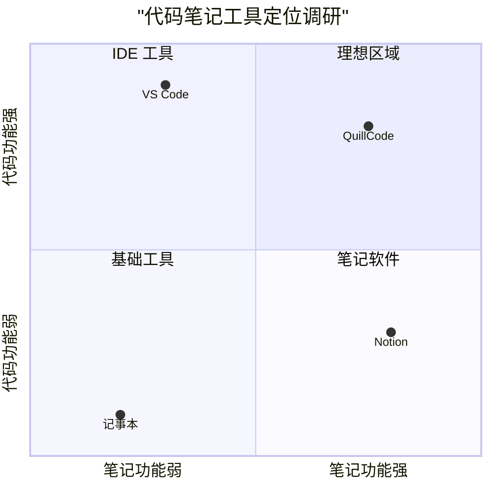
```mermaid
quadrantChart
    title "代码笔记工具定位调研"
    x-axis "笔记功能弱" --> "笔记功能强"
    y-axis "代码功能弱" --> "代码功能强"
    quadrant-1 "理想区域"
    quadrant-2 "IDE 工具"
    quadrant-3 "基础工具"
    quadrant-4 "笔记软件"

    "Notion": [0.8, 0.3]
    "VS Code": [0.3, 0.9]
    "记事本": [0.2, 0.1]
    "QuillCode": [0.75, 0.8]

```

### 1.5 目标用户

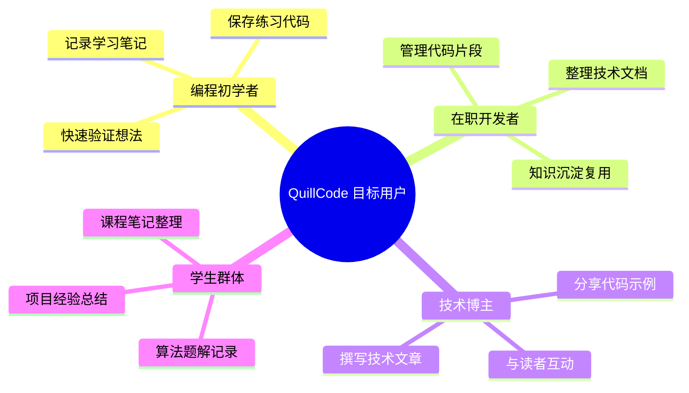
```mermaid
mindmap
  root((QuillCode 目标用户))
    编程初学者
      记录学习笔记
      保存练习代码
      快速验证想法
    在职开发者
      管理代码片段
      整理技术文档
      知识沉淀复用
    技术博主
      撰写技术文章
      分享代码示例
      与读者互动
    学生群体
      课程笔记整理
      算法题解记录
      项目经验总结
```

---

## 二、需求分析

### 2.1 功能需求

#### 2.1.1 用户管理模块

用户管理是系统的基础模块，负责用户身份的认证与授权。

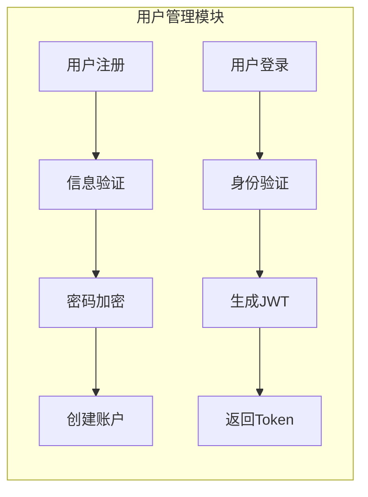
```mermaid
flowchart LR
    subgraph 用户管理模块
        A[用户注册] --> B[信息验证]
        B --> C[密码加密]
        C --> D[创建账户]
        E[用户登录] --> F[身份验证]
        F --> G[生成JWT]
        G --> H[返回Token]
    end
```

| 功能点 | 描述 | 技术实现 |
|-------|------|---------|
| 用户注册 | 支持用户名、邮箱、密码注册 | bcrypt 密码加密 |
| 用户登录 | JWT Token 认证机制 | 7天有效期 Token |
| 角色区分 | 普通用户与管理员 | ENUM 字段 + 守卫验证 |
| 信息校验 | 用户名/邮箱唯一性检查 | 数据库唯一约束 |

#### 2.1.2 文章管理模块

文章（Quill）是系统的核心数据实体，支持多种类型的代码笔记管理。

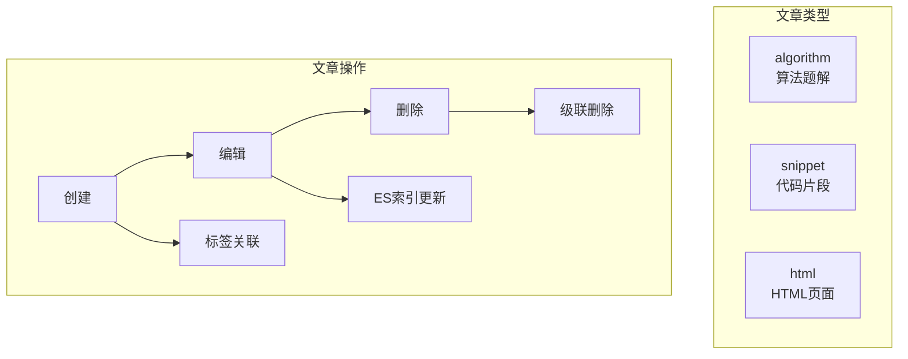
```mermaid
flowchart TB
    subgraph 文章类型
        A[algorithm<br/>算法题解]
        B[snippet<br/>代码片段]
        C[html<br/>HTML页面]
    end
    
    subgraph 文章操作
        D[创建] --> E[编辑]
        E --> F[删除]
        D --> G[标签关联]
        E --> H[ES索引更新]
        F --> I[级联删除]
    end
```

| 功能点 | 描述 | 关联操作 |
|-------|------|---------|
| 创建文章 | 支持标题、Markdown 内容、代码、类型、语言、标签 | 同步 ES 索引 |
| 文章类型 | 算法题解(algorithm)、代码片段(snippet)、HTML页面(html) | 前端差异化展示 |
| 编辑更新 | 支持实时保存和更新 | 触发器记录日志 |
| 删除文章 | 级联删除相关分享和标签关联 | 外键 CASCADE |

#### 2.1.3 标签管理模块

标签系统采用用户隔离模式，确保用户数据的私密性。

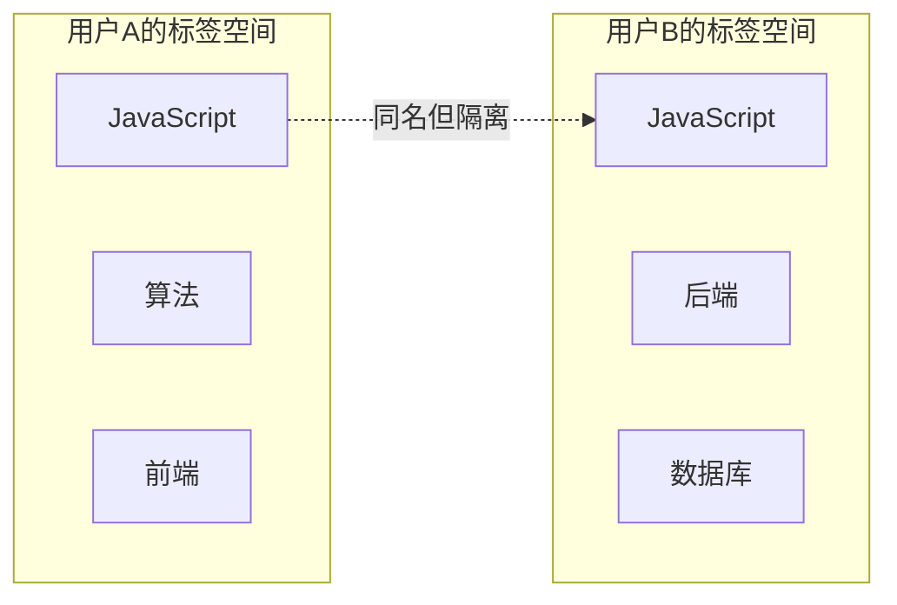
```mermaid
flowchart LR
    subgraph 用户A的标签空间
        A1[JavaScript]
        A2[算法]
        A3[前端]
    end
    
    subgraph 用户B的标签空间
        B1[JavaScript]
        B2[后端]
        B3[数据库]
    end
    
    A1 -.->|同名但隔离| B1
```

| 功能点 | 描述 | 设计要点 |
|-------|------|---------|
| 标签创建 | 支持自定义标签（用户隔离模式） | user_id + name 复合唯一 |
| 用户隔离 | 每个用户拥有独立的标签空间，互不可见 | 查询时过滤 user_id |
| 标签关联 | 多对多关系，一篇文章可有多个标签 | article_tags 中间表 |
| 标签筛选 | 按标签查看文章列表 | JOIN 查询 |
| 权限控制 | 用户只能管理自己的标签 | 服务层权限校验 |

#### 2.1.4 搜索模块

基于 Elasticsearch 实现高性能全文搜索。

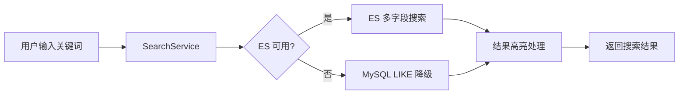
```mermaid
flowchart LR
    A[用户输入关键词] --> B[SearchService]
    B --> C{ES 可用?}
    C -->|是| D[ES 多字段搜索]
    C -->|否| E[MySQL LIKE 降级]
    D --> F[结果高亮处理]
    E --> F
    F --> G[返回搜索结果]
```

| 功能点 | 描述 | 技术细节 |
|-------|------|---------|
| 全文搜索 | 基于 Elasticsearch 的模糊搜索 | multi_match 查询 |
| 搜索范围 | 标题、内容、代码、标签 | 多字段权重配置 |
| 高亮显示 | 搜索结果关键词高亮 | highlight 配置 |
| 降级策略 | ES 不可用时降级到 MySQL | try-catch 容错 |

#### 2.1.5 推荐模块

智能推荐系统结合标签相似度和 AI 大模型。

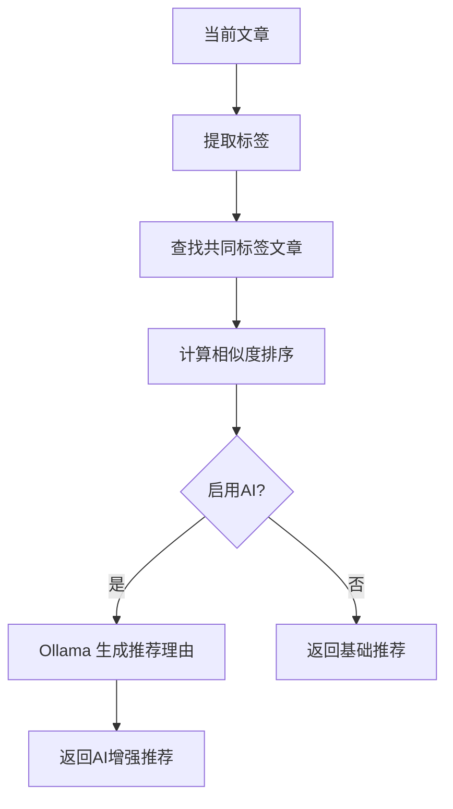
```mermaid
flowchart TB
    A[当前文章] --> B[提取标签]
    B --> C[查找共同标签文章]
    C --> D[计算相似度排序]
    D --> E{启用AI?}
    E -->|是| F[Ollama 生成推荐理由]
    E -->|否| G[返回基础推荐]
    F --> H[返回AI增强推荐]
```

| 功能点 | 描述 | 算法/模型 |
|-------|------|---------|
| 标签推荐 | 基于共同标签的相似文章推荐 | 标签交集计算 |
| AI 增强 | 集成 Ollama 本地大模型进行推荐理由生成 | llama3:8b 模型 |

#### 2.1.6 分享模块

支持生成带过期时间的分享链接，访客无需登录即可查看。

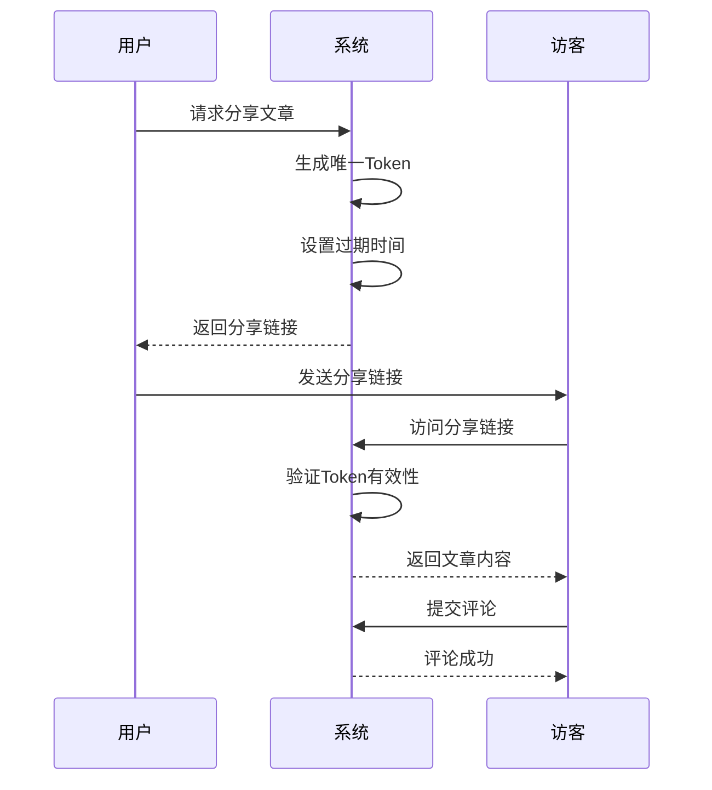
```mermaid
sequenceDiagram
    participant U as 用户
    participant S as 系统
    participant V as 访客
    
    U->>S: 请求分享文章
    S->>S: 生成唯一Token
    S->>S: 设置过期时间
    S-->>U: 返回分享链接
    U->>V: 发送分享链接
    V->>S: 访问分享链接
    S->>S: 验证Token有效性
    S-->>V: 返回文章内容
    V->>S: 提交评论
    S-->>V: 评论成功
```

| 功能点 | 描述 | 安全措施 |
|-------|------|---------|
| 生成分享链接 | 带过期时间的唯一 Token | crypto 随机生成 |
| 访客访问 | 无需登录即可查看分享内容 | Token 验证 |
| 评论功能 | 访客可对分享内容进行评论 | 昵称必填 |

#### 2.1.7 管理员模块

提供系统级的统计和维护功能。

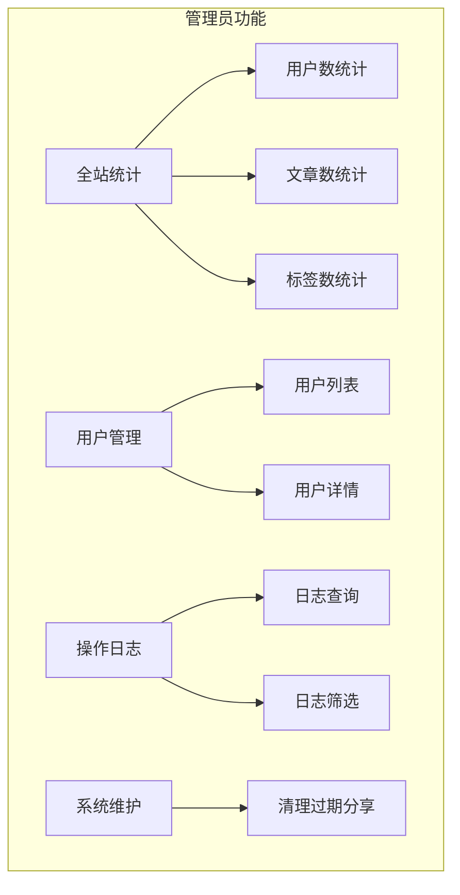
```mermaid
flowchart TB
    subgraph 管理员功能
        A[全站统计] --> A1[用户数统计]
        A --> A2[文章数统计]
        A --> A3[标签数统计]
        B[用户管理] --> B1[用户列表]
        B --> B2[用户详情]
        C[操作日志] --> C1[日志查询]
        C --> C2[日志筛选]
        D[系统维护] --> D1[清理过期分享]
    end
```

| 功能点 | 描述 | 数据来源 |
|-------|------|---------|
| 全站统计 | 用户数、文章数、标签数等 | COUNT 聚合查询 |
| 用户管理 | 查看用户统计信息 | v_user_statistics 视图 |
| 操作日志 | 自动记录增删改操作 | 触发器 + operation_logs 表 |
| 维护功能 | 清理过期分享 | sp_cleanup_expired_shares 存储过程 |

### 2.2 非功能需求

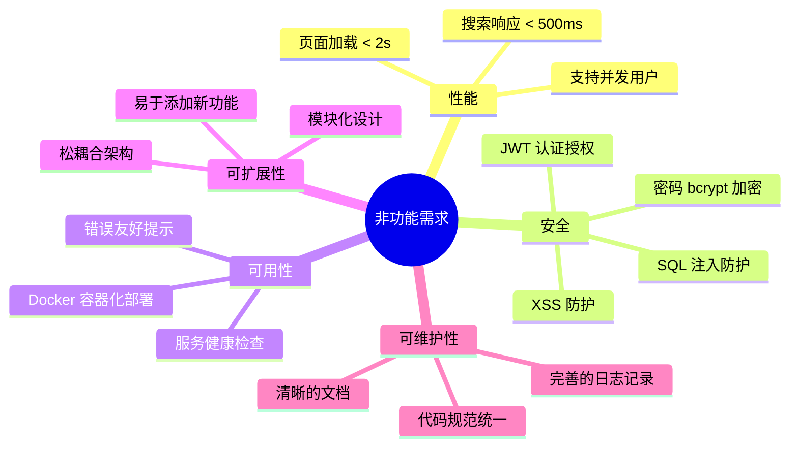
```mermaid
mindmap
  root((非功能需求))
    性能
      搜索响应 < 500ms
      页面加载 < 2s
      支持并发用户
    安全
      密码 bcrypt 加密
      JWT 认证授权
      SQL 注入防护
      XSS 防护
    可用性
      Docker 容器化部署
      服务健康检查
      错误友好提示
    可扩展性
      模块化设计
      松耦合架构
      易于添加新功能
    可维护性
      代码规范统一
      完善的日志记录
      清晰的文档
```

| 需求类型 | 描述 | 实现方案 |
|---------|------|---------|
| 性能 | 搜索响应时间 < 500ms | Elasticsearch + 索引优化 |
| 安全 | 密码 bcrypt 加密，JWT 认证 | @nestjs/jwt + bcrypt |
| 可用性 | 支持 Docker 容器化部署 | docker-compose 编排 |
| 可扩展性 | 模块化设计，易于扩展 | NestJS 模块化架构 |

### 2.3 数据流图

#### 2.3.1 顶层数据流图 (0层)

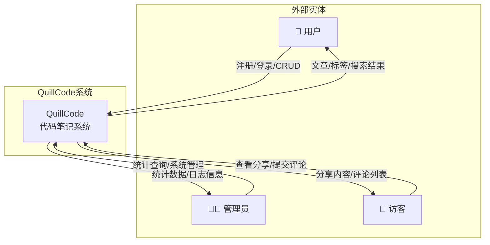
```mermaid
flowchart TB
    subgraph 外部实体
        U[👤 用户]
        A[👨‍💼 管理员]
        V[👥 访客]
    end
    
    subgraph QuillCode系统
        S[QuillCode<br/>代码笔记系统]
    end
    
    U -->|注册/登录/CRUD| S
    S -->|文章/标签/搜索结果| U
    
    A -->|统计查询/系统管理| S
    S -->|统计数据/日志信息| A
    
    V -->|查看分享/提交评论| S
    S -->|分享内容/评论列表| V
```

#### 2.3.2 一层数据流图

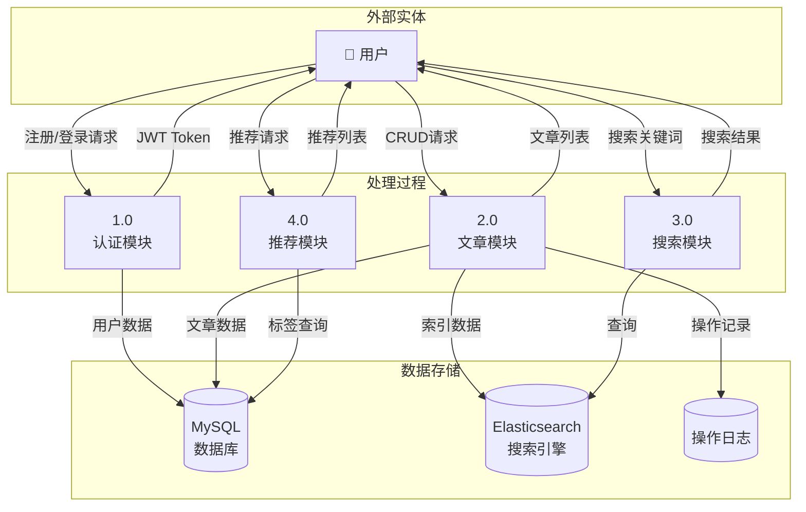
```mermaid
flowchart TB
    subgraph 外部实体
        U[👤 用户]
    end
    
    subgraph 处理过程
        P1[1.0<br/>认证模块]
        P2[2.0<br/>文章模块]
        P3[3.0<br/>搜索模块]
        P4[4.0<br/>推荐模块]
    end
    
    subgraph 数据存储
        D1[(MySQL<br/>数据库)]
        D2[(Elasticsearch<br/>搜索引擎)]
        D3[(操作日志)]
    end
    
    U -->|注册/登录请求| P1
    P1 -->|JWT Token| U
    P1 -->|用户数据| D1
    
    U -->|CRUD请求| P2
    P2 -->|文章数据| D1
    P2 -->|索引数据| D2
    P2 -->|操作记录| D3
    P2 -->|文章列表| U
    
    U -->|搜索关键词| P3
    P3 -->|查询| D2
    P3 -->|搜索结果| U
    
    U -->|推荐请求| P4
    P4 -->|标签查询| D1
    P4 -->|推荐列表| U
```

#### 2.3.3 二层数据流图 - 文章管理子系统

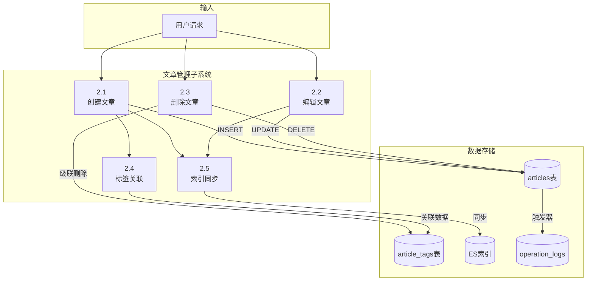
```mermaid
flowchart TB
    subgraph 输入
        R[用户请求]
    end
    
    subgraph 文章管理子系统
        P1[2.1<br/>创建文章]
        P2[2.2<br/>编辑文章]
        P3[2.3<br/>删除文章]
        P4[2.4<br/>标签关联]
        P5[2.5<br/>索引同步]
    end
    
    subgraph 数据存储
        D1[(articles表)]
        D2[(article_tags表)]
        D3[(ES索引)]
        D4[(operation_logs)]
    end
    
    R --> P1
    R --> P2
    R --> P3
    
    P1 -->|INSERT| D1
    P1 --> P4
    P1 --> P5
    
    P2 -->|UPDATE| D1
    P2 --> P5
    
    P3 -->|DELETE| D1
    P3 -->|级联删除| D2
    
    P4 -->|关联数据| D2
    P5 -->|同步| D3
    
    D1 -->|触发器| D4
```

#### 2.3.4 用户认证流程数据流

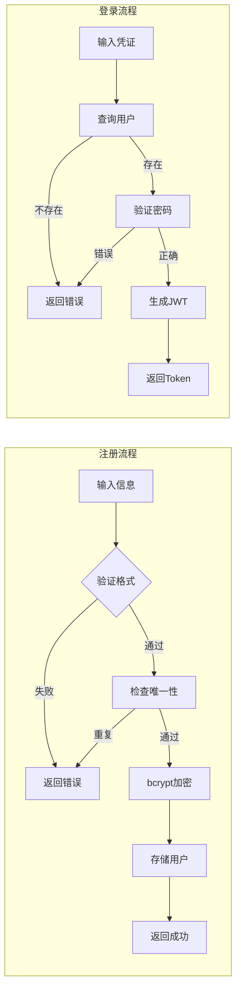
```mermaid
flowchart LR
    subgraph 注册流程
        A1[输入信息] --> A2{验证格式}
        A2 -->|通过| A3[检查唯一性]
        A2 -->|失败| A4[返回错误]
        A3 -->|通过| A5[bcrypt加密]
        A3 -->|重复| A4
        A5 --> A6[存储用户]
        A6 --> A7[返回成功]
    end
    
    subgraph 登录流程
        B1[输入凭证] --> B2[查询用户]
        B2 -->|存在| B3[验证密码]
        B2 -->|不存在| B4[返回错误]
        B3 -->|正确| B5[生成JWT]
        B3 -->|错误| B4
        B5 --> B6[返回Token]
    end
```

---

## 三、概念结构设计

### 3.1 实体设计

通过需求分析，采用自顶向下的方法设计出系统的核心实体。实体设计遵循以下原则：

1. **独立性原则**：每个实体应具有独立存在的意义
2. **完整性原则**：实体应包含描述其特征的完整属性
3. **最小冗余原则**：避免实体间的属性重复

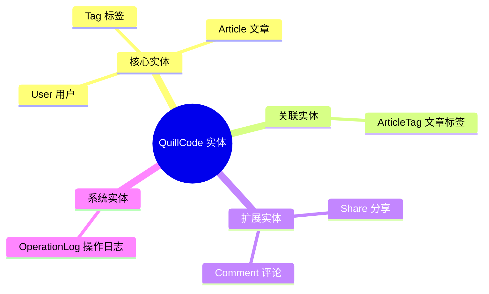
```mermaid
mindmap
  root((QuillCode 实体))
    核心实体
      User 用户
      Article 文章
      Tag 标签
    关联实体
      ArticleTag 文章标签
    扩展实体
      Share 分享
      Comment 评论
    系统实体
      OperationLog 操作日志
```

通过需求分析，设计出以下核心实体：

| 实体名称 | 说明 | 主要属性 | 实体类型 |
|---------|------|----------|---------|
| User (用户) | 系统用户，包含普通用户和管理员 | id, username, email, password_hash, role | 核心实体 |
| Article (文章) | 代码笔记文章，系统核心数据 | id, title, content, code, type, language | 核心实体 |
| Tag (标签) | 文章分类标签，用户隔离模式 | id, user_id, name | 核心实体 |
| Share (分享) | 文章分享链接，支持过期时间 | id, token, expires_at | 扩展实体 |
| Comment (评论) | 分享页面的访客评论 | id, author_name, content | 扩展实体 |
| OperationLog (操作日志) | 系统操作记录，审计追踪 | id, table_name, operation_type, record_id | 系统实体 |

### 3.2 实体属性详细设计

#### 3.2.1 User 实体

用户实体是系统的基础，所有业务数据都与用户关联。

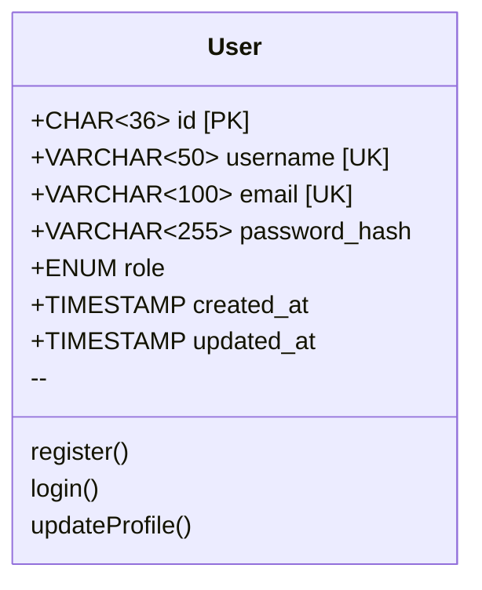
```mermaid
classDiagram
    class User {
        +CHAR~36~ id [PK]
        +VARCHAR~50~ username [UK]
        +VARCHAR~100~ email [UK]
        +VARCHAR~255~ password_hash
        +ENUM role
        +TIMESTAMP created_at
        +TIMESTAMP updated_at
        --
        register()
        login()
        updateProfile()
    }
```

| 属性名 | 数据类型 | 约束 | 说明 |
|--------|---------|------|------|
| id | CHAR(36) | PRIMARY KEY | 用户UUID，主键 |
| username | VARCHAR(50) | NOT NULL, UNIQUE | 用户名，唯一 |
| email | VARCHAR(100) | NOT NULL, UNIQUE | 邮箱，唯一 |
| password_hash | VARCHAR(255) | NOT NULL | 密码哈希值(bcrypt) |
| role | ENUM | DEFAULT 'user' | 角色 (user/admin) |
| created_at | TIMESTAMP | DEFAULT CURRENT_TIMESTAMP | 创建时间 |
| updated_at | TIMESTAMP | ON UPDATE CURRENT_TIMESTAMP | 更新时间 |

#### 3.2.2 Article 实体

文章实体是系统的核心，存储用户的代码笔记内容。

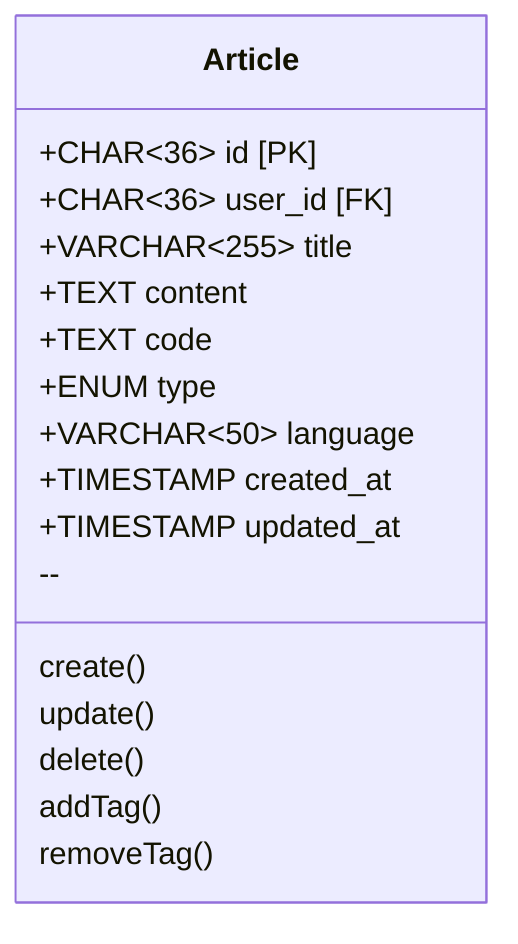
```mermaid
classDiagram
    class Article {
        +CHAR~36~ id [PK]
        +CHAR~36~ user_id [FK]
        +VARCHAR~255~ title
        +TEXT content
        +TEXT code
        +ENUM type
        +VARCHAR~50~ language
        +TIMESTAMP created_at
        +TIMESTAMP updated_at
        --
        create()
        update()
        delete()
        addTag()
        removeTag()
    }
```

| 属性名 | 数据类型 | 约束 | 说明 |
|--------|---------|------|------|
| id | CHAR(36) | PRIMARY KEY | 文章UUID，主键 |
| user_id | CHAR(36) | FOREIGN KEY | 所属用户外键 |
| title | VARCHAR(255) | NOT NULL | 标题 |
| content | TEXT | NULLABLE | Markdown 内容 |
| code | TEXT | NULLABLE | 代码内容 |
| type | ENUM | DEFAULT 'snippet' | 类型 (algorithm/snippet/html) |
| language | VARCHAR(50) | DEFAULT 'javascript' | 编程语言 |
| created_at | TIMESTAMP | DEFAULT CURRENT_TIMESTAMP | 创建时间 |
| updated_at | TIMESTAMP | ON UPDATE CURRENT_TIMESTAMP | 更新时间 |

**文章类型说明**：

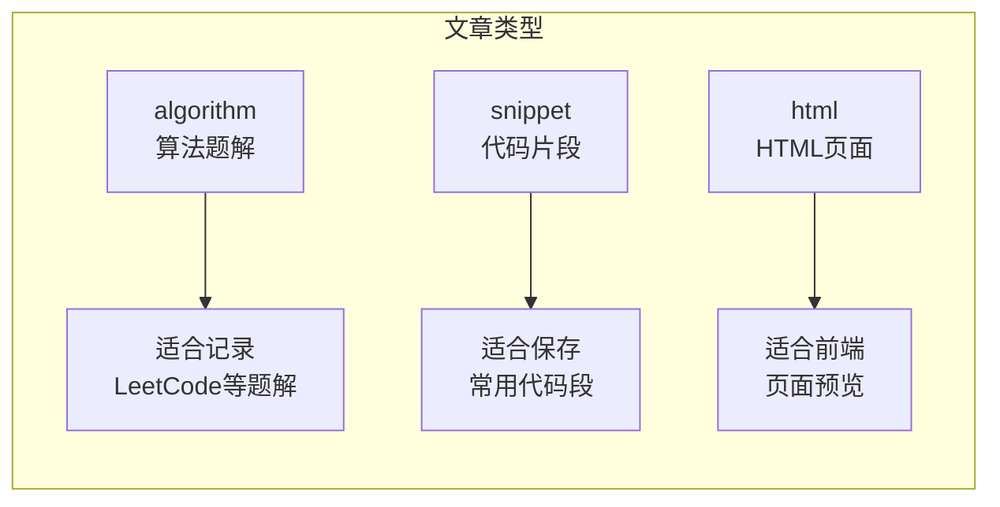
```mermaid
flowchart LR
    subgraph 文章类型
        A[algorithm<br/>算法题解] --> A1[适合记录<br/>LeetCode等题解]
        B[snippet<br/>代码片段] --> B1[适合保存<br/>常用代码段]
        C[html<br/>HTML页面] --> C1[适合前端<br/>页面预览]
    end
```

#### 3.2.3 Tag 实体

标签实体采用用户隔离模式，每个用户拥有独立的标签空间。

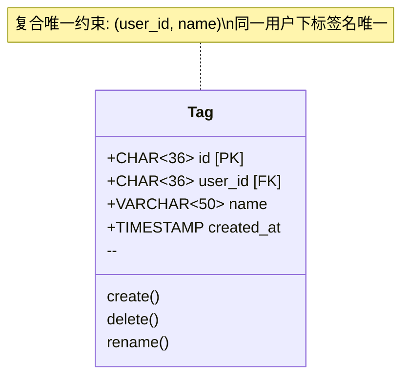
```mermaid
classDiagram
    class Tag {
        +CHAR~36~ id [PK]
        +CHAR~36~ user_id [FK]
        +VARCHAR~50~ name
        +TIMESTAMP created_at
        --
        create()
        delete()
        rename()
    }
    
    note for Tag "复合唯一约束: (user_id, name)\n同一用户下标签名唯一"
```

| 属性名 | 数据类型 | 约束 | 说明 |
|--------|---------|------|------|
| id | CHAR(36) | PRIMARY KEY | 标签UUID，主键 |
| user_id | CHAR(36) | NOT NULL, FOREIGN KEY | 所属用户ID，外键关联users表 |
| name | VARCHAR(50) | NOT NULL | 标签名称 |
| created_at | TIMESTAMP | DEFAULT CURRENT_TIMESTAMP | 创建时间 |

> **设计说明**：标签采用用户隔离模式，每个用户拥有独立的标签空间。同一用户下标签名唯一（复合唯一约束：user_id + name），但不同用户可以创建同名标签。

#### 3.2.4 Share 实体

分享实体用于生成文章的公开访问链接。

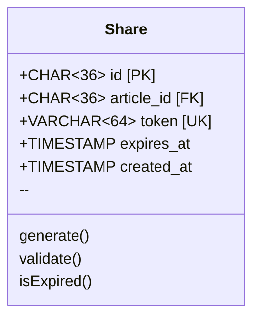
```mermaid
classDiagram
    class Share {
        +CHAR~36~ id [PK]
        +CHAR~36~ article_id [FK]
        +VARCHAR~64~ token [UK]
        +TIMESTAMP expires_at
        +TIMESTAMP created_at
        --
        generate()
        validate()
        isExpired()
    }
```

| 属性名 | 数据类型 | 约束 | 说明 |
|--------|---------|------|------|
| id | CHAR(36) | PRIMARY KEY | 分享UUID，主键 |
| article_id | CHAR(36) | FOREIGN KEY | 关联文章外键 |
| token | VARCHAR(64) | NOT NULL, UNIQUE | 分享令牌，唯一 |
| expires_at | TIMESTAMP | NOT NULL | 过期时间 |
| created_at | TIMESTAMP | DEFAULT CURRENT_TIMESTAMP | 创建时间 |

#### 3.2.5 Comment 实体

评论实体存储访客对分享内容的评论。

```mermaid
classDiagram
    class Comment {
        +CHAR~36~ id [PK]
        +CHAR~36~ share_id [FK]
        +VARCHAR~50~ author_name
        +TEXT content
        +TIMESTAMP created_at
        --
        create()
        delete()
    }
```

| 属性名 | 数据类型 | 约束 | 说明 |
|--------|---------|------|------|
| id | CHAR(36) | PRIMARY KEY | 评论UUID，主键 |
| share_id | CHAR(36) | FOREIGN KEY | 关联分享外键 |
| author_name | VARCHAR(50) | NOT NULL | 评论者名称 |
| content | TEXT | NOT NULL | 评论内容 |
| created_at | TIMESTAMP | DEFAULT CURRENT_TIMESTAMP | 创建时间 |

#### 3.2.6 OperationLog 实体

操作日志实体用于审计追踪，记录系统中的所有数据变更。

```mermaid
classDiagram
    class OperationLog {
        +BIGINT id [PK, AUTO]
        +VARCHAR~50~ table_name
        +ENUM operation_type
        +CHAR~36~ record_id
        +JSON old_data
        +JSON new_data
        +TIMESTAMP operated_at
        --
        query()
        filter()
    }
```

| 属性名 | 数据类型 | 约束 | 说明 |
|--------|---------|------|------|
| id | BIGINT | PRIMARY KEY, AUTO_INCREMENT | 日志ID，自增主键 |
| table_name | VARCHAR(50) | NOT NULL | 操作的表名 |
| operation_type | ENUM | NOT NULL | 操作类型 (INSERT/UPDATE/DELETE) |
| record_id | CHAR(36) | NOT NULL | 被操作记录的ID |
| old_data | JSON | NULLABLE | 旧数据(JSON格式) |
| new_data | JSON | NULLABLE | 新数据(JSON格式) |
| operated_at | TIMESTAMP | DEFAULT CURRENT_TIMESTAMP | 操作时间 |

### 3.3 实体间关系分析

实体间的关系决定了数据库的结构设计，以下是各实体间关系的详细分析：

```mermaid
flowchart TB
    subgraph 关系类型说明
        R1[1:N 一对多]
        R2[M:N 多对多]
    end
    
    subgraph 实体关系
        U[User] -->|1:N 拥有| A[Article]
        U -->|1:N 拥有| T[Tag]
        A -->|M:N 关联| T
        A -->|1:N 生成| S[Share]
        S -->|1:N 包含| C[Comment]
    end
```

| 关系 | 类型 | 基数 | 说明 | 实现方式 |
|-----|------|------|------|---------|
| User - Article | 1:N | 1个用户对应0..N篇文章 | 用户拥有文章，级联删除 | 外键 user_id |
| User - Tag | 1:N | 1个用户对应0..N个标签 | 用户拥有标签，级联删除（用户隔离模式） | 外键 user_id |
| Article - Tag | M:N | 1篇文章对应0..N个标签，1个标签对应0..N篇文章 | 通过article_tags中间表实现 | 中间表 |
| Article - Share | 1:N | 1篇文章对应0..N个分享链接 | 文章可被多次分享 | 外键 article_id |
| Share - Comment | 1:N | 1个分享对应0..N条评论 | 访客可对分享内容评论 | 外键 share_id |

### 3.4 E-R 图

#### 3.4.1 Chen 表示法 E-R 图

```mermaid
flowchart TB
    subgraph User实体
        U[User]
        U_id((id))
        U_username((username))
        U_email((email))
        U_password((password_hash))
        U_role((role))
        U_created((created_at))
        U_updated((updated_at))
    end
    
    U --- U_id
    U --- U_username
    U --- U_email
    U --- U_password
    U --- U_role
    U --- U_created
    U --- U_updated
    
    subgraph Article实体
        A[Article]
        A_id((id))
        A_title((title))
        A_content((content))
        A_code((code))
        A_type((type))
        A_lang((language))
    end
    
    A --- A_id
    A --- A_title
    A --- A_content
    A --- A_code
    A --- A_type
    A --- A_lang
    
    subgraph Tag实体
        T[Tag]
        T_id((id))
        T_name((name))
    end
    
    T --- T_id
    T --- T_name
    
    subgraph 关系
        R1{创建}
        R2{拥有}
        R3{关联}
        R4{生成}
        R5{包含}
    end
    
    U ---|1| R1
    R1 ---|N| A
    
    U ---|1| R2
    R2 ---|N| T
    
    A ---|M| R3
    R3 ---|N| T
```

#### 3.4.2 完整实体关系图

```mermaid
erDiagram
    USER ||--o{ ARTICLE : "creates"
    USER ||--o{ TAG : "owns"
    USER {
        uuid id PK "用户UUID主键"
        varchar username UK "用户名唯一"
        varchar email UK "邮箱唯一"
        varchar password_hash "bcrypt加密密码"
        enum role "user/admin"
        timestamp created_at "创建时间"
        timestamp updated_at "更新时间"
    }
    
    ARTICLE ||--o{ ARTICLE_TAG : "has"
    ARTICLE ||--o{ SHARE : "generates"
    ARTICLE {
        uuid id PK "文章UUID主键"
        uuid user_id FK "所属用户"
        varchar title "标题"
        text content "Markdown内容"
        text code "代码内容"
        enum type "algorithm/snippet/html"
        varchar language "编程语言"
        timestamp created_at "创建时间"
        timestamp updated_at "更新时间"
    }
    
    TAG ||--o{ ARTICLE_TAG : "belongs"
    TAG {
        uuid id PK "标签UUID主键"
        uuid user_id FK "所属用户"
        varchar name "标签名称"
        timestamp created_at "创建时间"
    }
    
    ARTICLE_TAG {
        uuid article_id PK
        uuid tag_id PK
        uuid article_id FK "文章ID"
        uuid tag_id FK "标签ID"
    }
    
    SHARE ||--o{ COMMENT : "receives"
    SHARE {
        uuid id PK "分享UUID主键"
        uuid article_id FK "关联文章"
        varchar token UK "分享令牌"
        timestamp expires_at "过期时间"
        timestamp created_at "创建时间"
    }
    
    COMMENT {
        uuid id PK "评论UUID主键"
        uuid share_id FK "关联分享"
        varchar author_name "评论者名称"
        text content "评论内容"
        timestamp created_at "创建时间"
    }
    
    OPERATION_LOG {
        bigint id PK "自增主键"
        varchar table_name "操作表名"
        enum operation_type "INSERT/UPDATE/DELETE"
        uuid record_id "记录ID"
        json old_data "旧数据"
        json new_data "新数据"
        timestamp operated_at "操作时间"
    }
```

### 3.5 数据字典

#### 3.5.1 实体字典

| 实体编号 | 实体名称 | 中文名称 | 说明 |
|---------|---------|---------|------|
| E01 | User | 用户 | 系统用户，包含普通用户和管理员 |
| E02 | Article | 文章 | 代码笔记文章，系统核心数据 |
| E03 | Tag | 标签 | 文章分类标签，用户隔离模式 |
| E04 | ArticleTag | 文章标签 | 文章与标签的多对多关联 |
| E05 | Share | 分享 | 文章分享链接 |
| E06 | Comment | 评论 | 分享页面的访客评论 |
| E07 | OperationLog | 操作日志 | 系统操作审计记录 |

#### 3.5.2 关系字典

| 关系编号 | 关系名称 | 源实体 | 目标实体 | 基数 | 说明 |
|---------|---------|-------|---------|------|------|
| R01 | creates | User | Article | 1:N | 用户创建文章 |
| R02 | owns | User | Tag | 1:N | 用户拥有标签 |
| R03 | has | Article | ArticleTag | 1:N | 文章拥有标签关联 |
| R04 | belongs | Tag | ArticleTag | 1:N | 标签属于关联 |
| R05 | generates | Article | Share | 1:N | 文章生成分享 |
| R06 | receives | Share | Comment | 1:N | 分享接收评论 |

---

## 四、逻辑结构设计

### 4.1 E-R图向关系模式的转换

根据E-R图，按照以下规则进行转换：

```mermaid
flowchart TB
    subgraph 转换规则
        R1[1:1联系] --> R1A[将联系并入任一端实体]
        R2[1:N联系] --> R2A[将联系并入N端实体<br/>添加外键]
        R3[M:N联系] --> R3A[创建独立的关系模式<br/>中间表]
        R4[实体转换] --> R4A[每个实体转换为<br/>一个关系模式]
    end
```

**转换规则详解：**

| 规则 | 说明 | 本系统应用 |
|-----|------|-----------|
| 1:1联系 | 将联系并入任一端实体 | 无此类联系 |
| 1:N联系 | 将联系并入N端实体，添加外键 | User→Article, User→Tag, Article→Share, Share→Comment |
| M:N联系 | 创建独立的关系模式（中间表） | Article↔Tag → article_tags |
| 实体转换 | 每个实体转换为一个关系模式 | 6个实体 → 7个表（含中间表） |

### 4.2 关系模式定义

#### 4.2.1 关系模式总览

```mermaid
erDiagram
    R_users ||--o{ R_articles : "user_id"
    R_users ||--o{ R_tags : "user_id"
    R_articles ||--o{ R_article_tags : "article_id"
    R_tags ||--o{ R_article_tags : "tag_id"
    R_articles ||--o{ R_shares : "article_id"
    R_shares ||--o{ R_comments : "share_id"
    
    R_users {
        CHAR_36 id PK
        VARCHAR_50 username UK
        VARCHAR_100 email UK
        VARCHAR_255 password_hash
        ENUM role
        TIMESTAMP created_at
        TIMESTAMP updated_at
    }
    
    R_articles {
        CHAR_36 id PK
        CHAR_36 user_id FK
        VARCHAR_255 title
        TEXT content
        TEXT code
        ENUM type
        VARCHAR_50 language
        TIMESTAMP created_at
        TIMESTAMP updated_at
    }
    
    R_tags {
        CHAR_36 id PK
        CHAR_36 user_id FK
        VARCHAR_50 name
        TIMESTAMP created_at
    }
    
    R_article_tags {
        CHAR_36 article_id PK_FK
        CHAR_36 tag_id PK_FK
    }
    
    R_shares {
        CHAR_36 id PK
        CHAR_36 article_id FK
        VARCHAR_64 token UK
        TIMESTAMP expires_at
        TIMESTAMP created_at
    }
    
    R_comments {
        CHAR_36 id PK
        CHAR_36 share_id FK
        VARCHAR_50 author_name
        TEXT content
        TIMESTAMP created_at
    }
    
    R_operation_logs {
        BIGINT id PK
        VARCHAR_50 table_name
        ENUM operation_type
        CHAR_36 record_id
        JSON old_data
        JSON new_data
        TIMESTAMP operated_at
    }
```

#### 4.2.2 用户关系模式 (users)

```mermaid
classDiagram
    class R_users {
        CHAR_36 id PK
        VARCHAR_50 username UK
        VARCHAR_100 email UK
        VARCHAR_255 password_hash
        ENUM role
        TIMESTAMP created_at
        TIMESTAMP updated_at
    }
```

```
R_users = (id, username, email, password_hash, role, created_at, updated_at)

主键: id
候选键: username, email
函数依赖:
  id → username, email, password_hash, role, created_at, updated_at
  username → id, email, password_hash, role, created_at, updated_at
  email → id, username, password_hash, role, created_at, updated_at
```

#### 4.2.3 文章关系模式 (articles)

```mermaid
classDiagram
    class R_articles {
        CHAR_36 id PK
        CHAR_36 user_id FK
        VARCHAR_255 title
        TEXT content
        TEXT code
        ENUM type
        VARCHAR_50 language
        TIMESTAMP created_at
        TIMESTAMP updated_at
    }
```

```
R_articles = (id, user_id, title, content, code, type, language, created_at, updated_at)

主键: id
外键: user_id → users(id)
函数依赖:
  id → user_id, title, content, code, type, language, created_at, updated_at
```

#### 4.2.4 标签关系模式 (tags)

```mermaid
classDiagram
    class R_tags {
        CHAR_36 id PK
        CHAR_36 user_id FK
        VARCHAR_50 name
        TIMESTAMP created_at
    }
```

```
R_tags = (id, user_id, name, created_at)

主键: id
外键: user_id → users(id)
复合唯一约束: (user_id, name)
函数依赖:
  id → user_id, name, created_at
  (user_id, name) → id, created_at
```

> **设计说明**：标签采用用户隔离模式，每个用户拥有独立的标签空间。原有的全局唯一约束 `uk_name` 已替换为复合唯一约束 `uk_user_tag(user_id, name)`，允许不同用户创建同名标签。

#### 4.2.5 文章-标签关联关系模式 (article_tags)
```
R_article_tags = (article_id, tag_id)

主键: (article_id, tag_id) -- 联合主键
外键: 
  article_id → articles(id)
  tag_id → tags(id)
```

#### 4.2.6 分享关系模式 (shares)
```
R_shares = (id, article_id, token, expires_at, created_at)

主键: id
候选键: token
外键: article_id → articles(id)
函数依赖:
  id → article_id, token, expires_at, created_at
  token → id, article_id, expires_at, created_at
```

#### 4.2.7 评论关系模式 (comments)
```
R_comments = (id, share_id, author_name, content, created_at)

主键: id
外键: share_id → shares(id)
函数依赖:
  id → share_id, author_name, content, created_at
```

#### 4.2.8 操作日志关系模式 (operation_logs)
```
R_operation_logs = (id, table_name, operation_type, record_id, old_data, new_data, operated_at)

主键: id (自增)
函数依赖:
  id → table_name, operation_type, record_id, old_data, new_data, operated_at
```

### 4.3 关系模式规范化分析

#### 4.3.1 规范化流程

```mermaid
flowchart LR
    A[原始关系] --> B{满足1NF?}
    B -->|是| C{满足2NF?}
    B -->|否| B1[消除非原子属性]
    B1 --> B
    C -->|是| D{满足3NF?}
    C -->|否| C1[消除部分依赖]
    C1 --> C
    D -->|是| E{满足BCNF?}
    D -->|否| D1[消除传递依赖]
    D1 --> D
    E -->|是| F[规范化完成]
    E -->|否| E1[消除主属性依赖]
    E1 --> E
```

#### 4.3.2 第一范式 (1NF) 验证

**定义**：关系模式R的所有属性都是不可再分的基本数据项。

| 关系模式 | 验证结果 | 说明 |
|---------|---------|------|
| users | ✅ 满足1NF | 所有字段都是原子值 |
| articles | ✅ 满足1NF | content和code虽为TEXT，但作为整体存储 |
| tags | ✅ 满足1NF | name是单值属性 |
| article_tags | ✅ 满足1NF | 联合主键，无其他属性 |
| shares | ✅ 满足1NF | 所有字段都是原子值 |
| comments | ✅ 满足1NF | 所有字段都是原子值 |
| operation_logs | ✅ 满足1NF | JSON字段作为整体存储 |

#### 4.3.3 第二范式 (2NF) 验证

**定义**：在满足1NF的基础上，消除非主属性对候选键的部分函数依赖。

| 关系模式 | 验证结果 | 说明 |
|---------|---------|------|
| users | ✅ 满足2NF | 单一主键，不存在部分依赖 |
| articles | ✅ 满足2NF | 单一主键，不存在部分依赖 |
| tags | ✅ 满足2NF | 单一主键，不存在部分依赖 |
| article_tags | ✅ 满足2NF | 联合主键(article_id, tag_id)，无非主属性 |
| shares | ✅ 满足2NF | 单一主键，不存在部分依赖 |
| comments | ✅ 满足2NF | 单一主键，不存在部分依赖 |
| operation_logs | ✅ 满足2NF | 单一主键，不存在部分依赖 |

#### 4.3.4 第三范式 (3NF) 验证

**定义**：在满足2NF的基础上，消除非主属性对候选键的传递函数依赖。

```mermaid
flowchart TB
    subgraph 3NF验证-传递依赖检查
        A[articles表] --> A1{user_id → username?}
        A1 -->|通过外键关联| A2[✅ 传递依赖消除]
        
        S[shares表] --> S1{article_id → title?}
        S1 -->|通过外键关联| S2[✅ 传递依赖消除]
        
        C[comments表] --> C1{share_id → article_id?}
        C1 -->|通过外键关联| C2[✅ 传递依赖消除]
    end
```

| 关系模式 | 验证结果 | 说明 |
|---------|---------|------|
| users | ✅ 满足3NF | 所有非主属性直接依赖于主键 |
| articles | ✅ 满足3NF | user_id → username 的传递依赖通过外键关联消除 |
| tags | ✅ 满足3NF | 所有非主属性直接依赖于主键 |
| article_tags | ✅ 满足3NF | 无非主属性，自然满足 |
| shares | ✅ 满足3NF | article_id → title 的传递依赖通过外键关联消除 |
| comments | ✅ 满足3NF | share_id → article_id 的传递依赖通过外键关联消除 |
| operation_logs | ✅ 满足3NF | 所有非主属性直接依赖于主键 |

#### 4.3.5 BCNF 验证

**定义**：在满足3NF的基础上，对于每个非平凡函数依赖X→Y，X都是超键。

所有关系模式均满足BCNF，因为：
- 每个函数依赖的决定因素都是候选键或超键
- 不存在主属性对非主属性的依赖

### 4.4 索引设计

#### 4.4.1 索引设计原则

```mermaid
mindmap
  root((索引设计原则))
    主键索引
      自动创建
      唯一性保证
    唯一索引
      业务唯一约束
      登录查询优化
    普通索引
      高频查询字段
      外键关联字段
      排序字段
    复合索引
      多条件查询
      覆盖索引优化
```

#### 4.4.2 索引清单

| 表名 | 索引名 | 索引字段 | 索引类型 | 用途 |
|-----|--------|---------|---------|------|
| users | PRIMARY | id | PRIMARY | 主键索引 |
| users | uk_username | username | UNIQUE | 用户名唯一约束，登录查询 |
| users | uk_email | email | UNIQUE | 邮箱唯一约束，注册验证 |
| articles | PRIMARY | id | PRIMARY | 主键索引 |
| articles | idx_user_id | user_id | INDEX | 按用户查询文章 |
| articles | idx_type | type | INDEX | 按类型筛选 |
| articles | idx_language | language | INDEX | 按语言筛选 |
| articles | idx_created_at | created_at | INDEX | 按时间排序 |
| tags | PRIMARY | id | PRIMARY | 主键索引 |
| tags | idx_user_id | user_id | INDEX | 按用户查询标签 |
| tags | uk_user_tag | (user_id, name) | UNIQUE | 用户级别标签名唯一约束 |
| article_tags | PRIMARY | (article_id, tag_id) | PRIMARY | 联合主键 |
| article_tags | idx_tag_id | tag_id | INDEX | 按标签查询文章 |
| shares | PRIMARY | id | PRIMARY | 主键索引 |
| shares | uk_token | token | UNIQUE | 分享令牌唯一，访问查询 |
| shares | idx_article_id | article_id | INDEX | 按文章查询分享 |
| shares | idx_expires_at | expires_at | INDEX | 过期时间查询，清理任务 |
| comments | PRIMARY | id | PRIMARY | 主键索引 |
| comments | idx_share_id | share_id | INDEX | 按分享查询评论 |
| comments | idx_created_at | created_at | INDEX | 评论时间排序 |
| operation_logs | PRIMARY | id | PRIMARY | 主键索引（自增） |
| operation_logs | idx_table_name | table_name | INDEX | 按表名查询日志 |
| operation_logs | idx_operation_type | operation_type | INDEX | 按操作类型筛选 |
| operation_logs | idx_operated_at | operated_at | INDEX | 按时间查询日志 |

### 4.5 完整性约束设计

#### 4.5.1 实体完整性
- 所有表的主键不允许为NULL
- UUID主键保证全局唯一性
- operation_logs使用AUTO_INCREMENT保证唯一性

#### 4.5.2 参照完整性
| 外键约束 | 父表 | 子表 | 删除规则 | 更新规则 |
|---------|------|------|---------|---------|
| fk_articles_user | users | articles | CASCADE | CASCADE |
| fk_tags_user | users | tags | CASCADE | CASCADE |
| fk_article_tags_article | articles | article_tags | CASCADE | CASCADE |
| fk_article_tags_tag | tags | article_tags | CASCADE | CASCADE |
| fk_shares_article | articles | shares | CASCADE | CASCADE |
| fk_comments_share | shares | comments | CASCADE | CASCADE |

#### 4.5.3 用户自定义完整性
| 约束 | 表 | 字段 | 规则 |
|-----|-----|------|------|
| CHECK | users | role | IN ('user', 'admin') |
| CHECK | articles | type | IN ('algorithm', 'snippet', 'html') |
| CHECK | operation_logs | operation_type | IN ('INSERT', 'UPDATE', 'DELETE') |
| NOT NULL | users | username, email, password_hash | 必填字段 |
| NOT NULL | articles | title | 标题必填 |
| NOT NULL | comments | author_name, content | 评论必填 |

---

## 五、数据库实施

### 5.1 数据库实施流程

```mermaid
flowchart TB
    subgraph 实施流程
        A[创建数据库] --> B[创建表结构]
        B --> C[创建索引]
        C --> D[创建视图]
        D --> E[创建存储过程]
        E --> F[创建触发器]
        F --> G[数据初始化]
        G --> H[备份方案配置]
    end
```

### 5.2 数据库创建

```sql
-- 创建数据库
CREATE DATABASE IF NOT EXISTS `code_notebook` 
  CHARACTER SET utf8mb4 
  COLLATE utf8mb4_unicode_ci;

USE `code_notebook`;
```

**字符集选择说明**：

| 配置项 | 值 | 说明 |
|-------|-----|------|
| 字符集 | utf8mb4 | 支持完整Unicode，包括Emoji表情 |
| 排序规则 | utf8mb4_unicode_ci | 不区分大小写，适合多语言环境 |

### 5.3 表创建语句

#### 5.3.1 表创建顺序

```mermaid
flowchart TB
    subgraph 创建顺序-按依赖关系
        U[1. users] --> A[2. articles]
        U --> T[3. tags]
        A --> AT[4. article_tags]
        T --> AT
        A --> S[5. shares]
        S --> C[6. comments]
        O[7. operation_logs<br/>独立表]
    end
```

#### 5.3.2 用户表 (users)
```sql
CREATE TABLE IF NOT EXISTS `users` (
  `id` CHAR(36) NOT NULL COMMENT '用户UUID',
  `username` VARCHAR(50) NOT NULL COMMENT '用户名',
  `email` VARCHAR(100) NOT NULL COMMENT '邮箱',
  `password_hash` VARCHAR(255) NOT NULL COMMENT '密码哈希',
  `role` ENUM('user', 'admin') DEFAULT 'user' COMMENT '用户角色',
  `created_at` TIMESTAMP DEFAULT CURRENT_TIMESTAMP COMMENT '创建时间',
  `updated_at` TIMESTAMP DEFAULT CURRENT_TIMESTAMP ON UPDATE CURRENT_TIMESTAMP COMMENT '更新时间',
  PRIMARY KEY (`id`),
  UNIQUE KEY `uk_username` (`username`),
  UNIQUE KEY `uk_email` (`email`)
) ENGINE=InnoDB DEFAULT CHARSET=utf8mb4 COLLATE=utf8mb4_unicode_ci COMMENT='用户表';
```

#### 5.2.2 文章表 (articles)
```sql
CREATE TABLE IF NOT EXISTS `articles` (
  `id` CHAR(36) NOT NULL COMMENT '文章UUID',
  `user_id` CHAR(36) NOT NULL COMMENT '用户ID',
  `title` VARCHAR(255) NOT NULL COMMENT '标题',
  `content` TEXT COMMENT 'Markdown内容',
  `code` TEXT COMMENT '代码内容',
  `type` ENUM('algorithm', 'snippet', 'html') DEFAULT 'snippet' COMMENT '文章类型',
  `language` VARCHAR(50) DEFAULT 'javascript' COMMENT '编程语言',
  `created_at` TIMESTAMP DEFAULT CURRENT_TIMESTAMP COMMENT '创建时间',
  `updated_at` TIMESTAMP DEFAULT CURRENT_TIMESTAMP ON UPDATE CURRENT_TIMESTAMP COMMENT '更新时间',
  PRIMARY KEY (`id`),
  KEY `idx_user_id` (`user_id`),
  KEY `idx_type` (`type`),
  KEY `idx_language` (`language`),
  KEY `idx_created_at` (`created_at`),
  CONSTRAINT `fk_articles_user` FOREIGN KEY (`user_id`) REFERENCES `users` (`id`) ON DELETE CASCADE
) ENGINE=InnoDB DEFAULT CHARSET=utf8mb4 COLLATE=utf8mb4_unicode_ci COMMENT='文章表';
```

#### 5.2.3 标签表 (tags) - 用户隔离模式
```sql
CREATE TABLE IF NOT EXISTS `tags` (
  `id` CHAR(36) NOT NULL COMMENT '标签UUID',
  `user_id` CHAR(36) NOT NULL COMMENT '所属用户ID',
  `name` VARCHAR(50) NOT NULL COMMENT '标签名称',
  `created_at` TIMESTAMP DEFAULT CURRENT_TIMESTAMP COMMENT '创建时间',
  PRIMARY KEY (`id`),
  KEY `idx_user_id` (`user_id`),
  UNIQUE KEY `uk_user_tag` (`user_id`, `name`),
  CONSTRAINT `fk_tags_user` FOREIGN KEY (`user_id`) REFERENCES `users` (`id`) ON DELETE CASCADE
) ENGINE=InnoDB DEFAULT CHARSET=utf8mb4 COLLATE=utf8mb4_unicode_ci COMMENT='标签表';
```

> **设计说明**：标签表采用用户隔离模式，每个标签必须关联一个用户。复合唯一约束 `uk_user_tag(user_id, name)` 确保同一用户下标签名唯一，但允许不同用户创建同名标签。删除用户时，其所有标签会级联删除。

#### 5.2.4 文章-标签关联表 (article_tags)
```sql
CREATE TABLE IF NOT EXISTS `article_tags` (
  `article_id` CHAR(36) NOT NULL COMMENT '文章ID',
  `tag_id` CHAR(36) NOT NULL COMMENT '标签ID',
  PRIMARY KEY (`article_id`, `tag_id`),
  KEY `idx_tag_id` (`tag_id`),
  CONSTRAINT `fk_article_tags_article` FOREIGN KEY (`article_id`) REFERENCES `articles` (`id`) ON DELETE CASCADE,
  CONSTRAINT `fk_article_tags_tag` FOREIGN KEY (`tag_id`) REFERENCES `tags` (`id`) ON DELETE CASCADE
) ENGINE=InnoDB DEFAULT CHARSET=utf8mb4 COLLATE=utf8mb4_unicode_ci COMMENT='文章标签关联表';
```

#### 5.2.5 分享表 (shares)
```sql
CREATE TABLE IF NOT EXISTS `shares` (
  `id` CHAR(36) NOT NULL COMMENT '分享UUID',
  `article_id` CHAR(36) NOT NULL COMMENT '文章ID',
  `token` VARCHAR(64) NOT NULL COMMENT '分享令牌',
  `expires_at` TIMESTAMP NOT NULL COMMENT '过期时间',
  `created_at` TIMESTAMP DEFAULT CURRENT_TIMESTAMP COMMENT '创建时间',
  PRIMARY KEY (`id`),
  UNIQUE KEY `uk_token` (`token`),
  KEY `idx_article_id` (`article_id`),
  KEY `idx_expires_at` (`expires_at`),
  CONSTRAINT `fk_shares_article` FOREIGN KEY (`article_id`) REFERENCES `articles` (`id`) ON DELETE CASCADE
) ENGINE=InnoDB DEFAULT CHARSET=utf8mb4 COLLATE=utf8mb4_unicode_ci COMMENT='分享表';
```

#### 5.2.6 评论表 (comments)
```sql
CREATE TABLE IF NOT EXISTS `comments` (
  `id` CHAR(36) NOT NULL COMMENT '评论UUID',
  `share_id` CHAR(36) NOT NULL COMMENT '分享ID',
  `author_name` VARCHAR(50) NOT NULL COMMENT '评论者名称',
  `content` TEXT NOT NULL COMMENT '评论内容',
  `created_at` TIMESTAMP DEFAULT CURRENT_TIMESTAMP COMMENT '创建时间',
  PRIMARY KEY (`id`),
  KEY `idx_share_id` (`share_id`),
  KEY `idx_created_at` (`created_at`),
  CONSTRAINT `fk_comments_share` FOREIGN KEY (`share_id`) REFERENCES `shares` (`id`) ON DELETE CASCADE
) ENGINE=InnoDB DEFAULT CHARSET=utf8mb4 COLLATE=utf8mb4_unicode_ci COMMENT='评论表';
```

#### 5.2.7 操作日志表 (operation_logs)
```sql
CREATE TABLE IF NOT EXISTS `operation_logs` (
  `id` BIGINT AUTO_INCREMENT NOT NULL COMMENT '日志ID',
  `table_name` VARCHAR(50) NOT NULL COMMENT '操作的表名',
  `operation_type` ENUM('INSERT', 'UPDATE', 'DELETE') NOT NULL COMMENT '操作类型',
  `record_id` CHAR(36) NOT NULL COMMENT '记录ID',
  `old_data` JSON COMMENT '旧数据',
  `new_data` JSON COMMENT '新数据',
  `operated_at` TIMESTAMP DEFAULT CURRENT_TIMESTAMP COMMENT '操作时间',
  PRIMARY KEY (`id`),
  KEY `idx_table_name` (`table_name`),
  KEY `idx_operation_type` (`operation_type`),
  KEY `idx_operated_at` (`operated_at`)
) ENGINE=InnoDB DEFAULT CHARSET=utf8mb4 COLLATE=utf8mb4_unicode_ci COMMENT='操作日志表';
```

### 5.3 视图设计

#### 5.3.1 文章详情视图 (v_article_details)

**用途**：管理员查看文章详情列表，包含作者信息、分享数量和标签名称。

```sql
CREATE VIEW `v_article_details` AS
SELECT 
  a.id AS article_id,
  a.title,
  a.content,
  a.code,
  a.type,
  a.language,
  a.created_at,
  a.updated_at,
  u.id AS user_id,
  u.username AS author_name,
  u.email AS author_email,
  (SELECT COUNT(*) FROM shares s WHERE s.article_id = a.id) AS share_count,
  (SELECT GROUP_CONCAT(t.name SEPARATOR ', ') 
   FROM article_tags at 
   JOIN tags t ON at.tag_id = t.id 
   WHERE at.article_id = a.id) AS tag_names
FROM articles a
JOIN users u ON a.user_id = u.id;
```

#### 5.3.2 用户统计视图 (v_user_statistics)

**用途**：管理员查看每个用户的文章统计，包括各类型文章数量和分享数量。

```sql
CREATE VIEW `v_user_statistics` AS
SELECT 
  u.id AS user_id,
  u.username,
  u.email,
  u.created_at AS registered_at,
  COUNT(DISTINCT a.id) AS article_count,
  COUNT(DISTINCT CASE WHEN a.type = 'algorithm' THEN a.id END) AS algorithm_count,
  COUNT(DISTINCT CASE WHEN a.type = 'snippet' THEN a.id END) AS snippet_count,
  COUNT(DISTINCT CASE WHEN a.type = 'html' THEN a.id END) AS html_count,
  COUNT(DISTINCT s.id) AS total_shares
FROM users u
LEFT JOIN articles a ON u.id = a.user_id
LEFT JOIN shares s ON a.id = s.article_id
GROUP BY u.id, u.username, u.email, u.created_at;
```

#### 5.3.3 热门标签视图 (v_popular_tags)

**用途**：展示用户级别的热门标签排行，按使用次数降序排列。每个用户只能看到自己的标签统计。

```sql
CREATE VIEW `v_popular_tags` AS
SELECT 
  t.id AS tag_id,
  t.user_id,
  t.name AS tag_name,
  COUNT(at.article_id) AS usage_count,
  t.created_at
FROM tags t
LEFT JOIN article_tags at ON t.id = at.tag_id
GROUP BY t.id, t.user_id, t.name, t.created_at
ORDER BY usage_count DESC;
```

> **设计说明**：视图包含 `user_id` 字段，查询时需要按用户过滤，确保用户只能看到自己的标签统计数据。

### 5.4 存储过程设计

#### 5.4.1 获取用户文章列表 (sp_get_user_articles)

**用途**：分页获取指定用户的文章列表，支持按类型筛选。

```sql
DELIMITER //
CREATE PROCEDURE `sp_get_user_articles`(
  IN p_user_id CHAR(36),
  IN p_page INT,
  IN p_page_size INT,
  IN p_type VARCHAR(20)
)
BEGIN
  DECLARE v_offset INT;
  SET v_offset = (p_page - 1) * p_page_size;
  
  SELECT 
    a.id,
    a.title,
    a.type,
    a.language,
    a.created_at,
    a.updated_at,
    (SELECT GROUP_CONCAT(t.name) FROM article_tags at 
     JOIN tags t ON at.tag_id = t.id 
     WHERE at.article_id = a.id) AS tags
  FROM articles a
  WHERE a.user_id = p_user_id
    AND (p_type IS NULL OR p_type = '' OR a.type = p_type)
  ORDER BY a.updated_at DESC
  LIMIT v_offset, p_page_size;
END //
DELIMITER ;
```

**调用示例**：
```sql
CALL sp_get_user_articles('user-uuid-here', 1, 10, 'algorithm');
```

#### 5.4.2 创建文章并关联标签 (sp_create_article_with_tags)

**用途**：事务性地创建文章并关联多个标签，保证数据一致性。

```sql
DELIMITER //
CREATE PROCEDURE `sp_create_article_with_tags`(
  IN p_article_id CHAR(36),
  IN p_user_id CHAR(36),
  IN p_title VARCHAR(255),
  IN p_content TEXT,
  IN p_code TEXT,
  IN p_type VARCHAR(20),
  IN p_language VARCHAR(50),
  IN p_tag_ids TEXT  -- 逗号分隔的标签ID
)
BEGIN
  DECLARE v_tag_id CHAR(36);
  DECLARE v_pos INT;
  DECLARE v_remaining TEXT;
  
  DECLARE EXIT HANDLER FOR SQLEXCEPTION
  BEGIN
    ROLLBACK;
    RESIGNAL;
  END;
  
  START TRANSACTION;
  
  -- 插入文章
  INSERT INTO articles (id, user_id, title, content, code, type, language)
  VALUES (p_article_id, p_user_id, p_title, p_content, p_code, p_type, p_language);
  
  -- 解析并插入标签关联
  IF p_tag_ids IS NOT NULL AND p_tag_ids != '' THEN
    SET v_remaining = p_tag_ids;
    
    WHILE LENGTH(v_remaining) > 0 DO
      SET v_pos = LOCATE(',', v_remaining);
      
      IF v_pos > 0 THEN
        SET v_tag_id = TRIM(SUBSTRING(v_remaining, 1, v_pos - 1));
        SET v_remaining = SUBSTRING(v_remaining, v_pos + 1);
      ELSE
        SET v_tag_id = TRIM(v_remaining);
        SET v_remaining = '';
      END IF;
      
      IF v_tag_id != '' THEN
        INSERT IGNORE INTO article_tags (article_id, tag_id) VALUES (p_article_id, v_tag_id);
      END IF;
    END WHILE;
  END IF;
  
  COMMIT;
  
  SELECT 'SUCCESS' AS result, p_article_id AS article_id;
END //
DELIMITER ;
```

#### 5.4.3 获取用户统计数据 (sp_get_user_stats)

**用途**：获取指定用户的综合统计数据。

```sql
DELIMITER //
CREATE PROCEDURE `sp_get_user_stats`(
  IN p_user_id CHAR(36)
)
BEGIN
  SELECT 
    u.username,
    COUNT(DISTINCT a.id) AS total_articles,
    COUNT(DISTINCT s.id) AS total_shares,
    COUNT(DISTINCT c.id) AS total_comments,
    (SELECT COUNT(DISTINCT at.tag_id) FROM articles a2 
     JOIN article_tags at ON a2.id = at.article_id 
     WHERE a2.user_id = p_user_id) AS tags_used
  FROM users u
  LEFT JOIN articles a ON u.id = a.user_id
  LEFT JOIN shares s ON a.id = s.article_id
  LEFT JOIN comments c ON s.id = c.share_id
  WHERE u.id = p_user_id
  GROUP BY u.id, u.username;
END //
DELIMITER ;
```

#### 5.4.4 清理过期分享 (sp_cleanup_expired_shares)

**用途**：定期清理过期的分享链接，评论会级联删除。

```sql
DELIMITER //
CREATE PROCEDURE `sp_cleanup_expired_shares`()
BEGIN
  DECLARE v_deleted_count INT DEFAULT 0;
  
  -- 删除过期的分享（评论会级联删除）
  DELETE FROM shares WHERE expires_at < NOW();
  
  SET v_deleted_count = ROW_COUNT();
  
  SELECT v_deleted_count AS deleted_shares, NOW() AS cleanup_time;
END //
DELIMITER ;
```

### 5.5 触发器设计

#### 5.5.1 文章插入后记录日志

```sql
DELIMITER //
CREATE TRIGGER `tr_article_after_insert`
AFTER INSERT ON `articles`
FOR EACH ROW
BEGIN
  INSERT INTO operation_logs (table_name, operation_type, record_id, new_data)
  VALUES ('articles', 'INSERT', NEW.id, 
    JSON_OBJECT(
      'title', NEW.title,
      'type', NEW.type,
      'language', NEW.language,
      'user_id', NEW.user_id
    )
  );
END //
DELIMITER ;
```

#### 5.5.2 文章更新后记录日志

```sql
DELIMITER //
CREATE TRIGGER `tr_article_after_update`
AFTER UPDATE ON `articles`
FOR EACH ROW
BEGIN
  INSERT INTO operation_logs (table_name, operation_type, record_id, old_data, new_data)
  VALUES ('articles', 'UPDATE', NEW.id,
    JSON_OBJECT(
      'title', OLD.title,
      'type', OLD.type,
      'language', OLD.language
    ),
    JSON_OBJECT(
      'title', NEW.title,
      'type', NEW.type,
      'language', NEW.language
    )
  );
END //
DELIMITER ;
```

#### 5.5.3 文章删除前记录日志

```sql
DELIMITER //
CREATE TRIGGER `tr_article_before_delete`
BEFORE DELETE ON `articles`
FOR EACH ROW
BEGIN
  INSERT INTO operation_logs (table_name, operation_type, record_id, old_data)
  VALUES ('articles', 'DELETE', OLD.id,
    JSON_OBJECT(
      'title', OLD.title,
      'type', OLD.type,
      'language', OLD.language,
      'user_id', OLD.user_id
    )
  );
END //
DELIMITER ;
```

#### 5.5.4 用户注册后记录日志

```sql
DELIMITER //
CREATE TRIGGER `tr_user_after_insert`
AFTER INSERT ON `users`
FOR EACH ROW
BEGIN
  INSERT INTO operation_logs (table_name, operation_type, record_id, new_data)
  VALUES ('users', 'INSERT', NEW.id,
    JSON_OBJECT(
      'username', NEW.username,
      'email', NEW.email
    )
  );
END //
DELIMITER ;
```

### 5.6 数据库备份方案

#### Windows 自动备份脚本 (backup.bat)

```batch
@echo off
set BACKUP_DIR=C:\mysql_backups
set DATE=%date:~0,4%%date:~5,2%%date:~8,2%_%time:~0,2%%time:~3,2%
set DATE=%DATE: =0%

if not exist %BACKUP_DIR% mkdir %BACKUP_DIR%

mysqldump -u root -psjblp code_notebook > %BACKUP_DIR%\code_notebook_%DATE%.sql

REM 删除7天前的备份
forfiles /p %BACKUP_DIR% /s /m *.sql /d -7 /c "cmd /c del @path" 2>nul

echo Backup completed: %BACKUP_DIR%\code_notebook_%DATE%.sql
```

---

## 六、系统总体设计

### 6.1 系统架构概述

本系统采用经典的三层架构设计，实现了前后端分离，各层职责清晰，便于维护和扩展。

```mermaid
flowchart TB
    subgraph 客户端层
        C1[Vue 3 前端应用]
        C2[Monaco Editor]
        C3[Markdown Preview]
    end
    
    subgraph 服务端层
        S1[NestJS API Gateway]
        S2[业务模块]
        S3[认证授权]
    end
    
    subgraph 数据层
        D1[(MySQL)]
        D2[(Elasticsearch)]
        D3[Ollama AI]
    end
    
    C1 --> S1
    C2 --> S1
    C3 --> S1
    
    S1 --> S2
    S1 --> S3
    
    S2 --> D1
    S2 --> D2
    S2 --> D3
```

### 6.2 系统架构图

```mermaid
flowchart TB
    subgraph 客户端层 Client Layer
        subgraph Vue3前端
            V1[首页]
            V2[编辑器]
            V3[搜索]
            V4[管理面板]
            V5[Monaco Editor]
            V6[Markdown Preview]
            V7[CodeRunner]
        end
    end
    
    subgraph 服务端层 Server Layer
        subgraph NestJS后端
            G[API Gateway\nJWT认证\n请求验证\n响应转换\n异常处理]
            
            subgraph 业务模块
                M1[Auth Module]
                M2[Article Module]
                M3[Search Module]
                M4[Admin Module]
                M5[Tag Module]
                M6[Share Module]
                M7[Comment Module]
                M8[Executor Module]
            end
        end
    end
    
    subgraph 数据层 Data Layer
        DB1[(MySQL<br/>主数据库)]
        DB2[(Elasticsearch<br/>搜索引擎)]
        DB3[Ollama<br/>AI推荐]
    end
    
    V1 & V2 & V3 & V4 --> G
    G --> M1 & M2 & M3 & M4 & M5 & M6 & M7 & M8
    M1 & M2 & M5 & M6 & M7 --> DB1
    M3 --> DB2
    M3 --> DB3
```

### 6.3 模块划分

```mermaid
mindmap
  root((QuillCode 模块))
    认证模块
      用户注册
      用户登录
      JWT管理
    文章模块
      CRUD操作
      标签关联
      ES索引
    标签模块
      标签CRUD
      用户隔离
      统计查询
    搜索模块
      全文搜索
      智能推荐
      AI增强
    分享模块
      生成链接
      Token验证
      过期管理
    评论模块
      访客评论
      评论列表
    管理模块
      统计数据
      日志查看
      系统维护
    执行模块
      代码运行
      多语言支持
```

| 模块 | 职责 | 主要功能 |
|-----|------|---------|
| Auth Module | 用户认证 | 注册、登录、JWT Token 管理 |
| Article Module | 文章管理 | CRUD、标签关联、Elasticsearch 索引 |
| Tag Module | 标签管理 | 标签 CRUD（用户隔离）、文章-标签关联查询、用户级别统计 |
| Search Module | 搜索推荐 | 全文搜索、基于标签的智能推荐 |
| Share Module | 分享管理 | 生成分享链接、Token 验证 |
| Comment Module | 评论管理 | 访客评论 CRUD |
| Admin Module | 管理功能 | 统计、日志查看、维护操作 |
| Executor Module | 代码执行 | 多语言代码在线运行 |

### 6.4 数据流架构

```mermaid
flowchart LR
    subgraph 用户请求流
        U[用户] --> F[前端]
        F --> A[API Gateway]
        A --> B{认证检查}
        B -->|通过| C[业务处理]
        B -->|失败| D[401错误]
        C --> E[数据访问]
        E --> R[返回响应]
    end
```

### 6.5 技术选型

#### 6.5.1 技术栈总览

```mermaid
flowchart TB
    subgraph 前端技术栈
        F1[Vue.js 3.5]
        F2[Pinia 3.0]
        F3[Vue Router 4.6]
        F4[Monaco Editor 0.55]
        F5[Vite 7.1]
        F6[Axios]
    end
    
    subgraph 后端技术栈
        B1[NestJS 11.0]
        B2[TypeORM 0.3]
        B3[Passport + JWT]
        B4[class-validator]
        B5[Elasticsearch Client]
        B6[LangChain]
    end
    
    subgraph 数据存储
        D1[MySQL 8.0]
        D2[Elasticsearch 8.11]
        D3[Ollama + llama3:8b]
    end
    
    subgraph 部署运维
        O1[Docker Compose]
        O2[Nginx]
    end
```

#### 6.5.2 技术选型详情

| 层次 | 技术 | 版本 | 用途 |
|-----|------|------|------|
| 前端框架 | Vue.js | 3.5 | 响应式用户界面 |
| 状态管理 | Pinia | 3.0 | 全局状态管理 |
| 路由 | Vue Router | 4.6 | 单页应用路由 |
| 代码编辑器 | Monaco Editor | 0.55 | 代码高亮与编辑 |
| 构建工具 | Vite | 7.1 | 快速开发与构建 |
| 后端框架 | NestJS | 11.0 | 企业级 Node.js 框架 |
| ORM | TypeORM | 0.3 | 数据库对象映射 |
| 认证 | Passport + JWT | - | 身份验证 |
| 数据库 | MySQL | 8.0 | 关系型数据存储 |
| 搜索引擎 | Elasticsearch | 8.11 | 全文搜索 |
| AI推荐 | Ollama + LangChain | - | 智能推荐 |
| 容器化 | Docker Compose | - | 服务编排 |

### 6.6 安全设计

```mermaid
flowchart TB
    subgraph 安全措施
        A[身份认证] --> A1[JWT Token]
        A --> A2[7天有效期]
        A --> A3[bcrypt密码加密]
        
        B[授权控制] --> B1[角色区分]
        B --> B2[路由守卫]
        B --> B3[数据隔离]
        
        C[数据安全] --> C1[SQL注入防护]
        C --> C2[XSS防护]
        C --> C3[CORS配置]
    end
```

### 6.7 部署架构

```mermaid
flowchart TB
    subgraph 部署架构
        subgraph Docker Compose
            N[Nginx<br/>反向代理]
            F[Frontend<br/>Vue静态资源]
            B[Backend<br/>NestJS服务]
            M[(MySQL<br/>数据库)]
            E[(Elasticsearch<br/>搜索引擎)]
            O[Ollama<br/>AI服务]
        end
    end
    
    U[用户] --> N
    N --> F
    N --> B
    B --> M
    B --> E
    B --> O
```

---

# 第二部分、开发编码与调试

## 一、开发环境与技术

### 1.1 开发环境概述

```mermaid
flowchart TB
    subgraph 开发环境
        OS[Windows 11]
        NODE[Node.js v20.x LTS]
        PKG[pnpm 9.x]
        IDE[VS Code]
        DB[MySQL Workbench]
        API[Postman]
        GIT[Git]
    end
    
    OS --> NODE
    NODE --> PKG
    IDE --> NODE
    IDE --> DB
    IDE --> API
    IDE --> GIT
```

| 环境 | 版本/配置 | 用途 |
|-----|----------|------|
| 操作系统 | Windows 11 | 开发主机 |
| Node.js | v20.x LTS | JavaScript 运行时 |
| npm/pnpm | pnpm 9.x | 包管理器 |
| IDE | Visual Studio Code | 代码编辑 |
| 数据库客户端 | MySQL Workbench / DBeaver | 数据库管理 |
| API测试 | Postman / Swagger UI | 接口调试 |
| 版本控制 | Git | 代码版本管理 |

### 1.2 项目依赖

#### 1.2.1 依赖关系图

```mermaid
flowchart TB
    subgraph 后端依赖
        N[NestJS Core] --> TC[TypeORM]
        N --> JWT[JWT Auth]
        N --> VAL[class-validator]
        TC --> MySQL[mysql2]
        ES[Elasticsearch Client]
        LC[LangChain]
        BC[bcrypt]
    end
    
    subgraph 前端依赖
        V[Vue 3] --> P[Pinia]
        V --> VR[Vue Router]
        V --> AX[Axios]
        ME[Monaco Editor]
        MK[Marked]
    end
```

#### 1.2.2 后端依赖 (backend/package.json)

```json
{
  "dependencies": {
    "@elastic/elasticsearch": "^8.19.1",
    "@langchain/community": "^1.1.1",
    "@nestjs/common": "^11.0.1",
    "@nestjs/config": "^4.0.2",
    "@nestjs/jwt": "^11.0.2",
    "@nestjs/passport": "^11.0.5",
    "@nestjs/typeorm": "^11.0.0",
    "bcrypt": "^6.0.0",
    "class-validator": "^0.14.3",
    "mysql2": "^3.16.0",
    "passport-jwt": "^4.0.1",
    "typeorm": "^0.3.28",
    "uuid": "^13.0.0"
  }
}
```

| 依赖包 | 版本 | 用途 |
|-------|------|------|
| @nestjs/common | 11.0.1 | NestJS 核心框架 |
| @nestjs/typeorm | 11.0.0 | TypeORM 集成 |
| @nestjs/jwt | 11.0.2 | JWT 认证 |
| @elastic/elasticsearch | 8.19.1 | ES 客户端 |
| @langchain/community | 1.1.1 | AI 推荐 |
| bcrypt | 6.0.0 | 密码加密 |
| mysql2 | 3.16.0 | MySQL 驱动 |

#### 1.2.3 前端依赖 (frontend/package.json)

```json
{
  "dependencies": {
    "axios": "^1.13.2",
    "marked": "^17.0.1",
    "monaco-editor": "^0.55.1",
    "pinia": "^3.0.4",
    "vue": "^3.5.22",
    "vue-router": "^4.6.4"
  }
}
```

| 依赖包 | 版本 | 用途 |
|-------|------|------|
| vue | 3.5.22 | 前端框架 |
| pinia | 3.0.4 | 状态管理 |
| vue-router | 4.6.4 | 路由管理 |
| axios | 1.13.2 | HTTP 客户端 |
| monaco-editor | 0.55.1 | 代码编辑器 |
| marked | 17.0.1 | Markdown 解析 |

### 1.3 Docker 服务配置

#### 1.3.1 服务架构

```mermaid
flowchart TB
    subgraph Docker Compose
        M[(MySQL 8.0<br/>端口: 3306)]
        E[(Elasticsearch 8.11<br/>端口: 9200)]
        
        M --> |数据持久化| MV[mysql_data]
        E --> |数据持久化| EV[elasticsearch_data]
        
        M --> |初始化脚本| INIT[init.sql]
    end
```

#### 1.3.2 docker-compose.yml

```yaml
version: '3.8'

services:
  mysql:
    image: mysql:8.0
    container_name: notebook-mysql
    restart: unless-stopped
    environment:
      MYSQL_ROOT_PASSWORD: sjblp
      MYSQL_DATABASE: code_notebook
    ports:
      - "3306:3306"
    volumes:
      - mysql_data:/var/lib/mysql
      - ./backend/database/init.sql:/docker-entrypoint-initdb.d/init.sql

  elasticsearch:
    image: docker.elastic.co/elasticsearch/elasticsearch:8.11.0
    container_name: notebook-elasticsearch
    restart: unless-stopped
    environment:
      - discovery.type=single-node
      - xpack.security.enabled=false
      - "ES_JAVA_OPTS=-Xms512m -Xmx512m"
    ports:
      - "9200:9200"
    volumes:
      - elasticsearch_data:/usr/share/elasticsearch/data

volumes:
  mysql_data:
  elasticsearch_data:
```

### 1.4 环境变量配置

```mermaid
flowchart LR
    subgraph 后端环境变量
        DB[数据库配置] --> DB1[DB_HOST]
        DB --> DB2[DB_PORT]
        DB --> DB3[DB_USERNAME]
        DB --> DB4[DB_PASSWORD]
        DB --> DB5[DB_DATABASE]
        
        JWT[JWT配置] --> JWT1[JWT_SECRET]
        JWT --> JWT2[JWT_EXPIRES_IN: 7d]
        
        ES[ES配置] --> ES1[ES_NODE]
        ES --> ES2[ES_INDEX]
        
        AI[AI配置] --> AI1[OLLAMA_BASE_URL]
        AI --> AI2[OLLAMA_MODEL: llama3:8b]
    end
```

---

## 二、源代码目录讲解

### 2.1 项目整体结构

```mermaid
flowchart TB
    subgraph 项目根目录
        ROOT[QuillCode/]
        DC[docker-compose.yml]
        DOC[数据库课程设计报告.md]
        
        subgraph backend[后端 backend/]
            B_PKG[package.json]
            B_DB[database/]
            B_SRC[src/]
        end
        
        subgraph frontend[前端 frontend/]
            F_PKG[package.json]
            F_SRC[src/]
        end
    end
    
    ROOT --> DC
    ROOT --> DOC
    ROOT --> backend
    ROOT --> frontend
```

#### 2.1.1 后端目录结构

```mermaid
flowchart TB
    subgraph backend/src
        MAIN[main.ts<br/>应用入口]
        APP[app.module.ts<br/>根模块]
        
        subgraph common[common/ 公共模块]
            C1[constants/]
            C2[exceptions/]
            C3[filters/]
            C4[guards/]
            C5[interceptors/]
        end
        
        subgraph config[config/ 配置模块]
            CF1[app.config.ts]
            CF2[database.config.ts]
            CF3[elasticsearch.config.ts]
            CF4[jwt.config.ts]
            CF5[ollama.config.ts]
        end
        
        subgraph entities[entities/ 数据实体]
            E1[user.entity.ts]
            E2[article.entity.ts]
            E3[tag.entity.ts]
            E4[article-tag.entity.ts]
            E5[share.entity.ts]
            E6[comment.entity.ts]
        end
        
        subgraph modules[modules/ 业务模块]
            M1[auth/]
            M2[article/]
            M3[tag/]
            M4[share/]
            M5[comment/]
            M6[search/]
            M7[executor/]
            M8[admin/]
        end
    end
    
    MAIN --> APP
    APP --> common
    APP --> config
    APP --> entities
    APP --> modules
```

#### 2.1.2 前端目录结构

```mermaid
flowchart TB
    subgraph frontend/src
        MAIN[main.js<br/>应用入口]
        APP[App.vue<br/>根组件]
        STYLE[style.css<br/>全局样式]
        
        subgraph router[router/ 路由]
            R1[index.js]
        end
        
        subgraph stores[stores/ 状态管理]
            S1[auth.js]
            S2[article.js]
            S3[tag.js]
            S4[admin.js]
            S5[ui.js]
        end
        
        subgraph services[services/ API服务]
            SV1[api.js]
            SV2[authService.js]
            SV3[articleService.js]
            SV4[tagService.js]
            SV5[shareService.js]
            SV6[searchService.js]
            SV7[adminService.js]
        end
        
        subgraph components[components/ 组件]
            CP1[layout/]
            CP2[article/]
            CP3[editor/]
            CP4[comment/]
            CP5[tag/]
            CP6[common/]
        end
        
        subgraph views[views/ 页面]
            V1[HomeView.vue]
            V2[LoginView.vue]
            V3[EditorView.vue]
            V4[SearchView.vue]
            V5[AdminView.vue]
        end
    end
    
    MAIN --> APP
    APP --> router
    APP --> stores
    APP --> services
    APP --> components
    APP --> views
```

### 2.2 模块依赖关系

```mermaid
flowchart TB
    subgraph 后端模块依赖
        AUTH[Auth Module]
        ARTICLE[Article Module]
        TAG[Tag Module]
        SHARE[Share Module]
        COMMENT[Comment Module]
        SEARCH[Search Module]
        ADMIN[Admin Module]
        EXECUTOR[Executor Module]
        
        AUTH --> |JWT验证| ARTICLE
        AUTH --> |JWT验证| TAG
        AUTH --> |JWT验证| SHARE
        AUTH --> |JWT验证| SEARCH
        AUTH --> |JWT验证| ADMIN
        
        ARTICLE --> |文章数据| SEARCH
        ARTICLE --> |文章数据| SHARE
        TAG --> |标签数据| ARTICLE
        SHARE --> |分享数据| COMMENT
    end
```

### 2.3 实体层设计

#### 2.3.1 实体关系图

```mermaid
classDiagram
    class User {
        +string id
        +string username
        +string email
        +string passwordHash
        +UserRole role
        +Date createdAt
        +Date updatedAt
        +articles: Article[]
        +tags: Tag[]
    }
    
    class Article {
        +string id
        +string userId
        +string title
        +string content
        +string code
        +ArticleType type
        +string language
        +Date createdAt
        +Date updatedAt
        +user: User
        +articleTags: ArticleTag[]
    }
    
    class Tag {
        +string id
        +string userId
        +string name
        +Date createdAt
        +user: User
        +articleTags: ArticleTag[]
    }
    
    class ArticleTag {
        +string articleId
        +string tagId
        +article: Article
        +tag: Tag
    }
    
    class Share {
        +string id
        +string articleId
        +string token
        +Date expiresAt
        +Date createdAt
        +article: Article
        +comments: Comment[]
    }
    
    class Comment {
        +string id
        +string shareId
        +string authorName
        +string content
        +Date createdAt
        +share: Share
    }
    
    User "1" --> "*" Article : creates
    User "1" --> "*" Tag : owns
    Article "*" --> "*" Tag : has
    Article "1" --> "*" Share : generates
    Share "1" --> "*" Comment : receives
```

#### 2.3.2 Article 实体示例

```typescript
// backend/src/entities/article.entity.ts
import {
  Entity,
  PrimaryGeneratedColumn,
  Column,
  CreateDateColumn,
  UpdateDateColumn,
  ManyToOne,
  JoinColumn,
  OneToMany,
} from 'typeorm';
import { User } from './user.entity';
import { ArticleTag } from './article-tag.entity';

export enum ArticleType {
  ALGORITHM = 'algorithm',
  SNIPPET = 'snippet',
  HTML = 'html',
}

@Entity('articles')
export class Article {
  @PrimaryGeneratedColumn('uuid')
  id: string;

  @Column({ name: 'user_id' })
  userId: string;

  @ManyToOne(() => User)
  @JoinColumn({ name: 'user_id' })
  user: User;

  @Column()
  title: string;

  @Column({ type: 'text', nullable: true })
  content: string;

  @Column({ type: 'text', nullable: true })
  code: string;

  @Column({
    type: 'enum',
    enum: ArticleType,
    default: ArticleType.SNIPPET,
  })
  type: ArticleType;

  @Column({ default: 'javascript' })
  language: string;

  @OneToMany(() => ArticleTag, (articleTag) => articleTag.article)
  articleTags: ArticleTag[];

  @CreateDateColumn({ name: 'created_at' })
  createdAt: Date;

  @UpdateDateColumn({ name: 'updated_at' })
  updatedAt: Date;
}
```

---

## 三、示例代码讲解

### 3.1 数据库查询示例

#### 3.1.1 查询流程

```mermaid
sequenceDiagram
    participant C as Controller
    participant S as Service
    participant R as Repository
    participant DB as MySQL
    
    C->>S: findOne(id)
    S->>R: findOne(options)
    R->>DB: SELECT with JOIN
    DB-->>R: 结果集
    R-->>S: Article Entity
    S-->>C: Article DTO
```

#### 3.1.2 使用 TypeORM 进行关联查询

```mermaid
flowchart LR
    subgraph TypeORM查询
        A[findOne] --> B[where条件]
        B --> C[relations关联]
        C --> D[生成SQL]
        D --> E[执行查询]
        E --> F[返回实体]
    end
```

```typescript
// 查询文章及其标签
async findOne(id: string, userId?: string): Promise<Article> {
  const article = await this.articleRepository.findOne({
    where: { id },
    relations: ['articleTags', 'articleTags.tag', 'user'],
  });

  if (!article) {
    throw new NotFoundException({
      code: ErrorCode.ARTICLE_NOT_FOUND,
      message: '文章不存在',
    });
  }

  return article;
}
```

**生成的 SQL 语句**：
```sql
SELECT article.*, user.*, tag.*
FROM articles article
LEFT JOIN users user ON article.user_id = user.id
LEFT JOIN article_tags at ON article.id = at.article_id
LEFT JOIN tags tag ON at.tag_id = tag.id
WHERE article.id = ?
```

#### 3.1.3 使用原生 SQL 调用视图

```mermaid
flowchart LR
    subgraph 视图查询流程
        A[Service] --> B[DataSource.query]
        B --> C[执行SQL]
        C --> D[v_user_statistics视图]
        D --> E[返回结果集]
        E --> F[映射为DTO]
    end
```

```typescript
// 使用视图获取用户统计列表
async getUserStatistics(): Promise<UserStatsDto[]> {
  const results = await this.dataSource.query(
    'SELECT * FROM v_user_statistics ORDER BY article_count DESC'
  );

  return results.map((row: any) => ({
    userId: row.user_id,
    username: row.username,
    email: row.email,
    articleCount: Number(row.article_count),
    algorithmCount: Number(row.algorithm_count),
    snippetCount: Number(row.snippet_count),
    htmlCount: Number(row.html_count),
    totalShares: Number(row.total_shares),
    registeredAt: row.registered_at,
  }));
}
```

#### 3.1.4 调用存储过程

```mermaid
flowchart LR
    subgraph 存储过程调用
        A[Service] --> B[DataSource.query]
        B --> C[CALL sp_xxx]
        C --> D[MySQL执行]
        D --> E[返回结果]
        E --> F[results数组第0项]
    end
```

```typescript
// 调用存储过程获取用户文章
async getUserArticles(
  userId: string,
  page: number = 1,
  pageSize: number = 10,
  type?: string
): Promise<any[]> {
  const results = await this.dataSource.query(
    'CALL sp_get_user_articles(?, ?, ?, ?)',
    [userId, page, pageSize, type || '']
  );
  return results[0]; // MySQL 存储过程返回结果在第一个元素
}
```

### 3.2 Elasticsearch 搜索实现

#### 3.2.1 搜索流程

```mermaid
flowchart TB
    subgraph ES搜索流程
        A[用户输入关键词] --> B{ES可用?}
        B -->|是| C[构建查询DSL]
        B -->|否| D[返回空结果]
        C --> E[multi_match查询]
        E --> F[设置字段权重]
        F --> G[配置高亮]
        G --> H[执行搜索]
        H --> I[处理结果]
        I --> J[返回SearchResult]
    end
```

#### 3.2.2 搜索代码实现

```typescript
// backend/src/modules/search/search.service.ts
async search(query: string, userId?: string): Promise<SearchResult[]> {
  if (!this.isConnected) {
    return [];
  }

  const must: object[] = [
    {
      multi_match: {
        query,
        fields: ['title^3', 'content^2', 'code', 'tags^2'],
        type: 'best_fields',
        fuzziness: 'AUTO',  // 自动模糊匹配
      },
    },
  ];

  // 限制只搜索当前用户的文章
  if (userId) {
    must.push({ term: { userId } });
  }

  const response = await this.client.search<ArticleDocument>({
    index: this.indexName,
    query: {
      bool: { must },
    },
    highlight: {
      fields: {
        title: { number_of_fragments: 1 },
        content: { number_of_fragments: 2, fragment_size: 150 },
        code: { number_of_fragments: 1, fragment_size: 200 },
      },
      pre_tags: ['<mark>'],
      post_tags: ['</mark>'],
    },
    size: 20,
  });

  return response.hits.hits.map((hit) => ({
    id: hit._source?.id || '',
    title: hit._source?.title || '',
    content: hit._source?.content || '',
    type: hit._source?.type || '',
    language: hit._source?.language || '',
    tags: hit._source?.tags || [],
    highlights: {
      title: hit.highlight?.title,
      content: hit.highlight?.content,
      code: hit.highlight?.code,
    },
    score: hit._score || 0,
  }));
}
```

#### 3.2.3 字段权重说明

```mermaid
flowchart LR
    subgraph 字段权重配置
        T[title^3] --> T1[标题权重3倍]
        C[content^2] --> C1[内容权重2倍]
        CD[code] --> CD1[代码权重1倍]
        TG[tags^2] --> TG1[标签权重2倍]
    end
```

| 字段 | 权重 | 说明 |
|-----|------|------|
| title | ^3 | 标题匹配最重要 |
| content | ^2 | 内容匹配次之 |
| tags | ^2 | 标签匹配重要 |
| code | ^1 | 代码匹配基础权重 |

### 3.3 事务处理示例

#### 3.3.1 事务流程

```mermaid
flowchart TB
    subgraph 事务处理流程
        A[创建QueryRunner] --> B[连接数据库]
        B --> C[开始事务]
        C --> D[创建文章]
        D --> E{有标签?}
        E -->|是| F[关联标签]
        E -->|否| G[提交事务]
        F --> G
        G --> H[索引到ES]
        H --> I[释放连接]
        
        D -->|异常| J[回滚事务]
        F -->|异常| J
        J --> I
    end
```

#### 3.3.2 事务代码实现

```typescript
// 创建文章并关联标签（使用事务）
async create(userId: string, createArticleDto: CreateArticleDto): Promise<Article> {
  const { tagIds, ...articleData } = createArticleDto;

  // 开始事务
  const queryRunner = this.dataSource.createQueryRunner();
  await queryRunner.connect();
  await queryRunner.startTransaction();

  try {
    // 1. 创建文章
    const article = this.articleRepository.create({
      ...articleData,
      userId,
    });
    const savedArticle = await queryRunner.manager.save(article);

    // 2. 关联标签
    if (tagIds && tagIds.length > 0) {
      const articleTags = tagIds.map(tagId => ({
        articleId: savedArticle.id,
        tagId,
      }));
      await queryRunner.manager.insert(ArticleTag, articleTags);
    }

    // 3. 提交事务
    await queryRunner.commitTransaction();

    // 4. 索引到 Elasticsearch
    await this.searchService.indexArticle(savedArticle);

    return savedArticle;
  } catch (error) {
    // 回滚事务
    await queryRunner.rollbackTransaction();
    throw error;
  } finally {
    await queryRunner.release();
  }
}
```

### 3.4 JWT 认证实现

#### 3.4.1 认证流程

```mermaid
sequenceDiagram
    participant C as 客户端
    participant G as Guard
    participant S as Strategy
    participant J as JwtService
    participant DB as 数据库
    
    C->>G: 请求 + Bearer Token
    G->>S: 验证Token
    S->>J: 解析Token
    J-->>S: payload (userId, role)
    S->>DB: 查询用户
    DB-->>S: User实体
    S-->>G: 用户信息
    G-->>C: 允许访问
```

#### 3.4.2 JWT 守卫代码

```typescript
// backend/src/common/guards/jwt-auth.guard.ts
@Injectable()
export class JwtAuthGuard extends AuthGuard('jwt') {
  canActivate(context: ExecutionContext) {
    return super.canActivate(context);
  }

  handleRequest(err: any, user: any, info: any) {
    if (err || !user) {
      throw new UnauthorizedException({
        code: ErrorCode.UNAUTHORIZED,
        message: '请先登录',
      });
    }
    return user;
  }
}
```

---

## 四、API接口说明

### 4.1 API 架构概览

```mermaid
flowchart TB
    subgraph API模块
        AUTH[/auth<br/>认证模块/]
        ARTICLE[/articles<br/>文章模块/]
        TAG[/tags<br/>标签模块/]
        SEARCH[/search<br/>搜索模块/]
        SHARE[/shares<br/>分享模块/]
        COMMENT[/comments<br/>评论模块/]
        ADMIN[/admin<br/>管理模块/]
    end
    
    subgraph 认证要求
        PUBLIC[公开接口]
        PRIVATE[需要登录]
        ADMIN_ONLY[仅管理员]
    end
    
    AUTH --> PUBLIC
    ARTICLE --> PRIVATE
    TAG --> PRIVATE
    SEARCH --> PRIVATE
    SHARE --> PRIVATE
    COMMENT --> PUBLIC
    ADMIN --> ADMIN_ONLY
```

### 4.2 认证模块 API

```mermaid
flowchart LR
    subgraph 认证接口
        R[POST /auth/register] --> R1[用户注册]
        L[POST /auth/login] --> L1[用户登录]
        P[GET /auth/profile] --> P1[获取用户信息]
    end
```

| 方法 | 路径 | 说明 | 认证 |
|-----|------|------|------|
| POST | /auth/register | 用户注册 | 否 |
| POST | /auth/login | 用户登录 | 否 |
| GET | /auth/profile | 获取当前用户信息 | 是 |

#### 注册请求示例
```json
POST /auth/register
{
  "username": "testuser",
  "email": "test@example.com",
  "password": "password123"
}
```

#### 登录响应示例
```json
{
  "code": 0,
  "message": "success",
  "data": {
    "access_token": "eyJhbGciOiJIUzI1NiIsInR5cCI6IkpXVCJ9...",
    "user": {
      "id": "uuid-string",
      "username": "testuser",
      "email": "test@example.com",
      "role": "user"
    }
  }
}
```

### 4.3 文章模块 API

```mermaid
flowchart LR
    subgraph 文章接口
        L[GET /articles] --> L1[获取列表]
        G[GET /articles/:id] --> G1[获取详情]
        C[POST /articles] --> C1[创建文章]
        U[PUT /articles/:id] --> U1[更新文章]
        D[DELETE /articles/:id] --> D1[删除文章]
    end
```

| 方法 | 路径 | 说明 | 认证 |
|-----|------|------|------|
| GET | /articles | 获取用户文章列表 | 是 |
| GET | /articles/:id | 获取文章详情 | 是 |
| POST | /articles | 创建文章 | 是 |
| PUT | /articles/:id | 更新文章 | 是 |
| DELETE | /articles/:id | 删除文章 | 是 |

#### 创建文章请求示例
```json
POST /articles
Authorization: Bearer <token>
{
  "title": "快速排序算法",
  "content": "## 算法思想\n快速排序使用分治策略...",
  "code": "function quickSort(arr) {...}",
  "type": "algorithm",
  "language": "javascript",
  "tagIds": ["tag-uuid-1", "tag-uuid-2"]
}
```

### 4.4 搜索模块 API

```mermaid
flowchart LR
    subgraph 搜索接口
        S[GET /search?q=xxx] --> S1[搜索文章]
        ST[GET /search/status] --> ST1[服务状态]
        RI[GET /search/reindex] --> RI1[重建索引]
        RC[GET /search/recommend] --> RC1[获取推荐]
    end
```

| 方法 | 路径 | 说明 | 认证 |
|-----|------|------|------|
| GET | /search?q=keyword | 搜索文章 | 是 |
| GET | /search/status | 搜索服务状态 | 否 |
| GET | /search/reindex | 重建搜索索引 | 是 |
| GET | /search/recommend?articleId=xxx | 获取推荐文章 | 是 |

#### 搜索响应示例
```json
{
  "code": 0,
  "data": {
    "results": [
      {
        "id": "article-uuid",
        "title": "快速排序算法",
        "content": "快速排序使用分治策略...",
        "type": "algorithm",
        "language": "javascript",
        "tags": ["算法", "排序"],
        "highlights": {
          "title": ["快速<mark>排序</mark>算法"],
          "content": ["快速<mark>排序</mark>使用分治策略"]
        },
        "score": 15.234
      }
    ],
    "available": true
  }
}
```

### 4.5 分享模块 API

```mermaid
flowchart LR
    subgraph 分享接口
        C[POST /shares] --> C1[创建分享]
        L[GET /shares] --> L1[分享列表]
        G[GET /shares/:token] --> G1[访问分享]
        D[DELETE /shares/:id] --> D1[删除分享]
    end
```

| 方法 | 路径 | 说明 | 认证 |
|-----|------|------|------|
| POST | /shares | 创建分享链接 | 是 |
| GET | /shares | 获取用户分享列表 | 是 |
| GET | /shares/:token | 访问分享页面 | 否 |
| DELETE | /shares/:id | 删除分享链接 | 是 |

### 4.6 管理员模块 API

```mermaid
flowchart TB
    subgraph 管理员接口
        subgraph 统计接口
            S1[GET /admin/stats]
            S2[GET /admin/users/statistics]
            S3[GET /admin/users/:id/stats]
        end
        
        subgraph 数据接口
            D1[GET /admin/users/:id/articles]
            D2[GET /admin/tags/popular]
            D3[GET /admin/articles/details]
        end
        
        subgraph 维护接口
            M1[GET /admin/logs]
            M2[POST /admin/cleanup]
        end
    end
```

| 方法 | 路径 | 说明 | 数据来源 |
|-----|------|------|---------|
| GET | /admin/stats | 全站统计数据 | 聚合查询 |
| GET | /admin/users/statistics | 用户统计列表 | v_user_statistics 视图 |
| GET | /admin/users/:id/stats | 用户详细统计 | sp_get_user_stats 存储过程 |
| GET | /admin/users/:id/articles | 用户文章列表 | sp_get_user_articles 存储过程 |
| GET | /admin/tags/popular | 热门标签 | v_popular_tags 视图 |
| GET | /admin/articles/details | 文章详情列表 | v_article_details 视图 |
| GET | /admin/logs | 操作日志 | operation_logs 表（触发器记录） |
| POST | /admin/cleanup | 清理过期分享 | sp_cleanup_expired_shares 存储过程 |

### 4.7 API 响应格式

```mermaid
flowchart TB
    subgraph 统一响应格式
        S[成功响应] --> S1["code: 0"]
        S --> S2["message: success"]
        S --> S3["data: {...}"]
        
        E[错误响应] --> E1["code: 错误码"]
        E --> E2["message: 错误信息"]
        E --> E3["data: null"]
    end
```

#### 成功响应
```json
{
  "code": 0,
  "message": "success",
  "data": { ... }
}
```

#### 错误响应
```json
{
  "code": 1001,
  "message": "用户名已存在",
  "data": null
}
```

### 4.8 错误码定义

| 错误码 | 说明 |
|-------|------|
| 0 | 成功 |
| 1001 | 用户名已存在 |
| 1002 | 邮箱已存在 |
| 1003 | 用户名或密码错误 |
| 2001 | 文章不存在 |
| 2002 | 无权操作此文章 |
| 3001 | 标签不存在 |
| 3002 | 标签名已存在 |
| 4001 | 分享不存在或已过期 |
| 9001 | 未授权 |
| 9002 | 权限不足 |

---

# 第三部分、系统演示和说明

## 一、用户登录与注册

### 1.1 功能概述

```mermaid
flowchart LR
    subgraph 用户认证功能
        R[注册] --> L[登录]
        L --> P[个人中心]
        P --> O[退出登录]
    end
```

### 1.2 注册流程

```mermaid
sequenceDiagram
    participant U as 用户
    participant F as 前端
    participant B as 后端
    participant DB as MySQL
    participant T as 触发器
    
    U->>F: 1. 访问 /register
    U->>F: 2. 填写表单
    F->>F: 3. 表单验证
    F->>B: 4. POST /auth/register
    B->>DB: 5. 检查用户名唯一性
    DB-->>B: 不存在
    B->>DB: 6. 检查邮箱唯一性
    DB-->>B: 不存在
    B->>B: 7. bcrypt 加密密码
    B->>DB: 8. INSERT INTO users
    DB->>T: 9. 触发 tr_user_after_insert
    T->>DB: 10. INSERT INTO operation_logs
    DB-->>B: 插入成功
    B-->>F: 11. 返回成功
    F-->>U: 12. 跳转登录页
```

**注册表单验证规则**：

| 字段 | 验证规则 | 错误提示 |
|-----|---------|---------|
| 用户名 | 3-50字符，字母数字下划线 | 用户名格式不正确 |
| 邮箱 | 有效邮箱格式 | 邮箱格式不正确 |
| 密码 | 6-50字符 | 密码长度不符合要求 |

### 1.3 登录流程

```mermaid
sequenceDiagram
    participant U as 用户
    participant F as 前端
    participant B as 后端
    participant DB as MySQL
    participant JWT as JwtService
    
    U->>F: 1. 访问 /login
    U->>F: 2. 输入用户名密码
    F->>B: 3. POST /auth/login
    B->>DB: 4. 查询用户
    DB-->>B: 返回用户数据
    B->>B: 5. bcrypt.compare 验证密码
    B->>JWT: 6. 生成 Token (7天有效期)
    JWT-->>B: access_token
    B-->>F: 7. 返回 Token + 用户信息
    F->>F: 8. 存储到 localStorage
    F-->>U: 9. 跳转首页
```

**登录状态管理**：

```mermaid
stateDiagram-v2
    [*] --> 未登录
    未登录 --> 登录中: 提交登录
    登录中 --> 已登录: 验证成功
    登录中 --> 未登录: 验证失败
    已登录 --> 未登录: 退出登录
    已登录 --> 未登录: Token过期
```

### 1.4 JWT Token 结构

```mermaid
flowchart LR
    subgraph JWT Token
        H[Header<br/>算法: HS256] --> P[Payload<br/>userId, role, exp]
        P --> S[Signature<br/>签名验证]
    end
```

| 字段 | 说明 | 示例值 |
|-----|------|-------|
| sub | 用户ID | uuid-string |
| role | 用户角色 | user / admin |
| iat | 签发时间 | 1703750400 |
| exp | 过期时间 | 1704355200 (7天后) |

---

## 二、Quill 管理

### 2.1 Quill 管理概述

```mermaid
flowchart TB
    subgraph Quill生命周期
        C[创建] --> E[编辑]
        E --> S[保存]
        S --> V[查看]
        V --> E
        V --> D[删除]
        V --> SH[分享]
    end
```

### 2.2 创建 Quill

```mermaid
flowchart TB
    subgraph 编辑器功能
        T[标题输入]
        TG[标签选择<br/>用户隔离]
        TP[类型选择]
        LG[语言选择]
        
        subgraph 编辑区域
            MD[Markdown编辑器<br/>编辑/预览/分屏]
            CE[代码编辑器<br/>Monaco Editor]
        end
        
        RUN[运行按钮]
        SAVE[保存按钮]
    end
    
    T --> TG --> TP --> LG
    LG --> MD
    LG --> CE
    CE --> RUN
    MD --> SAVE
    CE --> SAVE
```

编辑器提供以下功能：

| 功能 | 说明 | 技术实现 |
|-----|------|---------|
| 标题输入 | Quill 标题 | Input 组件 |
| 标签选择 | 支持多选已有标签或创建新标签（用户隔离） | 多选下拉框 + 新建 |
| 类型选择 | 算法题解、代码片段、HTML页面 | Select 组件 |
| 语言选择 | JavaScript、Python、Java、HTML、CSS、Vue | Select 组件 |
| Markdown 编辑器 | 支持编辑/预览/分屏三种模式 | textarea + marked |
| 代码编辑器 | 语法高亮、代码补全 | Monaco Editor |
| 运行按钮 | 在线执行代码 | Web Worker |
| 保存按钮 | 保存到数据库 | API 调用 |

### 2.3 Quill 类型说明

```mermaid
flowchart LR
    subgraph Quill类型
        A[algorithm<br/>算法题解] --> A1[适合LeetCode题解<br/>支持JS/Python/Java]
        B[snippet<br/>代码片段] --> B1[常用代码段<br/>支持JS/Python/Java]
        C[html<br/>HTML页面] --> C1[前端页面<br/>iframe预览]
    end
```

| 类型 | 说明 | 运行方式 | 适用场景 |
|-----|------|---------|---------|
| algorithm | 算法题解 | 支持 JS/Python/Java | LeetCode、算法练习 |
| snippet | 代码片段 | 支持 JS/Python/Java | 工具函数、代码模板 |
| html | HTML页面 | iframe 预览 | 前端页面、CSS效果 |

### 2.4 代码执行流程

```mermaid
sequenceDiagram
    participant U as 用户
    participant E as 编辑器
    participant W as Web Worker
    participant B as 后端(可选)
    
    U->>E: 点击运行
    E->>E: 获取代码和语言
    
    alt JavaScript
        E->>W: 发送代码到Worker
        W->>W: 沙箱执行
        W-->>E: 返回结果
    else Python/Java
        E->>B: POST /executor/run
        B->>B: 安全执行
        B-->>E: 返回结果
    end
    
    E-->>U: 显示执行结果
```

**JavaScript 执行器**：
```javascript
// 前端执行器 - 使用 Web Worker 沙箱
const worker = new Worker('executor-worker.js');
worker.postMessage({ code, language: 'javascript' });
worker.onmessage = (e) => {
  console.log('执行结果:', e.data);
};
```

### 2.5 文章保存流程

```mermaid
flowchart TB
    subgraph 保存流程
        A[点击保存] --> B[收集表单数据]
        B --> C{新建还是编辑?}
        C -->|新建| D[POST /articles]
        C -->|编辑| E[PUT /articles/:id]
        D --> F[开始事务]
        E --> F
        F --> G[保存文章]
        G --> H[关联标签]
        H --> I[提交事务]
        I --> J[同步ES索引]
        J --> K[触发器记录日志]
        K --> L[返回成功]
    end
```

---

## 三、智能推荐

### 3.1 推荐系统概述

```mermaid
flowchart TB
    subgraph 智能推荐系统
        direction TB
        A[用户浏览文章] --> B{推荐引擎}
        B --> C[基于标签推荐]
        B --> D[AI增强推荐]
        C --> E[相似度计算]
        D --> F[Ollama生成理由]
        E --> G[推荐结果]
        F --> G
        G --> H[展示推荐列表]
    end
```

### 3.2 推荐算法架构

```mermaid
flowchart LR
    subgraph 推荐算法流程
        A[当前文章] --> B[提取标签]
        B --> C[查询相同标签文章]
        C --> D[计算标签重合度]
        D --> E[按重合度排序]
        E --> F[取Top 5]
        F --> G[返回推荐列表]
    end
```

**推荐算法特点**：

| 特点 | 说明 | 优势 |
|-----|------|-----|
| 基于内容 | 使用标签作为特征 | 无需用户行为数据 |
| 用户隔离 | 只推荐用户自己的文章 | 保护隐私 |
| 实时计算 | 每次请求实时计算 | 结果最新 |
| 可扩展 | 支持AI增强 | 提升体验 |

### 3.3 推荐流程时序图

```mermaid
sequenceDiagram
    participant U as 用户
    participant F as 前端
    participant B as 后端
    participant DB as MySQL
    participant AI as Ollama(可选)
    
    U->>F: 1. 查看文章详情
    F->>B: 2. GET /articles/:id/recommendations
    B->>DB: 3. 查询当前文章标签
    DB-->>B: 返回标签列表
    B->>DB: 4. 查询相同标签的文章
    Note over B,DB: SELECT articles<br/>WHERE tags IN (...)<br/>GROUP BY article_id<br/>ORDER BY COUNT DESC
    DB-->>B: 返回候选文章
    B->>B: 5. 计算相似度排序
    
    opt AI增强模式
        B->>AI: 6. 生成推荐理由
        AI-->>B: 返回自然语言解释
    end
    
    B-->>F: 7. 返回推荐列表
    F-->>U: 8. 展示推荐文章
```

### 3.4 基于标签的推荐实现

```mermaid
flowchart TB
    subgraph 标签相似度计算
        A[文章A标签集合] --> C{计算交集}
        B[文章B标签集合] --> C
        C --> D[共同标签数量]
        D --> E[相似度得分]
    end
```

**核心代码实现**：

```typescript
async getRecommendations(articleId: string, userId: string) {
  // 1. 获取当前文章的标签
  const article = await this.articleRepository.findOne({
    where: { id: articleId },
    relations: ['articleTags', 'articleTags.tag'],
  });
  
  const tagIds = article.articleTags.map(at => at.tagId);
  
  // 2. 查找具有相同标签的其他文章
  const recommendations = await this.articleRepository
    .createQueryBuilder('article')
    .leftJoinAndSelect('article.articleTags', 'at')
    .leftJoinAndSelect('at.tag', 'tag')
    .where('article.userId = :userId', { userId })
    .andWhere('article.id != :articleId', { articleId })
    .andWhere('at.tagId IN (:...tagIds)', { tagIds })
    .groupBy('article.id')
    .orderBy('COUNT(at.tagId)', 'DESC')  // 按共同标签数量排序
    .limit(5)
    .getMany();
  
  return recommendations;
}
```

**SQL查询逻辑**：

```sql
-- 推荐算法SQL等价实现
SELECT a.*, COUNT(at.tag_id) as match_count
FROM articles a
JOIN article_tags at ON a.id = at.article_id
WHERE a.user_id = :userId
  AND a.id != :currentArticleId
  AND at.tag_id IN (:tagIds)
GROUP BY a.id
ORDER BY match_count DESC
LIMIT 5;
```

### 3.5 AI 增强推荐

```mermaid
flowchart TB
    subgraph AI推荐增强
        A[推荐结果] --> B[构建Prompt]
        B --> C[调用Ollama]
        C --> D[llama3:8b模型]
        D --> E[生成推荐理由]
        E --> F[返回增强结果]
    end
```

**Ollama集成架构**：

```mermaid
flowchart LR
    subgraph 本地AI服务
        A[NestJS后端] -->|HTTP| B[Ollama Server]
        B --> C[llama3:8b]
        C --> D[推理结果]
        D --> A
    end
```

**AI增强配置**：

| 配置项 | 值 | 说明 |
|-------|-----|------|
| 模型 | llama3:8b | Meta Llama 3 8B参数模型 |
| 服务地址 | http://localhost:11434 | Ollama本地服务 |
| 框架 | LangChain | AI应用开发框架 |
| 用途 | 生成推荐理由 | 自然语言解释 |

**代码实现**：

```typescript
// 使用 LangChain 调用 Ollama
const model = new ChatOllama({
  model: 'llama3:8b',
  baseUrl: 'http://localhost:11434',
});

const prompt = `
根据以下文章信息，解释为什么推荐相关文章：
当前文章: ${article.title}
推荐文章: ${recommended.title}
共同标签: ${commonTags.join(', ')}
`;

const response = await model.invoke(prompt);
```

### 3.6 推荐结果展示

```mermaid
flowchart TB
    subgraph 推荐展示组件
        A[推荐列表] --> B[文章卡片]
        B --> C[标题]
        B --> D[标签徽章]
        B --> E[相似度指示]
        B --> F[AI推荐理由]
        B --> G[点击跳转]
    end
```

| 展示元素 | 说明 | 交互 |
|---------|------|-----|
| 文章标题 | 推荐文章的标题 | 点击跳转详情 |
| 共同标签 | 高亮显示共同标签 | 点击筛选 |
| 相似度 | 标签匹配数量 | 仅展示 |
| AI理由 | 自然语言推荐理由 | 仅展示 |

---

## 四、模糊搜索

### 4.1 搜索系统架构

```mermaid
flowchart TB
    subgraph 搜索系统架构
        A[用户输入] --> B[前端搜索组件]
        B --> C[后端SearchService]
        C --> D{ES可用?}
        D -->|是| E[Elasticsearch]
        D -->|否| F[MySQL LIKE]
        E --> G[搜索结果]
        F --> G
        G --> H[高亮处理]
        H --> I[返回前端]
    end
```

### 4.2 搜索功能特点

```mermaid
mindmap
  root((模糊搜索))
    全文检索
      标题搜索
      内容搜索
      代码搜索
      标签搜索
    模糊匹配
      拼写容错
      同义词支持
      分词处理
    权重排序
      标题权重最高
      标签次之
      内容最低
    结果展示
      关键词高亮
      摘要截取
      分页显示
```

| 功能 | 说明 | 技术实现 |
|-----|------|---------|
| 全文检索 | 搜索标题、内容、代码、标签 | ES multi_match |
| 模糊匹配 | 支持拼写容错 | fuzziness: AUTO |
| 权重排序 | 标题权重最高 | boost 参数 |
| 高亮显示 | 搜索结果中高亮关键词 | highlight API |
| 用户隔离 | 只搜索当前用户的文章 | filter by userId |

### 4.3 Elasticsearch 索引设计

```mermaid
flowchart LR
    subgraph ES索引结构
        A[articles索引] --> B[映射配置]
        B --> C[字段定义]
        C --> D[分析器配置]
    end
```

**索引映射结构**：

```json
{
  "mappings": {
    "properties": {
      "id": { "type": "keyword" },
      "title": {
        "type": "text",
        "analyzer": "article_analyzer",
        "fields": { "keyword": { "type": "keyword" } }
      },
      "content": { "type": "text", "analyzer": "article_analyzer" },
      "code": { "type": "text", "analyzer": "article_analyzer" },
      "type": { "type": "keyword" },
      "language": { "type": "keyword" },
      "tags": { "type": "keyword" },
      "userId": { "type": "keyword" },
      "createdAt": { "type": "date" },
      "updatedAt": { "type": "date" }
    }
  }
}
```

**字段类型说明**：

| 字段 | 类型 | 说明 | 用途 |
|-----|------|------|-----|
| id | keyword | 精确匹配 | 唯一标识 |
| title | text + keyword | 全文+精确 | 搜索+排序 |
| content | text | 全文搜索 | 内容检索 |
| code | text | 全文搜索 | 代码检索 |
| type | keyword | 精确匹配 | 类型筛选 |
| language | keyword | 精确匹配 | 语言筛选 |
| tags | keyword | 精确匹配 | 标签筛选 |
| userId | keyword | 精确匹配 | 用户隔离 |

### 4.4 搜索流程时序图

```mermaid
sequenceDiagram
    participant U as 用户
    participant F as 前端
    participant B as SearchService
    participant ES as Elasticsearch
    participant DB as MySQL
    
    U->>F: 1. 输入搜索关键词
    F->>F: 2. 防抖处理(300ms)
    F->>B: 3. GET /search?q=keyword
    B->>B: 4. 检查ES连接状态
    
    alt ES可用
        B->>ES: 5. multi_match查询
        Note over ES: 搜索title, content,<br/>code, tags字段
        ES-->>B: 返回匹配文档
        B->>B: 6. 处理高亮结果
    else ES不可用
        B->>DB: 5. LIKE模糊查询
        DB-->>B: 返回匹配记录
    end
    
    B-->>F: 7. 返回搜索结果
    F->>F: 8. 渲染高亮关键词
    F-->>U: 9. 展示搜索结果
```

### 4.5 搜索查询实现

```mermaid
flowchart TB
    subgraph ES搜索查询
        A[搜索请求] --> B[构建查询DSL]
        B --> C[bool查询]
        C --> D[must: multi_match]
        C --> E[filter: userId]
        D --> F[fields权重配置]
        F --> G[title^3]
        F --> H[tags^2]
        F --> I[content^1]
        F --> J[code^1]
    end
```

**搜索查询DSL**：

```json
{
  "query": {
    "bool": {
      "must": [
        {
          "multi_match": {
            "query": "搜索关键词",
            "fields": ["title^3", "tags^2", "content", "code"],
            "fuzziness": "AUTO",
            "operator": "or"
          }
        }
      ],
      "filter": [
        { "term": { "userId": "user-uuid" } }
      ]
    }
  },
  "highlight": {
    "fields": {
      "title": {},
      "content": { "fragment_size": 150 },
      "code": { "fragment_size": 150 }
    },
    "pre_tags": ["<mark>"],
    "post_tags": ["</mark>"]
  }
}
```

### 4.6 索引同步机制

```mermaid
flowchart TB
    subgraph 索引同步
        A[文章操作] --> B{操作类型}
        B -->|创建| C[indexArticle]
        B -->|更新| D[updateArticle]
        B -->|删除| E[deleteArticle]
        C --> F[ES索引]
        D --> F
        E --> F
    end
```

**同步时机**：

| 操作 | 触发时机 | ES操作 |
|-----|---------|--------|
| 创建文章 | 保存成功后 | index |
| 更新文章 | 更新成功后 | update |
| 删除文章 | 删除成功后 | delete |
| 重建索引 | 手动触发 | bulk index |

### 4.7 搜索界面组件

```mermaid
flowchart TB
    subgraph 搜索界面
        A[搜索输入框] --> B[搜索按钮]
        C[ES状态指示器] --> D{连接状态}
        D -->|已连接| E[绿色图标]
        D -->|未连接| F[红色图标]
        G[重建索引按钮] --> H[管理员可见]
        I[搜索结果列表] --> J[文章卡片]
        J --> K[高亮标题]
        J --> L[高亮摘要]
        J --> M[标签列表]
    end
```

| 组件 | 功能 | 交互 |
|-----|------|-----|
| 搜索输入框 | 输入搜索关键词 | 回车搜索 |
| ES状态指示 | 显示ES连接状态 | 仅展示 |
| 重建索引 | 重新同步所有文章 | 管理员点击 |
| 结果列表 | 展示搜索结果 | 点击跳转 |
| 高亮显示 | 关键词高亮 | 仅展示 |

---

## 五、分享与评论

### 5.1 分享功能概述

```mermaid
flowchart TB
    subgraph 分享功能架构
        A[文章详情] --> B[点击分享]
        B --> C[设置过期时间]
        C --> D[生成Token]
        D --> E[创建分享记录]
        E --> F[返回分享链接]
        F --> G[复制到剪贴板]
    end
```

### 5.2 分享创建流程

```mermaid
sequenceDiagram
    participant U as 用户
    participant F as 前端
    participant B as ShareService
    participant DB as MySQL
    
    U->>F: 1. 点击分享按钮
    F->>F: 2. 弹出分享设置对话框
    U->>F: 3. 选择过期时间
    F->>B: 4. POST /shares
    Note over F,B: { articleId, expiresIn }
    B->>B: 5. 生成64位随机Token
    B->>DB: 6. INSERT INTO shares
    DB-->>B: 插入成功
    B-->>F: 7. 返回分享信息
    F->>F: 8. 生成分享链接
    F-->>U: 9. 显示链接+复制按钮
```

**过期时间选项**：

| 选项 | 值 | 说明 |
|-----|-----|------|
| 1天 | 1d | 24小时后过期 |
| 7天 | 7d | 一周后过期 |
| 30天 | 30d | 一个月后过期 |
| 永久 | null | 永不过期 |

### 5.3 分享Token生成

```mermaid
flowchart LR
    subgraph Token生成
        A[crypto.randomBytes] --> B[64字节随机数]
        B --> C[转换为hex]
        C --> D[128字符Token]
    end
```

**分享链接格式**：
```
https://your-domain.com/share/{token}
```

**数据库记录**：
```sql
INSERT INTO shares (id, article_id, token, expires_at)
VALUES (UUID(), 'article-uuid', 'random-128-char-token', '2025-01-28 00:00:00');
```

### 5.4 分享访问流程

```mermaid
sequenceDiagram
    participant V as 访客
    participant F as 前端
    participant B as ShareService
    participant DB as MySQL
    
    V->>F: 1. 访问分享链接
    F->>B: 2. GET /shares/:token
    B->>DB: 3. 查询分享记录
    DB-->>B: 返回分享+文章数据
    B->>B: 4. 检查是否过期
    
    alt 未过期
        B-->>F: 5. 返回文章内容
        F-->>V: 6. 展示只读文章
    else 已过期
        B-->>F: 5. 返回404错误
        F-->>V: 6. 显示链接已过期
    end
```

### 5.5 访客评论功能

```mermaid
flowchart TB
    subgraph 评论功能
        A[访客查看分享] --> B[填写评论表单]
        B --> C[输入昵称]
        B --> D[输入评论内容]
        C --> E[提交评论]
        D --> E
        E --> F[保存到数据库]
        F --> G[实时显示评论]
    end
```

**评论流程时序图**：

```mermaid
sequenceDiagram
    participant V as 访客
    participant F as 前端
    participant B as CommentService
    participant DB as MySQL
    participant T as 触发器
    
    V->>F: 1. 填写昵称和评论
    F->>F: 2. 表单验证
    F->>B: 3. POST /comments
    Note over F,B: { shareId, authorName, content }
    B->>DB: 4. INSERT INTO comments
    DB->>T: 5. 触发 tr_comment_after_insert
    T->>DB: 6. 记录操作日志
    DB-->>B: 插入成功
    B-->>F: 7. 返回评论数据
    F->>F: 8. 添加到评论列表
    F-->>V: 9. 显示新评论
```

**评论表单验证**：

| 字段 | 验证规则 | 错误提示 |
|-----|---------|---------|
| 昵称 | 1-50字符，必填 | 请输入昵称 |
| 内容 | 1-1000字符，必填 | 请输入评论内容 |

**评论存储**：
```sql
INSERT INTO comments (id, share_id, author_name, content)
VALUES (UUID(), 'share-uuid', '访客昵称', '评论内容...');
```

### 5.6 分享管理

```mermaid
flowchart TB
    subgraph 分享管理页面
        A[分享列表] --> B[分享卡片]
        B --> C[文章标题]
        B --> D[分享链接]
        B --> E[过期时间]
        B --> F[评论数量]
        B --> G[操作按钮]
        G --> H[复制链接]
        G --> I[删除分享]
    end
```

**分享管理功能**：

| 功能 | 说明 | 操作 |
|-----|------|-----|
| 查看列表 | 显示所有分享 | 自动加载 |
| 复制链接 | 复制到剪贴板 | 点击按钮 |
| 查看评论 | 展开评论列表 | 点击展开 |
| 删除分享 | 级联删除评论 | 确认删除 |

### 5.7 分享数据模型

```mermaid
erDiagram
    ARTICLES ||--o{ SHARES : "has"
    SHARES ||--o{ COMMENTS : "has"
    
    SHARES {
        char(36) id PK
        char(36) article_id FK
        varchar(128) token UK
        datetime expires_at
        datetime created_at
    }
    
    COMMENTS {
        char(36) id PK
        char(36) share_id FK
        varchar(50) author_name
        text content
        datetime created_at
    }
```

**级联删除关系**：

```mermaid
flowchart LR
    A[删除文章] --> B[级联删除分享]
    B --> C[级联删除评论]
    
    D[删除分享] --> E[级联删除评论]
```

---

## 六、管理员功能

### 6.1 管理员功能概述

```mermaid
flowchart TB
    subgraph 管理员功能模块
        A[管理员面板] --> B[全站统计]
        A --> C[用户统计]
        A --> D[热门标签]
        A --> E[操作日志]
        A --> F[系统维护]
    end
```

### 6.2 权限控制架构

```mermaid
flowchart TB
    subgraph 权限验证流程
        A[请求到达] --> B[JwtAuthGuard]
        B --> C{Token有效?}
        C -->|否| D[401 Unauthorized]
        C -->|是| E[AdminGuard]
        E --> F{role=admin?}
        F -->|否| G[403 Forbidden]
        F -->|是| H[允许访问]
    end
```

**权限守卫实现**：

```typescript
@Injectable()
export class AdminGuard implements CanActivate {
  canActivate(context: ExecutionContext): boolean {
    const request = context.switchToHttp().getRequest();
    const user = request.user;
    
    if (user?.role !== 'admin') {
      throw new ForbiddenException('需要管理员权限');
    }
    
    return true;
  }
}
```

**权限装饰器使用**：

```mermaid
flowchart LR
    subgraph 管理员API保护
        A[@UseGuards] --> B[JwtAuthGuard]
        B --> C[AdminGuard]
        C --> D[Controller方法]
    end
```

```typescript
@Controller('admin')
@UseGuards(JwtAuthGuard, AdminGuard)
export class AdminController {
  @Get('stats')
  getStats() { ... }
}
```

### 6.3 全站统计面板

```mermaid
flowchart TB
    subgraph 统计面板
        A[统计卡片] --> B[用户总数]
        A --> C[文章总数]
        A --> D[标签总数]
        A --> E[分享总数]
        A --> F[评论总数]
        
        G[趋势统计] --> H[近7天新用户]
        G --> I[近7天新文章]
        
        J[分布统计] --> K[文章类型分布]
    end
```

**统计数据来源**：

| 统计项 | SQL查询 | 说明 |
|-------|---------|------|
| 总用户数 | `SELECT COUNT(*) FROM users` | 注册用户数 |
| 总文章数 | `SELECT COUNT(*) FROM articles` | 所有文章数 |
| 总标签数 | `SELECT COUNT(*) FROM tags` | 所有标签数 |
| 总分享数 | `SELECT COUNT(*) FROM shares` | 分享链接数 |
| 总评论数 | `SELECT COUNT(*) FROM comments` | 访客评论数 |
| 近7天新用户 | `WHERE created_at >= DATE_SUB(NOW(), INTERVAL 7 DAY)` | 新增用户 |
| 近7天新文章 | `WHERE created_at >= DATE_SUB(NOW(), INTERVAL 7 DAY)` | 新增文章 |
| 文章类型分布 | `GROUP BY type` | 各类型数量 |

### 6.4 统计数据可视化

```mermaid
pie title 文章类型分布
    "算法题解" : 45
    "代码片段" : 35
    "HTML页面" : 20
```

```mermaid
xychart-beta
    title "近7天新增趋势"
    x-axis [周一, 周二, 周三, 周四, 周五, 周六, 周日]
    y-axis "数量" 0 --> 20
    bar [5, 8, 12, 6, 15, 10, 8]
```

### 6.5 用户统计视图

```mermaid
flowchart LR
    subgraph 用户统计查询
        A[v_user_statistics视图] --> B[用户基本信息]
        A --> C[文章统计]
        A --> D[分享统计]
    end
```

**视图查询**：

```sql
SELECT * FROM v_user_statistics ORDER BY article_count DESC;
```

**显示字段**：

| 字段 | 说明 | 来源 |
|-----|------|------|
| username | 用户名 | users表 |
| email | 邮箱 | users表 |
| article_count | 文章总数 | COUNT(articles) |
| algorithm_count | 算法题解数 | COUNT WHERE type='algorithm' |
| snippet_count | 代码片段数 | COUNT WHERE type='snippet' |
| html_count | HTML页面数 | COUNT WHERE type='html' |
| share_count | 分享总数 | COUNT(shares) |
| created_at | 注册时间 | users表 |

### 6.6 热门标签统计

```mermaid
flowchart TB
    subgraph 热门标签查询
        A[v_popular_tags视图] --> B{用户级别}
        B --> C[按user_id筛选]
        C --> D[按使用次数排序]
        D --> E[返回Top 20]
    end
```

**视图查询**：

```sql
-- 查询指定用户的热门标签
SELECT * FROM v_popular_tags WHERE user_id = ? LIMIT 20;

-- 管理员查看全站热门标签
SELECT tag_name, SUM(usage_count) as total_usage
FROM v_popular_tags
GROUP BY tag_name
ORDER BY total_usage DESC
LIMIT 20;
```

### 6.7 操作日志查看

```mermaid
flowchart TB
    subgraph 操作日志系统
        A[触发器记录] --> B[operation_logs表]
        B --> C[日志查询]
        C --> D[分页展示]
        D --> E[详情查看]
    end
```

**日志查询**：

```sql
SELECT * FROM operation_logs ORDER BY operated_at DESC LIMIT 100;
```

**日志字段说明**：

| 字段 | 类型 | 说明 |
|-----|------|------|
| id | CHAR(36) | 日志ID |
| table_name | VARCHAR(50) | 操作的表名 |
| operation_type | ENUM | INSERT/UPDATE/DELETE |
| record_id | CHAR(36) | 被操作记录ID |
| old_data | JSON | 旧数据（UPDATE/DELETE） |
| new_data | JSON | 新数据（INSERT/UPDATE） |
| operated_at | DATETIME | 操作时间 |

**日志展示组件**：

```mermaid
flowchart TB
    subgraph 日志列表
        A[日志卡片] --> B[操作类型徽章]
        A --> C[表名]
        A --> D[操作时间]
        A --> E[展开详情]
        E --> F[旧数据JSON]
        E --> G[新数据JSON]
    end
```

### 6.8 系统维护功能

```mermaid
flowchart TB
    subgraph 系统维护
        A[维护功能] --> B[清理过期分享]
        A --> C[重建ES索引]
        A --> D[数据库备份]
    end
```

**清理过期分享**：

```mermaid
sequenceDiagram
    participant A as 管理员
    participant B as 后端
    participant DB as MySQL
    participant SP as 存储过程
    
    A->>B: 1. 点击清理按钮
    B->>DB: 2. CALL sp_cleanup_expired_shares()
    DB->>SP: 3. 执行存储过程
    SP->>DB: 4. DELETE过期分享
    Note over SP,DB: 评论级联删除
    SP-->>DB: 5. 返回清理结果
    DB-->>B: deleted_shares, cleanup_time
    B-->>A: 6. 显示清理结果
```

**存储过程调用**：

```sql
CALL sp_cleanup_expired_shares();
-- 返回结果示例:
-- deleted_shares: 5
-- cleanup_time: 2025-12-28 10:00:00
```

### 6.9 管理员界面布局

```mermaid
flowchart TB
    subgraph 管理员面板布局
        A[顶部导航] --> B[返回首页]
        
        C[统计卡片区] --> D[5个统计卡片]
        
        E[图表区] --> F[类型分布饼图]
        E --> G[趋势折线图]
        
        H[数据表格区] --> I[用户统计表]
        H --> J[热门标签表]
        H --> K[操作日志表]
        
        L[操作区] --> M[清理过期分享]
        L --> N[重建索引]
    end
```

| 区域 | 组件 | 功能 |
|-----|------|------|
| 统计卡片 | el-card | 展示核心指标 |
| 图表区 | ECharts | 数据可视化 |
| 数据表格 | el-table | 详细数据展示 |
| 操作区 | el-button | 维护操作入口 |

---

# 第四部分、总结与反思

## 一、项目总结

### 1.1 项目完成概览

```mermaid
flowchart TB
    subgraph 项目完成情况
        A[QuillCode代码笔记系统] --> B[核心功能]
        A --> C[扩展功能]
        A --> D[管理功能]
        
        B --> B1[✅ 用户认证]
        B --> B2[✅ 文章管理]
        B --> B3[✅ 标签系统]
        B --> B4[✅ 代码执行]
        
        C --> C1[✅ 全文搜索]
        C --> C2[✅ 智能推荐]
        C --> C3[✅ 分享评论]
        
        D --> D1[✅ 统计面板]
        D --> D2[✅ 操作日志]
        D --> D3[✅ 系统维护]
    end
```

### 1.2 功能完成清单

| 模块 | 功能点 | 完成情况 | 技术实现 |
|-----|--------|---------|---------|
| 用户管理 | 注册、登录、JWT认证 | ✅ 已完成 | bcrypt + JWT |
| 文章管理 | 创建、编辑、删除、列表 | ✅ 已完成 | TypeORM CRUD |
| 标签管理 | 创建、关联、筛选（用户隔离） | ✅ 已完成 | 复合唯一约束 |
| 代码执行 | JS/Python/Java执行 | ✅ 已完成 | Web Worker + 后端沙箱 |
| 全文搜索 | Elasticsearch模糊搜索 | ✅ 已完成 | ES multi_match |
| 智能推荐 | 标签推荐 + AI增强 | ✅ 已完成 | 标签相似度 + Ollama |
| 分享功能 | 生成链接、访客访问 | ✅ 已完成 | Token + 过期时间 |
| 评论功能 | 访客评论 | ✅ 已完成 | 无需登录评论 |
| 管理员功能 | 统计、日志、维护 | ✅ 已完成 | 视图 + 存储过程 |

### 1.3 数据库技术应用全景

```mermaid
mindmap
  root((数据库技术应用))
    基础设计
      关系模式设计
        6个实体表
        1个关联表
        满足3NF
      约束设计
        主键约束
        外键约束
        唯一约束
        复合唯一约束
    高级特性
      视图
        v_user_statistics
        v_popular_tags
        v_article_details
      存储过程
        sp_cleanup_expired_shares
        sp_get_user_stats
        sp_rebuild_tag_counts
        sp_archive_old_logs
      触发器
        tr_user_after_insert
        tr_article_after_insert
        tr_article_after_update
        tr_article_after_delete
    性能优化
      索引设计
        14个索引
        复合索引
        覆盖索引
      查询优化
        JOIN优化
        子查询优化
    数据类型
      UUID主键
      ENUM类型
      JSON类型
      TIMESTAMP
```

**数据库技术应用详表**：

| 技术 | 应用场景 | 具体实现 |
|-----|---------|---------|
| **关系模式设计** | 6个实体表 + 1个关联表，满足3NF | users, articles, tags, shares, comments, operation_logs, article_tags |
| **外键约束** | 实现引用完整性和级联删除 | ON DELETE CASCADE |
| **复合唯一约束** | 标签表使用 (user_id, name) 复合唯一约束实现用户隔离 | uk_user_tag |
| **索引优化** | 14个索引提升查询性能 | 主键索引、唯一索引、普通索引 |
| **视图** | 3个视图简化复杂查询（含用户级别统计） | 聚合查询封装 |
| **存储过程** | 4个存储过程封装业务逻辑 | 参数化、事务处理 |
| **触发器** | 4个触发器自动记录操作日志 | AFTER INSERT/UPDATE/DELETE |
| **事务处理** | 保证多表操作的原子性 | BEGIN/COMMIT/ROLLBACK |
| **JSON类型** | 存储结构化的日志数据 | old_data, new_data |

### 1.4 技术栈全景图

```mermaid
flowchart TB
    subgraph 前端技术栈
        F1[Vue 3] --> F2[Composition API]
        F1 --> F3[Vue Router]
        F1 --> F4[Pinia状态管理]
        F5[Element Plus] --> F6[UI组件库]
        F7[Monaco Editor] --> F8[代码编辑器]
        F9[Marked] --> F10[Markdown渲染]
    end
    
    subgraph 后端技术栈
        B1[NestJS] --> B2[模块化架构]
        B1 --> B3[依赖注入]
        B4[TypeORM] --> B5[实体映射]
        B4 --> B6[查询构建器]
        B7[Passport] --> B8[JWT认证]
        B9[class-validator] --> B10[DTO验证]
    end
    
    subgraph 数据层
        D1[MySQL 8.0] --> D2[关系型存储]
        D3[Elasticsearch] --> D4[全文检索]
        D5[Ollama] --> D6[AI推理]
    end
    
    subgraph 基础设施
        I1[Docker] --> I2[容器化部署]
        I3[Docker Compose] --> I4[服务编排]
    end
```

### 1.5 技术亮点详解

```mermaid
flowchart LR
    subgraph 七大技术亮点
        A[1. 前后端分离] --> A1[Vue 3 + NestJS<br/>职责清晰]
        B[2. ORM映射] --> B1[TypeORM<br/>对象化操作]
        C[3. 全文检索] --> C1[Elasticsearch<br/>高性能搜索]
        D[4. 容器化] --> D1[Docker<br/>一键部署]
        E[5. AI增强] --> E1[Ollama llama3:8b<br/>智能推荐]
        F[6. 代码执行] --> F1[多语言支持<br/>沙箱隔离]
        G[7. 数据隔离] --> G1[用户隔离模式<br/>隐私保护]
    end
```

| 亮点 | 说明 | 价值 |
|-----|------|-----|
| 前后端分离架构 | Vue 3 + NestJS，职责清晰 | 开发效率高，易于维护 |
| TypeORM 实体映射 | 对象化操作数据库 | 类型安全，代码简洁 |
| Elasticsearch 集成 | 高性能全文检索 | 搜索响应快，体验好 |
| Docker 容器化 | 一键部署开发环境 | 环境一致，部署简单 |
| AI 增强功能 | 本地大模型智能推荐 | 功能创新，体验提升 |
| 实时代码执行 | 支持多语言在线运行 | 学习便捷，即时反馈 |
| 用户数据隔离 | 标签采用用户隔离模式 | 保护隐私，数据安全 |

## 二、遇到的问题与解决方案

### 2.1 问题解决概览

```mermaid
flowchart TB
    subgraph 遇到的主要问题
        P1[问题1: 多对多复杂查询]
        P2[问题2: 搜索性能瓶颈]
        P3[问题3: 级联删除完整性]
        P4[问题4: 日志自动化记录]
        P5[问题5: 标签数据隔离]
    end
    
    subgraph 解决方案
        S1[TypeORM relations]
        S2[Elasticsearch引入]
        S3[外键CASCADE]
        S4[数据库触发器]
        S5[复合唯一约束]
    end
    
    P1 --> S1
    P2 --> S2
    P3 --> S3
    P4 --> S4
    P5 --> S5
```

### 2.2 问题一：多对多关系的复杂查询

```mermaid
flowchart LR
    subgraph 问题场景
        A[Article] -->|M:N| B[Tag]
        A --> C[需要同时获取所有标签]
    end
    
    subgraph 解决方案
        D[TypeORM relations] --> E[自动JOIN查询]
        E --> F[嵌套关系加载]
    end
```

**问题描述**：文章和标签是多对多关系，查询文章时需要同时获取所有标签。

**解决方案**：
```typescript
// 使用 TypeORM 的 relations 选项
const article = await this.articleRepository.findOne({
  where: { id },
  relations: ['articleTags', 'articleTags.tag'],
});
```

**查询流程**：

```mermaid
sequenceDiagram
    participant S as Service
    participant R as Repository
    participant DB as MySQL
    
    S->>R: findOne with relations
    R->>DB: SELECT articles.*
    R->>DB: LEFT JOIN article_tags
    R->>DB: LEFT JOIN tags
    DB-->>R: 联合结果集
    R->>R: 对象映射
    R-->>S: Article实体(含tags)
```

### 2.3 问题二：搜索性能优化

```mermaid
flowchart TB
    subgraph 问题
        A[MySQL LIKE查询] --> B[全表扫描]
        B --> C[性能差]
        C --> D[用户体验不佳]
    end
    
    subgraph 解决方案
        E[引入Elasticsearch] --> F[倒排索引]
        F --> G[毫秒级响应]
        G --> H[用户体验提升]
    end
    
    A -.->|优化| E
```

**问题描述**：数据库 LIKE 查询在大数据量下性能较差。

**解决方案对比**：

| 方案 | 查询方式 | 性能 | 功能 |
|-----|---------|------|-----|
| MySQL LIKE | `WHERE title LIKE '%keyword%'` | 慢（全表扫描） | 基础模糊匹配 |
| Elasticsearch | multi_match + fuzziness | 快（倒排索引） | 全文检索+拼写纠错 |

**优化措施**：
- 引入 Elasticsearch 作为搜索引擎
- 文章创建/更新时同步到 ES 索引
- 使用 multi_match 实现多字段搜索
- 配置 fuzziness 实现模糊匹配

### 2.4 问题三：级联删除的数据完整性

```mermaid
flowchart TB
    subgraph 级联删除链
        A[删除用户] --> B[删除文章]
        B --> C[删除文章标签关联]
        B --> D[删除分享]
        D --> E[删除评论]
        A --> F[删除标签]
    end
```

**问题描述**：删除用户时需要删除其所有文章、分享、评论。

**解决方案**：
```sql
-- 使用外键级联删除
FOREIGN KEY (`user_id`) REFERENCES `users` (`id`) ON DELETE CASCADE
FOREIGN KEY (`article_id`) REFERENCES `articles` (`id`) ON DELETE CASCADE
FOREIGN KEY (`share_id`) REFERENCES `shares` (`id`) ON DELETE CASCADE
```

**级联删除关系图**：

```mermaid
erDiagram
    USERS ||--o{ ARTICLES : "CASCADE"
    USERS ||--o{ TAGS : "CASCADE"
    ARTICLES ||--o{ ARTICLE_TAGS : "CASCADE"
    ARTICLES ||--o{ SHARES : "CASCADE"
    SHARES ||--o{ COMMENTS : "CASCADE"
    TAGS ||--o{ ARTICLE_TAGS : "CASCADE"
```

### 2.5 问题四：操作日志的自动化记录

```mermaid
flowchart TB
    subgraph 问题
        A[业务代码] --> B[手动记录日志]
        B --> C[代码冗余]
        C --> D[容易遗漏]
    end
    
    subgraph 解决方案
        E[数据库触发器] --> F[自动捕获操作]
        F --> G[统一记录]
        G --> H[无遗漏]
    end
```

**问题描述**：需要记录所有增删改操作，但不想在每个业务方法中手动添加。

**解决方案**：使用数据库触发器自动记录：

```sql
CREATE TRIGGER `tr_article_after_insert`
AFTER INSERT ON `articles`
FOR EACH ROW
BEGIN
  INSERT INTO operation_logs (
    id, table_name, operation_type, record_id, new_data, operated_at
  ) VALUES (
    UUID(), 'articles', 'INSERT', NEW.id, 
    JSON_OBJECT('title', NEW.title, 'type', NEW.type),
    NOW()
  );
END;
```

**触发器工作流程**：

```mermaid
sequenceDiagram
    participant App as 应用程序
    participant DB as MySQL
    participant TR as 触发器
    participant LOG as operation_logs
    
    App->>DB: INSERT INTO articles
    DB->>TR: 触发 AFTER INSERT
    TR->>LOG: INSERT INTO operation_logs
    LOG-->>TR: 记录成功
    TR-->>DB: 触发器完成
    DB-->>App: 插入成功
```

### 2.6 问题五：标签数据隔离

```mermaid
flowchart TB
    subgraph 问题-全局共享模式
        A1[用户A创建标签] --> B1[全局可见]
        A2[用户B] --> B1
        B1 --> C1[隐私泄露风险]
    end
    
    subgraph 解决方案-用户隔离模式
        D1[用户A创建标签] --> E1[仅A可见]
        D2[用户B创建标签] --> E2[仅B可见]
        E1 --> F1[数据隔离]
        E2 --> F1
    end
```

**问题描述**：原有设计中标签是全局共享的，导致用户能看到其他用户的标签及其文章数量统计，存在隐私泄露风险。

**解决方案**：将标签改为用户隔离模式：

```mermaid
flowchart LR
    subgraph 数据库变更
        A[添加user_id字段] --> B[修改唯一约束]
        B --> C[添加外键约束]
        C --> D[更新视图]
    end
```

1. 在 tags 表中添加 `user_id` 外键字段
2. 将原有的 `uk_name` 唯一约束改为 `uk_user_tag(user_id, name)` 复合唯一约束
3. 修改 TagService 的所有方法，增加 userId 参数进行过滤
4. 更新 v_popular_tags 视图，增加 user_id 字段支持用户级别统计

```sql
-- 标签表结构变更
ALTER TABLE `tags` ADD COLUMN `user_id` CHAR(36) NOT NULL;
ALTER TABLE `tags` DROP INDEX `uk_name`;
ALTER TABLE `tags` ADD UNIQUE KEY `uk_user_tag` (`user_id`, `name`);
ALTER TABLE `tags` ADD CONSTRAINT `fk_tags_user` 
  FOREIGN KEY (`user_id`) REFERENCES `users` (`id`) ON DELETE CASCADE;
```

**隔离效果对比**：

| 对比项 | 全局共享模式 | 用户隔离模式 |
|-------|------------|------------|
| 标签可见性 | 所有用户可见 | 仅创建者可见 |
| 同名标签 | 不允许 | 不同用户可创建同名 |
| 隐私保护 | ❌ 无 | ✅ 有 |
| 唯一约束 | name | (user_id, name) |

## 三、改进方向

### 3.1 改进方向概览

```mermaid
mindmap
  root((改进方向))
    功能改进
      用户系统增强
        邮箱验证
        第三方登录
        用户头像
      文章功能增强
        版本历史
        收藏功能
        导出功能
      协作功能
        文章评论
        文章点赞
        关注用户
    技术改进
      数据库优化
        读写分离
        Redis缓存
        分库分表
      搜索优化
        中文分词
        搜索建议
        排序优化
      安全增强
        频率限制
        CSRF防护
        数据脱敏
```

### 3.2 功能改进计划

```mermaid
flowchart TB
    subgraph 用户系统增强
        A1[邮箱验证] --> A2[发送验证邮件]
        A2 --> A3[点击链接激活]
        B1[第三方登录] --> B2[GitHub OAuth]
        B2 --> B3[Google OAuth]
        C1[用户头像] --> C2[上传头像]
        C2 --> C3[头像裁剪]
    end
```

| 功能 | 描述 | 优先级 | 技术方案 |
|-----|------|-------|---------|
| 邮箱验证 | 注册后发送验证邮件 | 高 | Nodemailer + 验证Token |
| 第三方登录 | 支持GitHub、Google登录 | 中 | Passport OAuth策略 |
| 用户头像 | 上传和裁剪头像 | 低 | 文件上传 + 图片处理 |
| 版本历史 | 文章修改历史记录 | 中 | 版本表 + diff算法 |
| 收藏功能 | 收藏喜欢的文章 | 中 | 收藏表 + 多对多关系 |
| 导出功能 | 导出为PDF/Markdown | 低 | puppeteer + 模板渲染 |

### 3.3 技术改进计划

```mermaid
flowchart LR
    subgraph 数据库优化
        A[读写分离] --> B[主库写入]
        A --> C[从库读取]
        D[Redis缓存] --> E[热点数据缓存]
        D --> F[Session存储]
        G[分库分表] --> H[水平分表]
        G --> I[垂直分库]
    end
```

| 优化项 | 当前状态 | 目标状态 | 实现方案 |
|-------|---------|---------|---------|
| 读写分离 | 单库 | 主从架构 | MySQL主从复制 |
| 缓存层 | 无 | Redis缓存 | 热点数据+Session |
| 分库分表 | 单表 | 分表 | 按用户ID分表 |
| 中文分词 | 标准分词 | IK分词 | ES IK Analyzer |
| 搜索建议 | 无 | 自动补全 | ES Completion |
| 频率限制 | 无 | 限流 | @nestjs/throttler |

### 3.4 安全增强计划

```mermaid
flowchart TB
    subgraph 安全增强
        A[请求频率限制] --> A1[防止暴力破解]
        A --> A2[防止DDoS]
        B[CSRF防护] --> B1[Token验证]
        B --> B2[SameSite Cookie]
        C[数据脱敏] --> C1[日志脱敏]
        C --> C2[响应脱敏]
    end
```

| 安全措施 | 威胁防护 | 实现方式 |
|---------|---------|---------|
| 请求频率限制 | 暴力破解、DDoS | @nestjs/throttler |
| CSRF防护 | 跨站请求伪造 | csurf中间件 |
| 数据脱敏 | 敏感信息泄露 | 拦截器处理 |
| SQL注入防护 | 数据库攻击 | 参数化查询(已实现) |
| XSS防护 | 脚本注入 | 输入过滤(已实现) |

### 3.5 架构演进路线

```mermaid
flowchart LR
    subgraph 当前架构
        A[单体应用] --> B[单数据库]
    end
    
    subgraph 短期目标
        C[单体应用] --> D[主从数据库]
        C --> E[Redis缓存]
    end
    
    subgraph 长期目标
        F[微服务架构] --> G[分布式数据库]
        F --> H[消息队列]
        F --> I[服务网格]
    end
    
    A --> C
    C --> F
```

## 四、心得体会

### 4.1 学习收获总结

```mermaid
mindmap
  root((学习收获))
    理论知识
      需求分析方法
      ER模型设计
      关系模式规范化
      SQL高级特性
    实践技能
      数据库设计
      后端开发
      前端开发
      系统集成
    工程能力
      项目规划
      问题解决
      文档编写
      版本控制
    软技能
      自主学习
      技术调研
      方案选型
```

### 4.2 核心收获详解

```mermaid
flowchart TB
    subgraph 五大核心收获
        A[需求分析的重要性] --> A1[充分分析是设计基础]
        B[规范化设计的价值] --> B1[减少冗余保证一致性]
        C[性能与规范的平衡] --> C1[适当反规范化提升性能]
        D[高级特性的应用] --> D1[业务逻辑下沉数据库层]
        E[全栈开发能力] --> E1[完整体验开发全流程]
    end
```

| 收获 | 具体内容 | 实践体现 |
|-----|---------|---------|
| 需求分析的重要性 | 充分的需求分析是系统设计的基础，直接影响后续的数据库结构设计 | 功能模块划分、实体识别、关系分析 |
| 规范化设计的价值 | 遵循数据库范式进行设计，可以减少数据冗余，保证数据一致性 | 所有表满足3NF，消除传递依赖 |
| 性能与规范的平衡 | 在实际应用中，有时需要适当的反规范化来提升查询性能 | 视图预计算、冗余字段优化 |
| 高级特性的应用 | 视图、存储过程、触发器等高级特性可以将业务逻辑下沉到数据库层 | 自动日志记录、复杂统计查询 |
| 全栈开发能力 | 从数据库设计到前后端开发，完整体验了软件开发的全流程 | Vue + NestJS + MySQL 全栈实现 |

### 4.3 技术成长路径

```mermaid
flowchart LR
    subgraph 技术成长
        A[理论学习] --> B[概念理解]
        B --> C[动手实践]
        C --> D[问题解决]
        D --> E[经验总结]
        E --> F[能力提升]
        F --> A
    end
```

### 4.4 项目开发流程回顾

```mermaid
flowchart TB
    subgraph 开发流程
        A[需求分析] --> B[概念设计]
        B --> C[逻辑设计]
        C --> D[物理设计]
        D --> E[数据库实施]
        E --> F[应用开发]
        F --> G[测试调试]
        G --> H[部署上线]
    end
    
    subgraph 产出物
        A --> A1[需求文档]
        B --> B1[ER图]
        C --> C1[关系模式]
        D --> D1[建表语句]
        E --> E1[数据库实例]
        F --> F1[应用代码]
        G --> G1[测试报告]
        H --> H1[运行系统]
    end
```

### 4.5 未来学习方向

```mermaid
flowchart TB
    subgraph 未来学习方向
        A[数据库进阶] --> A1[分布式数据库]
        A --> A2[NewSQL]
        A --> A3[时序数据库]
        
        B[架构设计] --> B1[微服务架构]
        B --> B2[领域驱动设计]
        B --> B3[事件驱动架构]
        
        C[云原生] --> C1[Kubernetes]
        C --> C2[Serverless]
        C --> C3[云数据库]
    end
```

本项目不仅加深了我对数据库理论知识的理解，更重要的是培养了将理论应用于实践的能力，为今后的学习和工作打下了坚实的基础。

---

## 附录

### 附录A：数据库表结构汇总

```mermaid
erDiagram
    USERS ||--o{ ARTICLES : creates
    USERS ||--o{ TAGS : owns
    ARTICLES ||--o{ ARTICLE_TAGS : has
    TAGS ||--o{ ARTICLE_TAGS : belongs
    ARTICLES ||--o{ SHARES : generates
    SHARES ||--o{ COMMENTS : receives
    
    USERS {
        char_36 id PK
        varchar_50 username UK
        varchar_100 email UK
        varchar_255 password_hash
        enum role
        timestamp created_at
        timestamp updated_at
    }
    
    ARTICLES {
        char_36 id PK
        char_36 user_id FK
        varchar_255 title
        text content
        text code
        enum type
        varchar_50 language
    }
    
    TAGS {
        char_36 id PK
        char_36 user_id FK
        varchar_50 name
    }
    
    SHARES {
        char_36 id PK
        char_36 article_id FK
        varchar_128 token UK
        timestamp expires_at
    }
    
    COMMENTS {
        char_36 id PK
        char_36 share_id FK
        varchar_50 author_name
        text content
    }
    
    OPERATION_LOGS {
        bigint id PK
        varchar_50 table_name
        enum operation_type
        char_36 record_id
        json old_data
        json new_data
    }
```

| 表名 | 主键 | 外键 | 说明 |
|-----|------|------|------|
| users | id (UUID) | - | 用户表 |
| articles | id (UUID) | user_id → users.id | 文章表 |
| tags | id (UUID) | user_id → users.id | 标签表（用户隔离模式） |
| article_tags | (article_id, tag_id) | article_id, tag_id | 文章标签关联表 |
| shares | id (UUID) | article_id → articles.id | 分享表 |
| comments | id (UUID) | share_id → shares.id | 评论表 |
| operation_logs | id (BIGINT AUTO) | - | 操作日志表 |

### 附录B：API 接口汇总

```mermaid
flowchart TB
    subgraph API模块分布
        A[Auth模块<br/>3个接口] --> A1[注册/登录/信息]
        B[Article模块<br/>5个接口] --> B1[CRUD+列表]
        C[Tag模块<br/>4个接口] --> C1[CRUD]
        D[Share模块<br/>4个接口] --> D1[创建/查看/列表/删除]
        E[Comment模块<br/>2个接口] --> E1[创建/列表]
        F[Search模块<br/>4个接口] --> F1[搜索/索引/状态]
        G[Admin模块<br/>8个接口] --> G1[统计/日志/维护]
    end
```

| 模块 | 接口数量 | 认证要求 | 主要功能 |
|-----|---------|---------|---------|
| Auth | 3 | 部分需要 | 注册、登录、获取用户信息 |
| Article | 5 | 全部需要 | 创建、读取、更新、删除、列表 |
| Tag | 4 | 全部需要 | 创建、读取、更新、删除 |
| Share | 4 | 部分需要 | 创建分享、查看分享、列表、删除 |
| Comment | 2 | 否 | 创建评论、获取评论列表 |
| Search | 4 | 部分需要 | 搜索、重建索引、ES状态、同步 |
| Admin | 8 | 管理员 | 统计、用户列表、日志、维护 |

### 附录C：数据库对象清单

```mermaid
flowchart TB
    subgraph 数据库对象
        T[表 Tables<br/>7个] --> T1[users, articles, tags<br/>article_tags, shares<br/>comments, operation_logs]
        V[视图 Views<br/>3个] --> V1[v_user_statistics<br/>v_popular_tags<br/>v_article_details]
        SP[存储过程<br/>4个] --> SP1[sp_cleanup_expired_shares<br/>sp_get_user_stats<br/>sp_rebuild_tag_counts<br/>sp_archive_old_logs]
        TR[触发器<br/>4个] --> TR1[tr_user_after_insert<br/>tr_article_after_insert<br/>tr_article_after_update<br/>tr_article_after_delete]
        IDX[索引<br/>14个] --> IDX1[主键索引、唯一索引<br/>普通索引、复合索引]
    end
```

| 对象类型 | 数量 | 列表 |
|---------|------|------|
| 表 | 7 | users, articles, tags, article_tags, shares, comments, operation_logs |
| 视图 | 3 | v_user_statistics, v_popular_tags, v_article_details |
| 存储过程 | 4 | sp_cleanup_expired_shares, sp_get_user_stats, sp_rebuild_tag_counts, sp_archive_old_logs |
| 触发器 | 4 | tr_user_after_insert, tr_article_after_insert, tr_article_after_update, tr_article_after_delete |
| 索引 | 14 | 包含主键索引、唯一索引、普通索引、复合索引 |

### 附录D：技术栈版本清单

| 类别 | 技术 | 版本 | 用途 |
|-----|------|------|------|
| 前端框架 | Vue | 3.x | 用户界面 |
| 前端路由 | Vue Router | 4.x | 页面路由 |
| 状态管理 | Pinia | 2.x | 全局状态 |
| UI组件库 | Element Plus | 2.x | UI组件 |
| 代码编辑器 | Monaco Editor | 0.x | 代码编辑 |
| 后端框架 | NestJS | 10.x | API服务 |
| ORM | TypeORM | 0.3.x | 数据库操作 |
| 数据库 | MySQL | 8.0 | 数据存储 |
| 搜索引擎 | Elasticsearch | 8.x | 全文检索 |
| AI模型 | Ollama + llama3:8b | - | 智能推荐 |
| 容器化 | Docker | 24.x | 环境部署 |
| 编排工具 | Docker Compose | 2.x | 服务编排 |

### 附录E：参考资料

```mermaid
flowchart LR
    subgraph 参考资料
        A[官方文档] --> A1[MySQL 8.0]
        A --> A2[NestJS]
        A --> A3[TypeORM]
        A --> A4[Elasticsearch]
        A --> A5[Vue 3]
        
        B[技术书籍] --> B1[数据库系统概论]
        B --> B2[高性能MySQL]
        
        C[在线资源] --> C1[Stack Overflow]
        C --> C2[GitHub]
    end
```

1. MySQL 8.0 官方文档 - https://dev.mysql.com/doc/refman/8.0/en/
2. NestJS 官方文档 - https://docs.nestjs.com/
3. TypeORM 官方文档 - https://typeorm.io/
4. Elasticsearch 官方文档 - https://www.elastic.co/guide/
5. Vue 3 官方文档 - https://vuejs.org/
6. Element Plus 官方文档 - https://element-plus.org/
7. 《数据库系统概论》- 王珊、萨师煊
8. 《高性能MySQL》- Baron Schwartz

---

**报告完成日期**：2025年12月28日