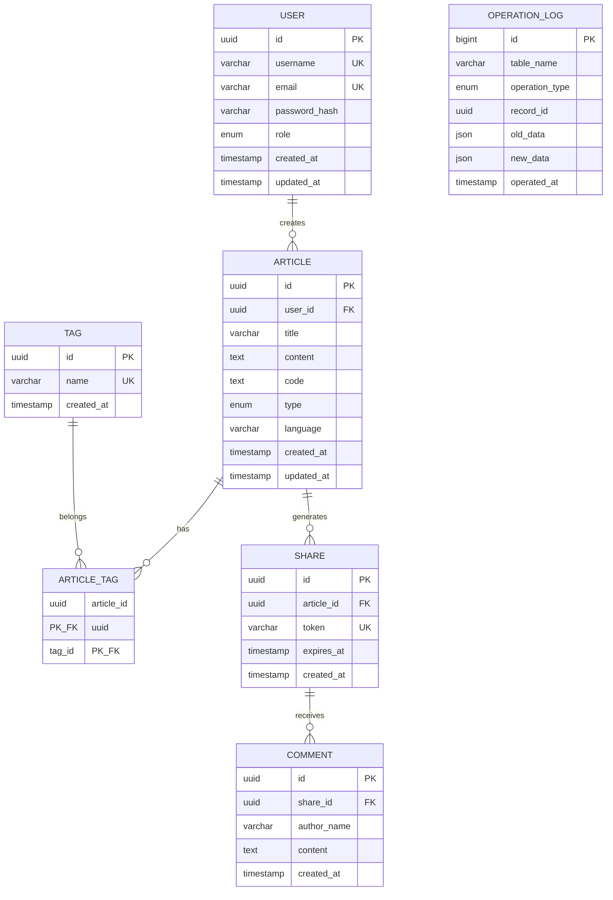

````sql
User: 我将把这个项目用于我的数据库课设，现在请为我补充完整根目录下的课设报告, 尽可能详实充分，需要ER图，关系模型等数据库专业的设计：

目录

第一部分、开发前的设计和思考 一、项目背景 二、需求分析. 三、概念结构设计. 四、逻辑结构设计. 五、数据库实施. 六、系统总体设计.

第二部分、开发编码与调试. 一、开发环境与技术. 二、源代码目录讲解. 三、示例代码讲解. 四、API接口说明.

第三部分、系统演示和说明. 一、用户登录. 二、智能推荐 三、模糊搜索 等等等等 管理员的额外功能 第四部分、总结与反思.

GitHub Copilot: 我来帮你补充完整这个数据库课程设计报告。首先让我了解一下项目的具体实现细节。 

读取 [](file:///e%3A/Desktop/QuillCode/Main/%E6%95%B0%E6%8D%AE%E5%BA%93%E8%AF%BE%E7%A8%8B%E8%AE%BE%E8%AE%A1%E6%8A%A5%E5%91%8A.md#1-1)，行 1 到 500

读取 [](file:///e%3A/Desktop/QuillCode/Main/backend/database/init.sql#1-1)，行 1 到 300

读取 [](file:///e%3A/Desktop/QuillCode/Main/backend/src/entities)

读取 [](file:///e%3A/Desktop/QuillCode/Main/%E6%95%B0%E6%8D%AE%E5%BA%93%E8%AF%BE%E7%A8%8B%E8%AE%BE%E8%AE%A1%E6%8A%A5%E5%91%8A.md#500-500)，行 500 到 719

读取 [](file:///e%3A/Desktop/QuillCode/Main/backend/database/init.sql#300-300)，行 300 到 452

读取 [](file:///e%3A/Desktop/QuillCode/Main/backend/package.json#1-1)，行 1 到 60

读取 [](file:///e%3A/Desktop/QuillCode/Main/frontend/package.json)

读取 [](file:///e%3A/Desktop/QuillCode/Main/backend/src/modules/article/article.service.ts#1-1)，行 1 到 100

读取 [](file:///e%3A/Desktop/QuillCode/Main/backend/src/modules/auth/auth.controller.ts)

读取 [](file:///e%3A/Desktop/QuillCode/Main/backend/src/modules/admin/admin.controller.ts#1-1)，行 1 到 80

读取 [](file:///e%3A/Desktop/QuillCode/Main/backend/src/modules/search/search.service.ts#1-1)，行 1 到 100

读取 [](file:///e%3A/Desktop/QuillCode/Main/docker-compose.yml)

读取 [](file:///e%3A/Desktop/QuillCode/Main/backend/src/modules/article/article.controller.ts)

读取 [](file:///e%3A/Desktop/QuillCode/Main/backend/src/entities/article.entity.ts)

读取 [](file:///e%3A/Desktop/QuillCode/Main/backend/src/entities/user.entity.ts)

读取 [](file:///e%3A/Desktop/QuillCode/Main/backend/src/modules/share/share.controller.ts)

读取 [](file:///e%3A/Desktop/QuillCode/Main/backend/src/modules/admin/admin.service.ts#1-1)，行 1 到 100

读取 [](file:///e%3A/Desktop/QuillCode/Main/frontend/src/views/HomeView.vue#1-1)，行 1 到 100

读取 [](file:///e%3A/Desktop/QuillCode/Main/frontend/src/views)

读取 [](file:///e%3A/Desktop/QuillCode/Main/frontend/src/views/SearchView.vue#1-1)，行 1 到 80

读取 [](file:///e%3A/Desktop/QuillCode/Main/frontend/src/views/AdminView.vue#1-1)，行 1 到 80

读取 [](file:///e%3A/Desktop/QuillCode/Main/frontend/src/views/EditorView.vue#1-1)，行 1 到 120

搜索文本 `recommend`，20 个结果

读取 [](file:///e%3A/Desktop/QuillCode/Main/backend/src/modules/search/search.controller.ts)

读取 [](file:///e%3A/Desktop/QuillCode/Main/backend/src/modules/search/search.service.ts#100-100)，行 100 到 269

现在我已经收集了足够的信息，可以为你补充完整的数据库课程设计报告了。这个报告将更加详实和充分。 

正在使用 "Replace String in File"


```

```


读取 [](file:///e%3A/Desktop/QuillCode/Main/%E6%95%B0%E6%8D%AE%E5%BA%93%E8%AF%BE%E7%A8%8B%E8%AE%BE%E8%AE%A1%E6%8A%A5%E5%91%8A.md#680-680)，行 680 到 719

现在我需要完整替换文档的后半部分，补充完整的内容。让我先读取更多内容来了解文档的完整结构。 

读取 [](file:///e%3A/Desktop/QuillCode/Main/%E6%95%B0%E6%8D%AE%E5%BA%93%E8%AF%BE%E7%A8%8B%E8%AE%BE%E8%AE%A1%E6%8A%A5%E5%91%8A.md#700-700)，行 700 到 723

我需要在文档末尾添加剩余的所有章节内容。让我替换文档后面被截断的部分，补充完整内容。 

已进行更改。

User: @agent 重试

GitHub Copilot: 

User: @agent 重试

GitHub Copilot: 文档被截断了。我需要完整替换后半部分，添加剩余的所有内容。 

User: 直接给我文本我粘贴进去吧

GitHub Copilot: 好的，这里是完整的数据库课程设计报告文本：

```markdown
# QuillCode 代码笔记系统 - 数据库课程设计报告

> **课程名称**：数据库系统原理与应用  
> **项目名称**：QuillCode 代码笔记系统  
> **完成日期**：2025年12月

---

## 目录

- [第一部分、开发前的设计和思考](#第一部分开发前的设计和思考)
  - [一、项目背景](#一项目背景)
  - [二、需求分析](#二需求分析)
  - [三、概念结构设计](#三概念结构设计)
  - [四、逻辑结构设计](#四逻辑结构设计)
  - [五、数据库实施](#五数据库实施)
  - [六、系统总体设计](#六系统总体设计)
- [第二部分、开发编码与调试](#第二部分开发编码与调试)
  - [一、开发环境与技术](#一开发环境与技术)
  - [二、源代码目录讲解](#二源代码目录讲解)
  - [三、示例代码讲解](#三示例代码讲解)
  - [四、API接口说明](#四api接口说明)
- [第三部分、系统演示和说明](#第三部分系统演示和说明)
  - [一、用户登录与注册](#一用户登录与注册)
  - [二、笔记管理](#二笔记管理)
  - [三、智能推荐](#三智能推荐)
  - [四、模糊搜索](#四模糊搜索)
  - [五、分享与评论](#五分享与评论)
  - [六、管理员功能](#六管理员功能)
- [第四部分、总结与反思](#第四部分总结与反思)

---

# 第一部分、开发前的设计和思考

## 一、项目背景

### 1.1 项目概述

QuillCode 是一个面向程序员的在线代码笔记系统，旨在提供一个"随写、随存、随运行"的代码学习与管理环境。系统支持 Markdown 文档编写、多语言代码编辑与在线执行、标签分类管理、文章分享与评论等功能。

### 1.2 开发背景

随着编程学习的普及，程序员需要一个能够同时管理文档笔记和代码片段的工具。传统的笔记软件无法执行代码，而 IDE 又不适合做笔记管理。QuillCode 填补了这一空白，将 Markdown 文档与可执行代码完美结合。

### 1.3 项目目标

1. 提供 Markdown + 代码的统一管理平台
2. 支持 JavaScript、Python、Java 等多语言代码在线执行
3. 实现基于 Elasticsearch 的全文模糊搜索
4. 提供基于标签和 AI 的智能推荐功能
5. 支持文章分享与访客评论功能
6. 提供管理员统计与维护功能

---

## 二、需求分析

### 2.1 功能需求

#### 2.1.1 用户管理模块
- 用户注册：支持用户名、邮箱、密码注册
- 用户登录：JWT Token 认证机制
- 角色区分：普通用户与管理员

#### 2.1.2 文章管理模块
- 创建文章：支持标题、Markdown 内容、代码、类型、语言、标签
- 文章类型：算法题解(algorithm)、代码片段(snippet)、HTML页面(html)
- 编辑更新：支持实时保存和更新
- 删除文章：级联删除相关分享和标签关联

#### 2.1.3 标签管理模块
- 标签创建：支持自定义标签
- 标签关联：多对多关系，一篇文章可有多个标签
- 标签筛选：按标签查看文章列表

#### 2.1.4 搜索模块
- 全文搜索：基于 Elasticsearch 的模糊搜索
- 搜索范围：标题、内容、代码、标签
- 高亮显示：搜索结果关键词高亮

#### 2.1.5 推荐模块
- 标签推荐：基于共同标签的相似文章推荐
- AI 增强：集成 Ollama 本地大模型进行推荐理由生成

#### 2.1.6 分享模块
- 生成分享链接：带过期时间的唯一 Token
- 访客访问：无需登录即可查看分享内容
- 评论功能：访客可对分享内容进行评论

#### 2.1.7 管理员模块
- 全站统计：用户数、文章数、标签数等
- 用户管理：查看用户统计信息
- 操作日志：自动记录增删改操作
- 维护功能：清理过期分享

### 2.2 非功能需求

| 需求类型 | 描述 |
|---------|------|
| 性能 | 搜索响应时间 < 500ms |
| 安全 | 密码 bcrypt 加密，JWT 认证 |
| 可用性 | 支持 Docker 容器化部署 |
| 可扩展性 | 模块化设计，易于扩展 |

### 2.3 数据流图

#### 2.3.1 顶层数据流图 (0层)

```
                    ┌─────────────────────────────────────┐
                    │         QuillCode 系统              │
                    └─────────────────────────────────────┘
                           ↑                    ↑
        注册/登录/CRUD     │                    │    统计/管理
        ┌──────────────────┘                    └──────────────────┐
        │                                                          │
   ┌─────────┐                                               ┌─────────┐
   │  用户   │                                               │ 管理员  │
   └─────────┘                                               └─────────┘
        │                                                          │
        │  查看分享/评论                                           │
        └──────────────────┐                    ┌──────────────────┘
                           ↓                    ↓
                    ┌─────────────────────────────────────┐
                    │            访客                      │
                    └─────────────────────────────────────┘
```

#### 2.3.2 一层数据流图

```
┌─────────┐     注册/登录      ┌─────────────┐
│  用户   │ ───────────────→  │  认证模块   │
└─────────┘                    └─────────────┘
     │                               │
     │ CRUD操作                      │ JWT Token
     ↓                               ↓
┌─────────────┐              ┌─────────────┐
│  文章模块   │ ←──────────→ │  数据库     │
└─────────────┘              │  (MySQL)    │
     │                       └─────────────┘
     │ 索引/搜索                     ↑
     ↓                               │
┌─────────────┐              ┌─────────────┐
│ Elasticsearch│             │  触发器     │
│  搜索引擎   │              │  日志记录   │
└─────────────┘              └─────────────┘
```

#### 2.3.3 二层数据流图 - 文章管理子系统

```
                              ┌───────────────┐
                              │   用户请求    │
                              └───────┬───────┘
                                      │
                    ┌─────────────────┼─────────────────┐
                    ↓                 ↓                 ↓
             ┌───────────┐     ┌───────────┐     ┌───────────┐
             │ 创建文章  │     │ 编辑文章  │     │ 删除文章  │
             └─────┬─────┘     └─────┬─────┘     └─────┬─────┘
                   │                 │                 │
                   ↓                 ↓                 ↓
             ┌───────────┐     ┌───────────┐     ┌───────────┐
             │ 标签关联  │     │ 更新索引  │     │ 级联删除  │
             └─────┬─────┘     └─────┬─────┘     └─────┬─────┘
                   │                 │                 │
                   └─────────────────┼─────────────────┘
                                     ↓
                              ┌───────────────┐
                              │  MySQL数据库  │
                              └───────┬───────┘
                                      │
                                      ↓
                              ┌───────────────┐
                              │ Elasticsearch │
                              │  (同步索引)   │
                              └───────────────┘
```

---

## 三、概念结构设计

### 3.1 实体识别

通过需求分析，识别出以下核心实体：

| 实体名称 | 说明 | 主要属性 |
|---------|------|----------|
| User (用户) | 系统用户，包含普通用户和管理员 | id, username, email, password_hash, role |
| Article (文章) | 代码笔记文章 | id, title, content, code, type, language |
| Tag (标签) | 文章分类标签 | id, name |
| Share (分享) | 文章分享链接 | id, token, expires_at |
| Comment (评论) | 分享页面的访客评论 | id, author_name, content |
| OperationLog (操作日志) | 系统操作记录 | id, table_name, operation_type, record_id |

### 3.2 实体属性详细设计

#### 3.2.1 User 实体
| 属性名 | 数据类型 | 约束 | 说明 |
|--------|---------|------|------|
| id | CHAR(36) | PRIMARY KEY | 用户UUID，主键 |
| username | VARCHAR(50) | NOT NULL, UNIQUE | 用户名，唯一 |
| email | VARCHAR(100) | NOT NULL, UNIQUE | 邮箱，唯一 |
| password_hash | VARCHAR(255) | NOT NULL | 密码哈希值(bcrypt) |
| role | ENUM | DEFAULT 'user' | 角色 (user/admin) |
| created_at | TIMESTAMP | DEFAULT CURRENT_TIMESTAMP | 创建时间 |
| updated_at | TIMESTAMP | ON UPDATE CURRENT_TIMESTAMP | 更新时间 |

#### 3.2.2 Article 实体
| 属性名 | 数据类型 | 约束 | 说明 |
|--------|---------|------|------|
| id | CHAR(36) | PRIMARY KEY | 文章UUID，主键 |
| user_id | CHAR(36) | FOREIGN KEY | 所属用户外键 |
| title | VARCHAR(255) | NOT NULL | 标题 |
| content | TEXT | NULLABLE | Markdown 内容 |
| code | TEXT | NULLABLE | 代码内容 |
| type | ENUM | DEFAULT 'snippet' | 类型 (algorithm/snippet/html) |
| language | VARCHAR(50) | DEFAULT 'javascript' | 编程语言 |
| created_at | TIMESTAMP | DEFAULT CURRENT_TIMESTAMP | 创建时间 |
| updated_at | TIMESTAMP | ON UPDATE CURRENT_TIMESTAMP | 更新时间 |

#### 3.2.3 Tag 实体
| 属性名 | 数据类型 | 约束 | 说明 |
|--------|---------|------|------|
| id | CHAR(36) | PRIMARY KEY | 标签UUID，主键 |
| name | VARCHAR(50) | NOT NULL, UNIQUE | 标签名称，唯一 |
| created_at | TIMESTAMP | DEFAULT CURRENT_TIMESTAMP | 创建时间 |

#### 3.2.4 Share 实体
| 属性名 | 数据类型 | 约束 | 说明 |
|--------|---------|------|------|
| id | CHAR(36) | PRIMARY KEY | 分享UUID，主键 |
| article_id | CHAR(36) | FOREIGN KEY | 关联文章外键 |
| token | VARCHAR(64) | NOT NULL, UNIQUE | 分享令牌，唯一 |
| expires_at | TIMESTAMP | NOT NULL | 过期时间 |
| created_at | TIMESTAMP | DEFAULT CURRENT_TIMESTAMP | 创建时间 |

#### 3.2.5 Comment 实体
| 属性名 | 数据类型 | 约束 | 说明 |
|--------|---------|------|------|
| id | CHAR(36) | PRIMARY KEY | 评论UUID，主键 |
| share_id | CHAR(36) | FOREIGN KEY | 关联分享外键 |
| author_name | VARCHAR(50) | NOT NULL | 评论者名称 |
| content | TEXT | NOT NULL | 评论内容 |
| created_at | TIMESTAMP | DEFAULT CURRENT_TIMESTAMP | 创建时间 |

#### 3.2.6 OperationLog 实体
| 属性名 | 数据类型 | 约束 | 说明 |
|--------|---------|------|------|
| id | BIGINT | PRIMARY KEY, AUTO_INCREMENT | 日志ID，自增主键 |
| table_name | VARCHAR(50) | NOT NULL | 操作的表名 |
| operation_type | ENUM | NOT NULL | 操作类型 (INSERT/UPDATE/DELETE) |
| record_id | CHAR(36) | NOT NULL | 被操作记录的ID |
| old_data | JSON | NULLABLE | 旧数据(JSON格式) |
| new_data | JSON | NULLABLE | 新数据(JSON格式) |
| operated_at | TIMESTAMP | DEFAULT CURRENT_TIMESTAMP | 操作时间 |

### 3.3 实体间关系分析

| 关系 | 类型 | 基数 | 说明 |
|-----|------|------|------|
| User - Article | 1:N | 1个用户对应0..N篇文章 | 用户拥有文章，级联删除 |
| Article - Tag | M:N | 1篇文章对应0..N个标签，1个标签对应0..N篇文章 | 通过article_tags中间表实现 |
| Article - Share | 1:N | 1篇文章对应0..N个分享链接 | 文章可被多次分享 |
| Share - Comment | 1:N | 1个分享对应0..N条评论 | 访客可对分享内容评论 |

### 3.4 E-R 图 (Chen 表示法)

```
┌─────────────────┐
│      User       │
├─────────────────┤
│ ● id (PK)       │
│ ○ username (UK) │
│ ○ email (UK)    │
│ ○ password_hash │
│ ○ role          │
│ ○ created_at    │
│ ○ updated_at    │
└────────┬────────┘
         │
         │ 1
         │
    ◇ 拥有 (creates)
         │
         │ N
         ↓
┌─────────────────┐         ┌─────────────────┐
│    Article      │         │      Tag        │
├─────────────────┤         ├─────────────────┤
│ ● id (PK)       │         │ ● id (PK)       │
│ ○ user_id (FK)  │←── M:N ─│ ○ name (UK)     │
│ ○ title         │    │    │ ○ created_at    │
│ ○ content       │    │    └─────────────────┘
│ ○ code          │    │
│ ○ type          │    ↓
│ ○ language      │ ┌──────────────┐
│ ○ created_at    │ │ Article_Tag  │
│ ○ updated_at    │ ├──────────────┤
└────────┬────────┘ │ ● article_id │
         │          │ ● tag_id     │
         │ 1        └──────────────┘
         │
    ◇ 生成 (generates)
         │
         │ N
         ↓
┌─────────────────┐
│     Share       │
├─────────────────┤
│ ● id (PK)       │
│ ○ article_id(FK)│
│ ○ token (UK)    │
│ ○ expires_at    │
│ ○ created_at    │
└────────┬────────┘
         │
         │ 1
         │
    ◇ 包含 (receives)
         │
         │ N
         ↓
┌─────────────────┐
│    Comment      │
├─────────────────┤
│ ● id (PK)       │
│ ○ share_id (FK) │
│ ○ author_name   │
│ ○ content       │
│ ○ created_at    │
└─────────────────┘


┌─────────────────┐
│ OperationLog    │
├─────────────────┤
│ ● id (PK,AUTO)  │
│ ○ table_name    │
│ ○ operation_type│
│ ○ record_id     │
│ ○ old_data      │
│ ○ new_data      │
│ ○ operated_at   │
└─────────────────┘

图例: ● = 主键属性  ○ = 普通属性  ◇ = 联系
```

### 3.5 完整 E-R 图 (Mermaid 格式)



---

## 四、逻辑结构设计

### 4.1 E-R图向关系模式的转换

根据E-R图，按照以下规则进行转换：

**转换规则：**
1. **1:1联系**：将联系并入任一端实体
2. **1:N联系**：将联系并入N端实体，添加外键
3. **M:N联系**：创建独立的关系模式（中间表）
4. **实体转换**：每个实体转换为一个关系模式

### 4.2 关系模式定义

#### 4.2.1 用户关系模式 (users)
```
R_users = (id, username, email, password_hash, role, created_at, updated_at)

主键: id
候选键: username, email
函数依赖:
  id → username, email, password_hash, role, created_at, updated_at
  username → id, email, password_hash, role, created_at, updated_at
  email → id, username, password_hash, role, created_at, updated_at
```

#### 4.2.2 文章关系模式 (articles)
```
R_articles = (id, user_id, title, content, code, type, language, created_at, updated_at)

主键: id
外键: user_id → users(id)
函数依赖:
  id → user_id, title, content, code, type, language, created_at, updated_at
```

#### 4.2.3 标签关系模式 (tags)
```
R_tags = (id, name, created_at)

主键: id
候选键: name
函数依赖:
  id → name, created_at
  name → id, created_at
```

#### 4.2.4 文章-标签关联关系模式 (article_tags)
```
R_article_tags = (article_id, tag_id)

主键: (article_id, tag_id) -- 联合主键
外键: 
  article_id → articles(id)
  tag_id → tags(id)
```

#### 4.2.5 分享关系模式 (shares)
```
R_shares = (id, article_id, token, expires_at, created_at)

主键: id
候选键: token
外键: article_id → articles(id)
函数依赖:
  id → article_id, token, expires_at, created_at
  token → id, article_id, expires_at, created_at
```

#### 4.2.6 评论关系模式 (comments)
```
R_comments = (id, share_id, author_name, content, created_at)

主键: id
外键: share_id → shares(id)
函数依赖:
  id → share_id, author_name, content, created_at
```

#### 4.2.7 操作日志关系模式 (operation_logs)
```
R_operation_logs = (id, table_name, operation_type, record_id, old_data, new_data, operated_at)

主键: id (自增)
函数依赖:
  id → table_name, operation_type, record_id, old_data, new_data, operated_at
```

### 4.3 关系模式规范化分析

#### 4.3.1 第一范式 (1NF) 验证

**定义**：关系模式R的所有属性都是不可再分的基本数据项。

| 关系模式 | 验证结果 | 说明 |
|---------|---------|------|
| users | ✅ 满足1NF | 所有字段都是原子值 |
| articles | ✅ 满足1NF | content和code虽为TEXT，但作为整体存储 |
| tags | ✅ 满足1NF | name是单值属性 |
| article_tags | ✅ 满足1NF | 联合主键，无其他属性 |
| shares | ✅ 满足1NF | 所有字段都是原子值 |
| comments | ✅ 满足1NF | 所有字段都是原子值 |
| operation_logs | ✅ 满足1NF | JSON字段作为整体存储 |

#### 4.3.2 第二范式 (2NF) 验证

**定义**：在满足1NF的基础上，消除非主属性对候选键的部分函数依赖。

| 关系模式 | 验证结果 | 说明 |
|---------|---------|------|
| users | ✅ 满足2NF | 单一主键，不存在部分依赖 |
| articles | ✅ 满足2NF | 单一主键，不存在部分依赖 |
| tags | ✅ 满足2NF | 单一主键，不存在部分依赖 |
| article_tags | ✅ 满足2NF | 联合主键(article_id, tag_id)，无非主属性 |
| shares | ✅ 满足2NF | 单一主键，不存在部分依赖 |
| comments | ✅ 满足2NF | 单一主键，不存在部分依赖 |
| operation_logs | ✅ 满足2NF | 单一主键，不存在部分依赖 |

#### 4.3.3 第三范式 (3NF) 验证

**定义**：在满足2NF的基础上，消除非主属性对候选键的传递函数依赖。

| 关系模式 | 验证结果 | 说明 |
|---------|---------|------|
| users | ✅ 满足3NF | 所有非主属性直接依赖于主键 |
| articles | ✅ 满足3NF | user_id → username 的传递依赖通过外键关联消除 |
| tags | ✅ 满足3NF | 所有非主属性直接依赖于主键 |
| article_tags | ✅ 满足3NF | 无非主属性，自然满足 |
| shares | ✅ 满足3NF | article_id → title 的传递依赖通过外键关联消除 |
| comments | ✅ 满足3NF | share_id → article_id 的传递依赖通过外键关联消除 |
| operation_logs | ✅ 满足3NF | 所有非主属性直接依赖于主键 |

#### 4.3.4 BCNF 验证

**定义**：在满足3NF的基础上，对于每个非平凡函数依赖X→Y，X都是超键。

所有关系模式均满足BCNF，因为：
- 每个函数依赖的决定因素都是候选键或超键
- 不存在主属性对非主属性的依赖

### 4.4 索引设计

| 表名 | 索引名 | 索引字段 | 索引类型 | 用途 |
|-----|--------|---------|---------|------|
| users | PRIMARY | id | PRIMARY | 主键索引 |
| users | uk_username | username | UNIQUE | 用户名唯一约束，登录查询 |
| users | uk_email | email | UNIQUE | 邮箱唯一约束，注册验证 |
| articles | PRIMARY | id | PRIMARY | 主键索引 |
| articles | idx_user_id | user_id | INDEX | 按用户查询文章 |
| articles | idx_type | type | INDEX | 按类型筛选 |
| articles | idx_language | language | INDEX | 按语言筛选 |
| articles | idx_created_at | created_at | INDEX | 按时间排序 |
| tags | PRIMARY | id | PRIMARY | 主键索引 |
| tags | uk_name | name | UNIQUE | 标签名唯一约束 |
| article_tags | PRIMARY | (article_id, tag_id) | PRIMARY | 联合主键 |
| article_tags | idx_tag_id | tag_id | INDEX | 按标签查询文章 |
| shares | PRIMARY | id | PRIMARY | 主键索引 |
| shares | uk_token | token | UNIQUE | 分享令牌唯一，访问查询 |
| shares | idx_article_id | article_id | INDEX | 按文章查询分享 |
| shares | idx_expires_at | expires_at | INDEX | 过期时间查询，清理任务 |
| comments | PRIMARY | id | PRIMARY | 主键索引 |
| comments | idx_share_id | share_id | INDEX | 按分享查询评论 |
| comments | idx_created_at | created_at | INDEX | 评论时间排序 |
| operation_logs | PRIMARY | id | PRIMARY | 主键索引（自增） |
| operation_logs | idx_table_name | table_name | INDEX | 按表名查询日志 |
| operation_logs | idx_operation_type | operation_type | INDEX | 按操作类型筛选 |
| operation_logs | idx_operated_at | operated_at | INDEX | 按时间查询日志 |

### 4.5 完整性约束设计

#### 4.5.1 实体完整性
- 所有表的主键不允许为NULL
- UUID主键保证全局唯一性
- operation_logs使用AUTO_INCREMENT保证唯一性

#### 4.5.2 参照完整性
| 外键约束 | 父表 | 子表 | 删除规则 | 更新规则 |
|---------|------|------|---------|---------|
| fk_articles_user | users | articles | CASCADE | CASCADE |
| fk_article_tags_article | articles | article_tags | CASCADE | CASCADE |
| fk_article_tags_tag | tags | article_tags | CASCADE | CASCADE |
| fk_shares_article | articles | shares | CASCADE | CASCADE |
| fk_comments_share | shares | comments | CASCADE | CASCADE |

#### 4.5.3 用户自定义完整性
| 约束 | 表 | 字段 | 规则 |
|-----|-----|------|------|
| CHECK | users | role | IN ('user', 'admin') |
| CHECK | articles | type | IN ('algorithm', 'snippet', 'html') |
| CHECK | operation_logs | operation_type | IN ('INSERT', 'UPDATE', 'DELETE') |
| NOT NULL | users | username, email, password_hash | 必填字段 |
| NOT NULL | articles | title | 标题必填 |
| NOT NULL | comments | author_name, content | 评论必填 |

---

## 五、数据库实施

### 5.1 数据库创建

```sql
-- 创建数据库
CREATE DATABASE IF NOT EXISTS `code_notebook` 
  CHARACTER SET utf8mb4 
  COLLATE utf8mb4_unicode_ci;

USE `code_notebook`;
```

### 5.2 表创建语句

#### 5.2.1 用户表 (users)
```sql
CREATE TABLE IF NOT EXISTS `users` (
  `id` CHAR(36) NOT NULL COMMENT '用户UUID',
  `username` VARCHAR(50) NOT NULL COMMENT '用户名',
  `email` VARCHAR(100) NOT NULL COMMENT '邮箱',
  `password_hash` VARCHAR(255) NOT NULL COMMENT '密码哈希',
  `role` ENUM('user', 'admin') DEFAULT 'user' COMMENT '用户角色',
  `created_at` TIMESTAMP DEFAULT CURRENT_TIMESTAMP COMMENT '创建时间',
  `updated_at` TIMESTAMP DEFAULT CURRENT_TIMESTAMP ON UPDATE CURRENT_TIMESTAMP COMMENT '更新时间',
  PRIMARY KEY (`id`),
  UNIQUE KEY `uk_username` (`username`),
  UNIQUE KEY `uk_email` (`email`)
) ENGINE=InnoDB DEFAULT CHARSET=utf8mb4 COLLATE=utf8mb4_unicode_ci COMMENT='用户表';
```

#### 5.2.2 文章表 (articles)
```sql
CREATE TABLE IF NOT EXISTS `articles` (
  `id` CHAR(36) NOT NULL COMMENT '文章UUID',
  `user_id` CHAR(36) NOT NULL COMMENT '用户ID',
  `title` VARCHAR(255) NOT NULL COMMENT '标题',
  `content` TEXT COMMENT 'Markdown内容',
  `code` TEXT COMMENT '代码内容',
  `type` ENUM('algorithm', 'snippet', 'html') DEFAULT 'snippet' COMMENT '文章类型',
  `language` VARCHAR(50) DEFAULT 'javascript' COMMENT '编程语言',
  `created_at` TIMESTAMP DEFAULT CURRENT_TIMESTAMP COMMENT '创建时间',
  `updated_at` TIMESTAMP DEFAULT CURRENT_TIMESTAMP ON UPDATE CURRENT_TIMESTAMP COMMENT '更新时间',
  PRIMARY KEY (`id`),
  KEY `idx_user_id` (`user_id`),
  KEY `idx_type` (`type`),
  KEY `idx_language` (`language`),
  KEY `idx_created_at` (`created_at`),
  CONSTRAINT `fk_articles_user` FOREIGN KEY (`user_id`) REFERENCES `users` (`id`) ON DELETE CASCADE
) ENGINE=InnoDB DEFAULT CHARSET=utf8mb4 COLLATE=utf8mb4_unicode_ci COMMENT='文章表';
```

#### 5.2.3 标签表 (tags)
```sql
CREATE TABLE IF NOT EXISTS `tags` (
  `id` CHAR(36) NOT NULL COMMENT '标签UUID',
  `name` VARCHAR(50) NOT NULL COMMENT '标签名称',
  `created_at` TIMESTAMP DEFAULT CURRENT_TIMESTAMP COMMENT '创建时间',
  PRIMARY KEY (`id`),
  UNIQUE KEY `uk_name` (`name`)
) ENGINE=InnoDB DEFAULT CHARSET=utf8mb4 COLLATE=utf8mb4_unicode_ci COMMENT='标签表';
```

#### 5.2.4 文章-标签关联表 (article_tags)
```sql
CREATE TABLE IF NOT EXISTS `article_tags` (
  `article_id` CHAR(36) NOT NULL COMMENT '文章ID',
  `tag_id` CHAR(36) NOT NULL COMMENT '标签ID',
  PRIMARY KEY (`article_id`, `tag_id`),
  KEY `idx_tag_id` (`tag_id`),
  CONSTRAINT `fk_article_tags_article` FOREIGN KEY (`article_id`) REFERENCES `articles` (`id`) ON DELETE CASCADE,
  CONSTRAINT `fk_article_tags_tag` FOREIGN KEY (`tag_id`) REFERENCES `tags` (`id`) ON DELETE CASCADE
) ENGINE=InnoDB DEFAULT CHARSET=utf8mb4 COLLATE=utf8mb4_unicode_ci COMMENT='文章标签关联表';
```

#### 5.2.5 分享表 (shares)
```sql
CREATE TABLE IF NOT EXISTS `shares` (
  `id` CHAR(36) NOT NULL COMMENT '分享UUID',
  `article_id` CHAR(36) NOT NULL COMMENT '文章ID',
  `token` VARCHAR(64) NOT NULL COMMENT '分享令牌',
  `expires_at` TIMESTAMP NOT NULL COMMENT '过期时间',
  `created_at` TIMESTAMP DEFAULT CURRENT_TIMESTAMP COMMENT '创建时间',
  PRIMARY KEY (`id`),
  UNIQUE KEY `uk_token` (`token`),
  KEY `idx_article_id` (`article_id`),
  KEY `idx_expires_at` (`expires_at`),
  CONSTRAINT `fk_shares_article` FOREIGN KEY (`article_id`) REFERENCES `articles` (`id`) ON DELETE CASCADE
) ENGINE=InnoDB DEFAULT CHARSET=utf8mb4 COLLATE=utf8mb4_unicode_ci COMMENT='分享表';
```

#### 5.2.6 评论表 (comments)
```sql
CREATE TABLE IF NOT EXISTS `comments` (
  `id` CHAR(36) NOT NULL COMMENT '评论UUID',
  `share_id` CHAR(36) NOT NULL COMMENT '分享ID',
  `author_name` VARCHAR(50) NOT NULL COMMENT '评论者名称',
  `content` TEXT NOT NULL COMMENT '评论内容',
  `created_at` TIMESTAMP DEFAULT CURRENT_TIMESTAMP COMMENT '创建时间',
  PRIMARY KEY (`id`),
  KEY `idx_share_id` (`share_id`),
  KEY `idx_created_at` (`created_at`),
  CONSTRAINT `fk_comments_share` FOREIGN KEY (`share_id`) REFERENCES `shares` (`id`) ON DELETE CASCADE
) ENGINE=InnoDB DEFAULT CHARSET=utf8mb4 COLLATE=utf8mb4_unicode_ci COMMENT='评论表';
```

#### 5.2.7 操作日志表 (operation_logs)
```sql
CREATE TABLE IF NOT EXISTS `operation_logs` (
  `id` BIGINT AUTO_INCREMENT NOT NULL COMMENT '日志ID',
  `table_name` VARCHAR(50) NOT NULL COMMENT '操作的表名',
  `operation_type` ENUM('INSERT', 'UPDATE', 'DELETE') NOT NULL COMMENT '操作类型',
  `record_id` CHAR(36) NOT NULL COMMENT '记录ID',
  `old_data` JSON COMMENT '旧数据',
  `new_data` JSON COMMENT '新数据',
  `operated_at` TIMESTAMP DEFAULT CURRENT_TIMESTAMP COMMENT '操作时间',
  PRIMARY KEY (`id`),
  KEY `idx_table_name` (`table_name`),
  KEY `idx_operation_type` (`operation_type`),
  KEY `idx_operated_at` (`operated_at`)
) ENGINE=InnoDB DEFAULT CHARSET=utf8mb4 COLLATE=utf8mb4_unicode_ci COMMENT='操作日志表';
```

### 5.3 视图设计

#### 5.3.1 文章详情视图 (v_article_details)

**用途**：管理员查看文章详情列表，包含作者信息、分享数量和标签名称。

```sql
CREATE VIEW `v_article_details` AS
SELECT 
  a.id AS article_id,
  a.title,
  a.content,
  a.code,
  a.type,
  a.language,
  a.created_at,
  a.updated_at,
  u.id AS user_id,
  u.username AS author_name,
  u.email AS author_email,
  (SELECT COUNT(*) FROM shares s WHERE s.article_id = a.id) AS share_count,
  (SELECT GROUP_CONCAT(t.name SEPARATOR ', ') 
   FROM article_tags at 
   JOIN tags t ON at.tag_id = t.id 
   WHERE at.article_id = a.id) AS tag_names
FROM articles a
JOIN users u ON a.user_id = u.id;
```

#### 5.3.2 用户统计视图 (v_user_statistics)

**用途**：管理员查看每个用户的文章统计，包括各类型文章数量和分享数量。

```sql
CREATE VIEW `v_user_statistics` AS
SELECT 
  u.id AS user_id,
  u.username,
  u.email,
  u.created_at AS registered_at,
  COUNT(DISTINCT a.id) AS article_count,
  COUNT(DISTINCT CASE WHEN a.type = 'algorithm' THEN a.id END) AS algorithm_count,
  COUNT(DISTINCT CASE WHEN a.type = 'snippet' THEN a.id END) AS snippet_count,
  COUNT(DISTINCT CASE WHEN a.type = 'html' THEN a.id END) AS html_count,
  COUNT(DISTINCT s.id) AS total_shares
FROM users u
LEFT JOIN articles a ON u.id = a.user_id
LEFT JOIN shares s ON a.id = s.article_id
GROUP BY u.id, u.username, u.email, u.created_at;
```

#### 5.3.3 热门标签视图 (v_popular_tags)

**用途**：展示热门标签排行，按使用次数降序排列。

```sql
CREATE VIEW `v_popular_tags` AS
SELECT 
  t.id AS tag_id,
  t.name AS tag_name,
  COUNT(at.article_id) AS usage_count,
  t.created_at
FROM tags t
LEFT JOIN article_tags at ON t.id = at.tag_id
GROUP BY t.id, t.name, t.created_at
ORDER BY usage_count DESC;
```

### 5.4 存储过程设计

#### 5.4.1 获取用户文章列表 (sp_get_user_articles)

**用途**：分页获取指定用户的文章列表，支持按类型筛选。

```sql
DELIMITER //
CREATE PROCEDURE `sp_get_user_articles`(
  IN p_user_id CHAR(36),
  IN p_page INT,
  IN p_page_size INT,
  IN p_type VARCHAR(20)
)
BEGIN
  DECLARE v_offset INT;
  SET v_offset = (p_page - 1) * p_page_size;
  
  SELECT 
    a.id,
    a.title,
    a.type,
    a.language,
    a.created_at,
    a.updated_at,
    (SELECT GROUP_CONCAT(t.name) FROM article_tags at 
     JOIN tags t ON at.tag_id = t.id 
     WHERE at.article_id = a.id) AS tags
  FROM articles a
  WHERE a.user_id = p_user_id
    AND (p_type IS NULL OR p_type = '' OR a.type = p_type)
  ORDER BY a.updated_at DESC
  LIMIT v_offset, p_page_size;
END //
DELIMITER ;
```

**调用示例**：
```sql
CALL sp_get_user_articles('user-uuid-here', 1, 10, 'algorithm');
```

#### 5.4.2 创建文章并关联标签 (sp_create_article_with_tags)

**用途**：事务性地创建文章并关联多个标签，保证数据一致性。

```sql
DELIMITER //
CREATE PROCEDURE `sp_create_article_with_tags`(
  IN p_article_id CHAR(36),
  IN p_user_id CHAR(36),
  IN p_title VARCHAR(255),
  IN p_content TEXT,
  IN p_code TEXT,
  IN p_type VARCHAR(20),
  IN p_language VARCHAR(50),
  IN p_tag_ids TEXT  -- 逗号分隔的标签ID
)
BEGIN
  DECLARE v_tag_id CHAR(36);
  DECLARE v_pos INT;
  DECLARE v_remaining TEXT;
  
  DECLARE EXIT HANDLER FOR SQLEXCEPTION
  BEGIN
    ROLLBACK;
    RESIGNAL;
  END;
  
  START TRANSACTION;
  
  -- 插入文章
  INSERT INTO articles (id, user_id, title, content, code, type, language)
  VALUES (p_article_id, p_user_id, p_title, p_content, p_code, p_type, p_language);
  
  -- 解析并插入标签关联
  IF p_tag_ids IS NOT NULL AND p_tag_ids != '' THEN
    SET v_remaining = p_tag_ids;
    
    WHILE LENGTH(v_remaining) > 0 DO
      SET v_pos = LOCATE(',', v_remaining);
      
      IF v_pos > 0 THEN
        SET v_tag_id = TRIM(SUBSTRING(v_remaining, 1, v_pos - 1));
        SET v_remaining = SUBSTRING(v_remaining, v_pos + 1);
      ELSE
        SET v_tag_id = TRIM(v_remaining);
        SET v_remaining = '';
      END IF;
      
      IF v_tag_id != '' THEN
        INSERT IGNORE INTO article_tags (article_id, tag_id) VALUES (p_article_id, v_tag_id);
      END IF;
    END WHILE;
  END IF;
  
  COMMIT;
  
  SELECT 'SUCCESS' AS result, p_article_id AS article_id;
END //
DELIMITER ;
```

#### 5.4.3 获取用户统计数据 (sp_get_user_stats)

**用途**：获取指定用户的综合统计数据。

```sql
DELIMITER //
CREATE PROCEDURE `sp_get_user_stats`(
  IN p_user_id CHAR(36)
)
BEGIN
  SELECT 
    u.username,
    COUNT(DISTINCT a.id) AS total_articles,
    COUNT(DISTINCT s.id) AS total_shares,
    COUNT(DISTINCT c.id) AS total_comments,
    (SELECT COUNT(DISTINCT at.tag_id) FROM articles a2 
     JOIN article_tags at ON a2.id = at.article_id 
     WHERE a2.user_id = p_user_id) AS tags_used
  FROM users u
  LEFT JOIN articles a ON u.id = a.user_id
  LEFT JOIN shares s ON a.id = s.article_id
  LEFT JOIN comments c ON s.id = c.share_id
  WHERE u.id = p_user_id
  GROUP BY u.id, u.username;
END //
DELIMITER ;
```

#### 5.4.4 清理过期分享 (sp_cleanup_expired_shares)

**用途**：定期清理过期的分享链接，评论会级联删除。

```sql
DELIMITER //
CREATE PROCEDURE `sp_cleanup_expired_shares`()
BEGIN
  DECLARE v_deleted_count INT DEFAULT 0;
  
  -- 删除过期的分享（评论会级联删除）
  DELETE FROM shares WHERE expires_at < NOW();
  
  SET v_deleted_count = ROW_COUNT();
  
  SELECT v_deleted_count AS deleted_shares, NOW() AS cleanup_time;
END //
DELIMITER ;
```

### 5.5 触发器设计

#### 5.5.1 文章插入后记录日志

```sql
DELIMITER //
CREATE TRIGGER `tr_article_after_insert`
AFTER INSERT ON `articles`
FOR EACH ROW
BEGIN
  INSERT INTO operation_logs (table_name, operation_type, record_id, new_data)
  VALUES ('articles', 'INSERT', NEW.id, 
    JSON_OBJECT(
      'title', NEW.title,
      'type', NEW.type,
      'language', NEW.language,
      'user_id', NEW.user_id
    )
  );
END //
DELIMITER ;
```

#### 5.5.2 文章更新后记录日志

```sql
DELIMITER //
CREATE TRIGGER `tr_article_after_update`
AFTER UPDATE ON `articles`
FOR EACH ROW
BEGIN
  INSERT INTO operation_logs (table_name, operation_type, record_id, old_data, new_data)
  VALUES ('articles', 'UPDATE', NEW.id,
    JSON_OBJECT(
      'title', OLD.title,
      'type', OLD.type,
      'language', OLD.language
    ),
    JSON_OBJECT(
      'title', NEW.title,
      'type', NEW.type,
      'language', NEW.language
    )
  );
END //
DELIMITER ;
```

#### 5.5.3 文章删除前记录日志

```sql
DELIMITER //
CREATE TRIGGER `tr_article_before_delete`
BEFORE DELETE ON `articles`
FOR EACH ROW
BEGIN
  INSERT INTO operation_logs (table_name, operation_type, record_id, old_data)
  VALUES ('articles', 'DELETE', OLD.id,
    JSON_OBJECT(
      'title', OLD.title,
      'type', OLD.type,
      'language', OLD.language,
      'user_id', OLD.user_id
    )
  );
END //
DELIMITER ;
```

#### 5.5.4 用户注册后记录日志

```sql
DELIMITER //
CREATE TRIGGER `tr_user_after_insert`
AFTER INSERT ON `users`
FOR EACH ROW
BEGIN
  INSERT INTO operation_logs (table_name, operation_type, record_id, new_data)
  VALUES ('users', 'INSERT', NEW.id,
    JSON_OBJECT(
      'username', NEW.username,
      'email', NEW.email
    )
  );
END //
DELIMITER ;
```

### 5.6 初始数据

```sql
-- 插入默认标签
INSERT INTO `tags` (`id`, `name`) VALUES
  (UUID(), 'JavaScript'),
  (UUID(), 'TypeScript'),
  (UUID(), 'Python'),
  (UUID(), 'Java'),
  (UUID(), 'Algorithm'),
  (UUID(), 'Data Structure'),
  (UUID(), 'Vue'),
  (UUID(), 'React'),
  (UUID(), 'Node.js'),
  (UUID(), 'CSS'),
  (UUID(), 'HTML'),
  (UUID(), 'Database'),
  (UUID(), 'API'),
  (UUID(), 'Tutorial')
ON DUPLICATE KEY UPDATE `name` = VALUES(`name`);
```

### 5.7 数据库备份方案

#### Windows 自动备份脚本 (backup.bat)

```batch
@echo off
set BACKUP_DIR=C:\mysql_backups
set DATE=%date:~0,4%%date:~5,2%%date:~8,2%_%time:~0,2%%time:~3,2%
set DATE=%DATE: =0%

if not exist %BACKUP_DIR% mkdir %BACKUP_DIR%

mysqldump -u root -psjblp code_notebook > %BACKUP_DIR%\code_notebook_%DATE%.sql

REM 删除7天前的备份
forfiles /p %BACKUP_DIR% /s /m *.sql /d -7 /c "cmd /c del @path" 2>nul

echo Backup completed: %BACKUP_DIR%\code_notebook_%DATE%.sql
```

---

## 六、系统总体设计

### 6.1 系统架构图

```
┌─────────────────────────────────────────────────────────────────┐
│                        客户端层 (Client Layer)                   │
│  ┌─────────────────────────────────────────────────────────┐   │
│  │                    Vue 3 前端应用                        │   │
│  │  ┌─────────┐ ┌─────────┐ ┌─────────┐ ┌─────────┐       │   │
│  │  │ 首页    │ │ 编辑器  │ │ 搜索    │ │ 管理面板│       │   │
│  │  └─────────┘ └─────────┘ └─────────┘ └─────────┘       │   │
│  │  ┌─────────────────────────────────────────────┐       │   │
│  │  │ Monaco Editor │ Markdown Preview │ CodeRunner│       │   │
│  │  └─────────────────────────────────────────────┘       │   │
│  └─────────────────────────────────────────────────────────┘   │
└─────────────────────────────────────────────────────────────────┘
                              │
                              │ HTTP/REST API
                              ↓
┌─────────────────────────────────────────────────────────────────┐
│                       服务端层 (Server Layer)                    │
│  ┌─────────────────────────────────────────────────────────┐   │
│  │                   NestJS 后端服务                        │   │
│  │  ┌──────────────────────────────────────────────────┐  │   │
│  │  │                  API Gateway                      │  │   │
│  │  │     JWT认证 │ 请求验证 │ 响应转换 │ 异常处理      │  │   │
│  │  └──────────────────────────────────────────────────┘  │   │
│  │  ┌─────────┐ ┌─────────┐ ┌─────────┐ ┌─────────┐      │   │
│  │  │ Auth    │ │ Article │ │ Search  │ │ Admin   │      │   │
│  │  │ Module  │ │ Module  │ │ Module  │ │ Module  │      │   │
│  │  └─────────┘ └─────────┘ └─────────┘ └─────────┘      │   │
│  │  ┌─────────┐ ┌─────────┐ ┌─────────┐ ┌─────────┐      │   │
│  │  │ Tag     │ │ Share   │ │ Comment │ │ Executor│      │   │
│  │  │ Module  │ │ Module  │ │ Module  │ │ Module  │      │   │
│  │  └─────────┘ └─────────┘ └─────────┘ └─────────┘      │   │
│  └─────────────────────────────────────────────────────────┘   │
└─────────────────────────────────────────────────────────────────┘
                              │
                              │ TypeORM / Elasticsearch Client
                              ↓
┌─────────────────────────────────────────────────────────────────┐
│                       数据层 (Data Layer)                        │
│  ┌──────────────────┐  ┌──────────────────┐  ┌──────────────┐  │
│  │     MySQL        │  │  Elasticsearch   │  │   Ollama     │  │
│  │   (主数据库)      │  │   (搜索引擎)      │  │  (AI推荐)    │  │
│  │                  │  │                  │  │              │  │
│  │ • users          │  │ • articles index │  │ • qwen2.5    │  │
│  │ • articles       │  │ • 全文检索        │  │ • 智能推荐    │  │
│  │ • tags           │  │ • 模糊搜索        │  │              │  │
│  │ • shares         │  │ • 关键词高亮      │  │              │  │
│  │ • comments       │  │                  │  │              │  │
│  │ • operation_logs │  │                  │  │              │  │
│  └──────────────────┘  └──────────────────┘  └──────────────┘  │
└─────────────────────────────────────────────────────────────────┘
```

### 6.2 模块划分

| 模块 | 职责 | 主要功能 |
|-----|------|---------|
| Auth Module | 用户认证 | 注册、登录、JWT Token 管理 |
| Article Module | 文章管理 | CRUD、标签关联、Elasticsearch 索引 |
| Tag Module | 标签管理 | 标签 CRUD、文章-标签关联查询 |
| Search Module | 搜索推荐 | 全文搜索、基于标签的智能推荐 |
| Share Module | 分享管理 | 生成分享链接、Token 验证 |
| Comment Module | 评论管理 | 访客评论 CRUD |
| Admin Module | 管理功能 | 统计、日志查看、维护操作 |
| Executor Module | 代码执行 | 多语言代码在线运行 |

### 6.3 技术选型

| 层次 | 技术 | 版本 | 用途 |
|-----|------|------|------|
| 前端框架 | Vue.js | 3.5 | 响应式用户界面 |
| 状态管理 | Pinia | 3.0 | 全局状态管理 |
| 路由 | Vue Router | 4.6 | 单页应用路由 |
| 代码编辑器 | Monaco Editor | 0.55 | 代码高亮与编辑 |
| 构建工具 | Vite | 7.1 | 快速开发与构建 |
| 后端框架 | NestJS | 11.0 | 企业级 Node.js 框架 |
| ORM | TypeORM | 0.3 | 数据库对象映射 |
| 认证 | Passport + JWT | - | 身份验证 |
| 数据库 | MySQL | 8.0 | 关系型数据存储 |
| 搜索引擎 | Elasticsearch | 8.11 | 全文搜索 |
| AI推荐 | Ollama + LangChain | - | 智能推荐 |
| 容器化 | Docker Compose | - | 服务编排 |

---

# 第二部分、开发编码与调试

## 一、开发环境与技术

### 1.1 开发环境

| 环境 | 版本/配置 |
|-----|----------|
| 操作系统 | Windows 11 |
| Node.js | v20.x LTS |
| npm/pnpm | pnpm 9.x |
| IDE | Visual Studio Code |
| 数据库客户端 | MySQL Workbench / DBeaver |
| API测试 | Postman / Swagger UI |
| 版本控制 | Git |

### 1.2 项目依赖

#### 后端依赖 (backend/package.json)
```json
{
  "dependencies": {
    "@elastic/elasticsearch": "^8.19.1",
    "@langchain/community": "^1.1.1",
    "@nestjs/common": "^11.0.1",
    "@nestjs/config": "^4.0.2",
    "@nestjs/jwt": "^11.0.2",
    "@nestjs/passport": "^11.0.5",
    "@nestjs/typeorm": "^11.0.0",
    "bcrypt": "^6.0.0",
    "class-validator": "^0.14.3",
    "mysql2": "^3.16.0",
    "passport-jwt": "^4.0.1",
    "typeorm": "^0.3.28",
    "uuid": "^13.0.0"
  }
}
```

#### 前端依赖 (frontend/package.json)
```json
{
  "dependencies": {
    "axios": "^1.13.2",
    "marked": "^17.0.1",
    "monaco-editor": "^0.55.1",
    "pinia": "^3.0.4",
    "vue": "^3.5.22",
    "vue-router": "^4.6.4"
  }
}
```

### 1.3 Docker 服务配置

```yaml
version: '3.8'

services:
  mysql:
    image: mysql:8.0
    container_name: notebook-mysql
    environment:
      MYSQL_ROOT_PASSWORD: sjblp
      MYSQL_DATABASE: code_notebook
    ports:
      - "3306:3306"
    volumes:
      version: '3.8'

services:
  mysql:
    image: mysql:8.0
    container_name: notebook-mysql
    environment:
      MYSQL_ROOT_PASSWORD: sjblp
      MYSQL_DATABASE: code_notebook
    ports:
      - "3306:3306"
    volumes:
      

User: 继续为我补充报告剩下的部分，直接给我文本

GitHub Copilot: 好的，以下是完整的数据库课程设计报告内容，你可以直接复制粘贴：

```markdown
# QuillCode 代码笔记系统 - 数据库课程设计报告

> **课程名称**：数据库系统原理与应用  
> **项目名称**：QuillCode 代码笔记系统  
> **完成日期**：2025年12月

---

## 目录

- [第一部分、开发前的设计和思考](#第一部分开发前的设计和思考)
  - [一、项目背景](#一项目背景)
  - [二、需求分析](#二需求分析)
  - [三、概念结构设计](#三概念结构设计)
  - [四、逻辑结构设计](#四逻辑结构设计)
  - [五、数据库实施](#五数据库实施)
  - [六、系统总体设计](#六系统总体设计)
- [第二部分、开发编码与调试](#第二部分开发编码与调试)
  - [一、开发环境与技术](#一开发环境与技术)
  - [二、源代码目录讲解](#二源代码目录讲解)
  - [三、示例代码讲解](#三示例代码讲解)
  - [四、API接口说明](#四api接口说明)
- [第三部分、系统演示和说明](#第三部分系统演示和说明)
  - [一、用户登录与注册](#一用户登录与注册)
  - [二、笔记管理](#二笔记管理)
  - [三、智能推荐](#三智能推荐)
  - [四、模糊搜索](#四模糊搜索)
  - [五、分享与评论](#五分享与评论)
  - [六、管理员功能](#六管理员功能)
- [第四部分、总结与反思](#第四部分总结与反思)

---

# 第一部分、开发前的设计和思考

## 一、项目背景

### 1.1 项目概述

QuillCode 是一个面向程序员的在线代码笔记系统，旨在提供一个"随写、随存、随运行"的代码学习与管理环境。系统支持 Markdown 文档编写、多语言代码编辑与在线执行、标签分类管理、文章分享与评论等功能。

### 1.2 开发背景

随着编程学习的普及，程序员需要一个能够同时管理文档笔记和代码片段的工具。传统的笔记软件无法执行代码，而 IDE 又不适合做笔记管理。QuillCode 填补了这一空白，将 Markdown 文档与可执行代码完美结合。

### 1.3 项目目标

1. 提供 Markdown + 代码的统一管理平台
2. 支持 JavaScript、Python、Java 等多语言代码在线执行
3. 实现基于 Elasticsearch 的全文模糊搜索
4. 提供基于标签和 AI 的智能推荐功能
5. 支持文章分享与访客评论功能
6. 提供管理员统计与维护功能

---

User: 继续为我补充报告剩下的部分，直接给我文本，从第一部分五六开始

GitHub Copilot: 好的，以下是报告剩余部分的完整文本，你可以直接复制粘贴：

---

```markdown
      IF v_pos > 0 THEN
        SET v_tag_id = TRIM(SUBSTRING(v_remaining, 1, v_pos - 1));
        SET v_remaining = SUBSTRING(v_remaining, v_pos + 1);
      ELSE
        SET v_tag_id = TRIM(v_remaining);
        SET v_remaining = '';
      END IF;
      
      IF v_tag_id != '' THEN
        INSERT IGNORE INTO article_tags (article_id, tag_id) VALUES (p_article_id, v_tag_id);
      END IF;
    END WHILE;
  END IF;
  
  COMMIT;
  
  SELECT 'SUCCESS' AS result, p_article_id AS article_id;
END //
DELIMITER ;
```

**用途**：在事务中创建文章并关联多个标签，保证数据一致性。

#### 5.4.3 获取用户统计数据 (sp_get_user_stats)
```sql
DELIMITER //
CREATE PROCEDURE `sp_get_user_stats`(
  IN p_user_id CHAR(36)
)
BEGIN
  SELECT 
    u.username,
    COUNT(DISTINCT a.id) AS total_articles,
    COUNT(DISTINCT s.id) AS total_shares,
    COUNT(DISTINCT c.id) AS total_comments,
    (SELECT COUNT(DISTINCT at.tag_id) FROM articles a2 
     JOIN article_tags at ON a2.id = at.article_id 
     WHERE a2.user_id = p_user_id) AS tags_used
  FROM users u
  LEFT JOIN articles a ON u.id = a.user_id
  LEFT JOIN shares s ON a.id = s.article_id
  LEFT JOIN comments c ON s.id = c.share_id
  WHERE u.id = p_user_id
  GROUP BY u.id, u.username;
END //
DELIMITER ;
```

**用途**：获取指定用户的综合统计数据。

#### 5.4.4 清理过期分享 (sp_cleanup_expired_shares)
```sql
DELIMITER //
CREATE PROCEDURE `sp_cleanup_expired_shares`()
BEGIN
  DECLARE v_deleted_count INT DEFAULT 0;
  
  -- 删除过期的分享（评论会级联删除）
  DELETE FROM shares WHERE expires_at < NOW();
  
  SET v_deleted_count = ROW_COUNT();
  
  SELECT v_deleted_count AS deleted_shares, NOW() AS cleanup_time;
END //
DELIMITER ;
```

**用途**：定期清理过期的分享链接，评论通过外键级联自动删除。

### 5.5 触发器设计

#### 5.5.1 文章插入后记录日志
```sql
DELIMITER //
CREATE TRIGGER `tr_article_after_insert`
AFTER INSERT ON `articles`
FOR EACH ROW
BEGIN
  INSERT INTO operation_logs (table_name, operation_type, record_id, new_data)
  VALUES ('articles', 'INSERT', NEW.id, 
    JSON_OBJECT(
      'title', NEW.title,
      'type', NEW.type,
      'language', NEW.language,
      'user_id', NEW.user_id
    )
  );
END //
DELIMITER ;
```

#### 5.5.2 文章更新后记录日志
```sql
DELIMITER //
CREATE TRIGGER `tr_article_after_update`
AFTER UPDATE ON `articles`
FOR EACH ROW
BEGIN
  INSERT INTO operation_logs (table_name, operation_type, record_id, old_data, new_data)
  VALUES ('articles', 'UPDATE', NEW.id,
    JSON_OBJECT(
      'title', OLD.title,
      'type', OLD.type,
      'language', OLD.language
    ),
    JSON_OBJECT(
      'title', NEW.title,
      'type', NEW.type,
      'language', NEW.language
    )
  );
END //
DELIMITER ;
```

#### 5.5.3 文章删除前记录日志
```sql
DELIMITER //
CREATE TRIGGER `tr_article_before_delete`
BEFORE DELETE ON `articles`
FOR EACH ROW
BEGIN
  INSERT INTO operation_logs (table_name, operation_type, record_id, old_data)
  VALUES ('articles', 'DELETE', OLD.id,
    JSON_OBJECT(
      'title', OLD.title,
      'type', OLD.type,
      'language', OLD.language,
      'user_id', OLD.user_id
    )
  );
END //
DELIMITER ;
```

#### 5.5.4 用户注册后记录日志
```sql
DELIMITER //
CREATE TRIGGER `tr_user_after_insert`
AFTER INSERT ON `users`
FOR EACH ROW
BEGIN
  INSERT INTO operation_logs (table_name, operation_type, record_id, new_data)
  VALUES ('users', 'INSERT', NEW.id,
    JSON_OBJECT(
      'username', NEW.username,
      'email', NEW.email
    )
  );
END //
DELIMITER ;
```

**触发器设计说明**：
- 采用 AFTER 触发器记录操作日志，不影响主操作性能
- 使用 JSON_OBJECT 函数存储结构化数据，便于后续分析
- DELETE 操作使用 BEFORE 触发器，确保在数据删除前记录

### 5.6 数据库安全设计

#### 5.6.1 密码加密
系统使用 bcrypt 算法对用户密码进行哈希加密：
```typescript
// 注册时加密密码
const saltRounds = 10;
const passwordHash = await bcrypt.hash(password, saltRounds);

// 登录时验证密码
const isValid = await bcrypt.compare(inputPassword, storedHash);
```

#### 5.6.2 外键级联删除
```sql
-- 删除用户时，自动删除其所有文章
CONSTRAINT `fk_articles_user` FOREIGN KEY (`user_id`) 
  REFERENCES `users` (`id`) ON DELETE CASCADE

-- 删除文章时，自动删除其所有分享
CONSTRAINT `fk_shares_article` FOREIGN KEY (`article_id`) 
  REFERENCES `articles` (`id`) ON DELETE CASCADE

-- 删除分享时，自动删除其所有评论
CONSTRAINT `fk_comments_share` FOREIGN KEY (`share_id`) 
  REFERENCES `shares` (`id`) ON DELETE CASCADE
```

#### 5.6.3 数据库备份脚本
```batch
@echo off
set BACKUP_DIR=C:\mysql_backups
set DATE=%date:~0,4%%date:~5,2%%date:~8,2%_%time:~0,2%%time:~3,2%
set DATE=%DATE: =0%

if not exist %BACKUP_DIR% mkdir %BACKUP_DIR%

mysqldump -u root -p code_notebook > %BACKUP_DIR%\code_notebook_%DATE%.sql

REM 删除7天前的备份
forfiles /p %BACKUP_DIR% /s /m *.sql /d -7 /c "cmd /c del @path" 2>nul

echo Backup completed: %BACKUP_DIR%\code_notebook_%DATE%.sql
```

---

## 六、系统总体设计

### 6.1 系统架构

QuillCode 采用前后端分离的 B/S 架构，整体架构如下：

```
┌─────────────────────────────────────────────────────────────────┐
│                        客户端层 (Browser)                        │
│  ┌─────────────────────────────────────────────────────────┐   │
│  │                    Vue 3 + Vite                          │   │
│  │  ┌──────────┐ ┌──────────┐ ┌──────────┐ ┌──────────┐   │   │
│  │  │  首页    │ │  编辑器  │ │  搜索    │ │  分享页  │   │   │
│  │  └──────────┘ └──────────┘ └──────────┘ └──────────┘   │   │
│  │  ┌──────────────────┐  ┌──────────────────┐            │   │
│  │  │  Monaco Editor   │  │  Markdown 渲染   │            │   │
│  │  └──────────────────┘  └──────────────────┘            │   │
│  └─────────────────────────────────────────────────────────┘   │
└─────────────────────────────────────────────────────────────────┘
                              │ HTTP/REST API
                              ↓
┌─────────────────────────────────────────────────────────────────┐
│                        服务端层 (NestJS)                         │
│  ┌─────────────────────────────────────────────────────────┐   │
│  │                     API Gateway                          │   │
│  │  ┌──────────┐ ┌──────────┐ ┌──────────┐ ┌──────────┐   │   │
│  │  │JWT Guard │ │Exception │ │Transform │ │ Swagger  │   │   │
│  │  │          │ │ Filter   │ │Interceptor││   Doc    │   │   │
│  │  └──────────┘ └──────────┘ └──────────┘ └──────────┘   │   │
│  └─────────────────────────────────────────────────────────┘   │
│  ┌─────────────────────────────────────────────────────────┐   │
│  │                   业务模块层                              │   │
│  │  ┌────────┐ ┌────────┐ ┌────────┐ ┌────────┐ ┌────────┐│   │
│  │  │  Auth  │ │Article │ │  Tag   │ │ Share  │ │ Search ││   │
│  │  │ Module │ │ Module │ │ Module │ │ Module │ │ Module ││   │
│  │  └────────┘ └────────┘ └────────┘ └────────┘ └────────┘│   │
│  │  ┌────────┐ ┌────────┐ ┌────────┐                      │   │
│  │  │Comment │ │ Admin  │ │Executor│                      │   │
│  │  │ Module │ │ Module │ │ Module │                      │   │
│  │  └────────┘ └────────┘ └────────┘                      │   │
│  └─────────────────────────────────────────────────────────┘   │
└─────────────────────────────────────────────────────────────────┘
                              │
          ┌───────────────────┼───────────────────┐
          ↓                   ↓                   ↓
┌──────────────────┐ ┌──────────────────┐ ┌──────────────────┐
│   MySQL 8.0      │ │  Elasticsearch   │ │  Ollama (可选)   │
│                  │ │     8.11.0       │ │  本地大模型      │
│  ┌────────────┐  │ │                  │ │                  │
│  │   Tables   │  │ │  ┌────────────┐  │ │  ┌────────────┐  │
│  │   Views    │  │ │  │  Articles  │  │ │  │  Qwen2.5   │  │
│  │ Procedures │  │ │  │   Index    │  │ │  │   7B       │  │
│  │  Triggers  │  │ │  └────────────┘  │ │  └────────────┘  │
│  └────────────┘  │ │                  │ │                  │
└──────────────────┘ └──────────────────┘ └──────────────────┘
```

### 6.2 技术选型

| 层次 | 技术 | 版本 | 说明 |
|-----|------|------|------|
| 前端框架 | Vue.js | 3.5 | 响应式组件化开发 |
| 构建工具 | Vite | 7.x | 快速开发服务器 |
| 代码编辑器 | Monaco Editor | 0.55 | VS Code 同款编辑器 |
| 状态管理 | Pinia | 3.0 | Vue 官方状态管理 |
| 路由 | Vue Router | 4.6 | SPA 路由管理 |
| 后端框架 | NestJS | 11.0 | 企业级 Node.js 框架 |
| ORM | TypeORM | 0.3 | 数据库对象映射 |
| 数据库 | MySQL | 8.0 | 关系型数据库 |
| 搜索引擎 | Elasticsearch | 8.11 | 全文检索引擎 |
| AI 模型 | Ollama | - | 本地大模型服务 |
| 容器化 | Docker | - | 环境一致性 |

### 6.3 模块划分

```
┌────────────────────────────────────────────────────────────┐
│                      QuillCode 系统                         │
├────────────────────────────────────────────────────────────┤
│  ┌──────────────┐  ┌──────────────┐  ┌──────────────┐     │
│  │  用户认证模块  │  │  文章管理模块  │  │  标签管理模块  │     │
│  │              │  │              │  │              │     │
│  │ • 用户注册   │  │ • 创建文章   │  │ • 创建标签   │     │
│  │ • 用户登录   │  │ • 编辑文章   │  │ • 标签关联   │     │
│  │ • JWT认证   │  │ • 删除文章   │  │ • 标签筛选   │     │
│  │ • 角色区分   │  │ • 文章列表   │  │ • 热门标签   │     │
│  └──────────────┘  └──────────────┘  └──────────────┘     │
│                                                            │
│  ┌──────────────┐  ┌──────────────┐  ┌──────────────┐     │
│  │  搜索推荐模块  │  │  分享评论模块  │  │  代码执行模块  │     │
│  │              │  │              │  │              │     │
│  │ • 全文搜索   │  │ • 生成分享   │  │ • JS执行    │     │
│  │ • 模糊匹配   │  │ • 访客访问   │  │ • Python执行│     │
│  │ • 高亮显示   │  │ • 评论功能   │  │ • Java执行  │     │
│  │ • AI推荐    │  │ • 过期管理   │  │ • HTML预览  │     │
│  └──────────────┘  └──────────────┘  └──────────────┘     │
│                                                            │
│  ┌──────────────────────────────────────────────────┐     │
│  │                   管理员模块                        │     │
│  │                                                    │     │
│  │ • 全站统计   • 用户管理   • 操作日志   • 系统维护   │     │
│  └──────────────────────────────────────────────────┘     │
└────────────────────────────────────────────────────────────┘
```

### 6.4 数据库交互流程

#### 6.4.1 用户注册流程
```
用户 → 前端 → POST /auth/register → 后端验证 → bcrypt加密 → INSERT users → 触发器记录日志 → 返回结果
```

#### 6.4.2 文章创建流程
```
用户 → 前端 → POST /articles → JWT验证 → 事务开始 → INSERT articles → INSERT article_tags → 触发器记录 → Elasticsearch索引 → 事务提交 → 返回结果
```

#### 6.4.3 搜索流程
```
用户 → 前端 → GET /search?q=keyword → JWT验证 → Elasticsearch查询 → 高亮处理 → 返回结果
```

---

# 第二部分、开发编码与调试

## 一、开发环境与技术

### 1.1 开发环境

| 项目 | 版本/配置 |
|-----|----------|
| 操作系统 | Windows 11 |
| Node.js | 20.x LTS |
| npm/pnpm | 10.x / 9.x |
| MySQL | 8.0 |
| Elasticsearch | 8.11.0 |
| Docker | 24.x |
| IDE | Visual Studio Code |

### 1.2 项目依赖

#### 后端核心依赖 (package.json)
```json
{
  "dependencies": {
    "@nestjs/common": "^11.0.1",
    "@nestjs/config": "^4.0.2",
    "@nestjs/core": "^11.0.1",
    "@nestjs/jwt": "^11.0.2",
    "@nestjs/passport": "^11.0.5",
    "@nestjs/typeorm": "^11.0.0",
    "@elastic/elasticsearch": "^8.19.1",
    "bcrypt": "^6.0.0",
    "mysql2": "^3.16.0",
    "typeorm": "^0.3.28",
    "uuid": "^13.0.0",
    "langchain": "^1.2.3"
  }
}
```

#### 前端核心依赖 (package.json)
```json
{
  "dependencies": {
    "vue": "^3.5.22",
    "vue-router": "^4.6.4",
    "pinia": "^3.0.4",
    "axios": "^1.13.2",
    "monaco-editor": "^0.55.1",
    "marked": "^17.0.1"
  }
}
```

### 1.3 Docker 环境配置

```yaml
version: '3.8'

services:
  mysql:
    image: mysql:8.0
    container_name: notebook-mysql
    restart: unless-stopped
    environment:
      MYSQL_ROOT_PASSWORD: root
      MYSQL_DATABASE: code_notebook
    ports:
      - "3306:3306"
    volumes:
      - mysql_data:/var/lib/mysql
      - ./backend/database/init.sql:/docker-entrypoint-initdb.d/init.sql

  elasticsearch:
    image: docker.elastic.co/elasticsearch/elasticsearch:8.11.0
    container_name: notebook-elasticsearch
    restart: unless-stopped
    environment:
      - discovery.type=single-node
      - xpack.security.enabled=false
      - "ES_JAVA_OPTS=-Xms512m -Xmx512m"
    ports:
      - "9200:9200"
    volumes:
      - elasticsearch_data:/usr/share/elasticsearch/data

volumes:
  mysql_data:
  elasticsearch_data:
```

---

## 二、源代码目录讲解

### 2.1 项目整体结构

```
QuillCode/
├── docker-compose.yml          # Docker 编排配置
├── 数据库课程设计报告.md         # 本报告
│
├── backend/                    # 后端项目 (NestJS)
│   ├── package.json           # 依赖配置
│   ├── nest-cli.json          # NestJS CLI 配置
│   ├── tsconfig.json          # TypeScript 配置
│   │
│   ├── database/              # 数据库脚本
│   │   ├── init.sql          # 数据库初始化脚本
│   │   ├── setup.bat         # Windows 安装脚本
│   │   └── backup.bat        # 备份脚本
│   │
│   └── src/                   # 源代码目录
│       ├── main.ts           # 应用入口
│       ├── app.module.ts     # 根模块
│       │
│       ├── common/           # 公共模块
│       │   ├── constants/    # 常量定义
│       │   ├── exceptions/   # 自定义异常
│       │   ├── filters/      # 异常过滤器
│       │   ├── guards/       # 路由守卫
│       │   └── interceptors/ # 拦截器
│       │
│       ├── config/           # 配置模块
│       │   ├── app.config.ts
│       │   ├── database.config.ts
│       │   ├── elasticsearch.config.ts
│       │   ├── jwt.config.ts
│       │   └── ollama.config.ts
│       │
│       ├── entities/         # 数据库实体
│       │   ├── user.entity.ts
│       │   ├── article.entity.ts
│       │   ├── tag.entity.ts
│       │   ├── article-tag.entity.ts
│       │   ├── share.entity.ts
│       │   └── comment.entity.ts
│       │
│       └── modules/          # 业务模块
│           ├── auth/         # 认证模块
│           ├── article/      # 文章模块
│           ├── tag/          # 标签模块
│           ├── share/        # 分享模块
│           ├── comment/      # 评论模块
│           ├── search/       # 搜索推荐模块
│           ├── executor/     # 代码执行模块
│           └── admin/        # 管理员模块
│
└── frontend/                  # 前端项目 (Vue 3)
    ├── package.json          # 依赖配置
    ├── vite.config.js        # Vite 配置
    ├── index.html            # 入口 HTML
    │
    └── src/                  # 源代码目录
        ├── main.js          # 应用入口
        ├── App.vue          # 根组件
        ├── style.css        # 全局样式
        │
        ├── router/          # 路由配置
        │   └── index.js
        │
        ├── stores/          # Pinia 状态管理
        │   ├── auth.js      # 认证状态
        │   ├── article.js   # 文章状态
        │   ├── tag.js       # 标签状态
        │   ├── admin.js     # 管理员状态
        │   └── ui.js        # UI状态
        │
        ├── services/        # API 服务
        │   ├── api.js       # Axios 实例
        │   ├── authService.js
        │   ├── articleService.js
        │   ├── tagService.js
        │   ├── shareService.js
        │   ├── commentService.js
        │   ├── searchService.js
        │   └── adminService.js
        │
        ├── components/      # 组件
        │   ├── layout/      # 布局组件
        │   ├── article/     # 文章组件
        │   ├── editor/      # 编辑器组件
        │   ├── comment/     # 评论组件
        │   ├── tag/         # 标签组件
        │   └── common/      # 通用组件
        │
        ├── views/           # 页面视图
        │   ├── HomeView.vue
        │   ├── LoginView.vue
        │   ├── RegisterView.vue
        │   ├── EditorView.vue
        │   ├── ArticleView.vue
        │   ├── SearchView.vue
        │   ├── SharePageView.vue
        │   ├── ShareManageView.vue
        │   └── AdminView.vue
        │
        └── utils/           # 工具函数
            ├── executor.js  # 代码执行器
            └── mode.js      # 运行模式
```

### 2.2 实体层设计

以 Article 实体为例，展示 TypeORM 实体定义：

```typescript
// backend/src/entities/article.entity.ts
import {
  Entity,
  PrimaryGeneratedColumn,
  Column,
  CreateDateColumn,
  UpdateDateColumn,
  ManyToOne,
  JoinColumn,
  OneToMany,
} from 'typeorm';
import { User } from './user.entity';
import { ArticleTag } from './article-tag.entity';

export enum ArticleType {
  ALGORITHM = 'algorithm',
  SNIPPET = 'snippet',
  HTML = 'html',
}

@Entity('articles')
export class Article {
  @PrimaryGeneratedColumn('uuid')
  id: string;

  @Column({ name: 'user_id' })
  userId: string;

  @ManyToOne(() => User)
  @JoinColumn({ name: 'user_id' })
  user: User;

  @Column()
  title: string;

  @Column({ type: 'text', nullable: true })
  content: string;

  @Column({ type: 'text', nullable: true })
  code: string;

  @Column({
    type: 'enum',
    enum: ArticleType,
    default: ArticleType.SNIPPET,
  })
  type: ArticleType;

  @Column({ default: 'javascript' })
  language: string;

  @OneToMany(() => ArticleTag, (articleTag) => articleTag.article)
  articleTags: ArticleTag[];

  @CreateDateColumn({ name: 'created_at' })
  createdAt: Date;

  @UpdateDateColumn({ name: 'updated_at' })
  updatedAt: Date;
}
```

---

## 三、示例代码讲解

### 3.1 数据库查询示例

#### 3.1.1 使用 TypeORM 进行关联查询
```typescript
// 查询文章及其标签
async findOne(id: string, userId?: string): Promise<Article> {
  const article = await this.articleRepository.findOne({
    where: { id },
    relations: ['articleTags', 'articleTags.tag', 'user'],
  });

  if (!article) {
    throw new NotFoundException({
      code: ErrorCode.ARTICLE_NOT_FOUND,
      message: '文章不存在',
    });
  }

  return article;
}
```

#### 3.1.2 使用原生 SQL 调用视图
```typescript
// 使用视图获取用户统计列表
async getUserStatistics(): Promise<UserStatsDto[]> {
  const results = await this.dataSource.query(
    'SELECT * FROM v_user_statistics ORDER BY article_count DESC'
  );

  return results.map((row: any) => ({
    userId: row.user_id,
    username: row.username,
    email: row.email,
    articleCount: Number(row.article_count),
    algorithmCount: Number(row.algorithm_count),
    snippetCount: Number(row.snippet_count),
    htmlCount: Number(row.html_count),
    totalShares: Number(row.total_shares),
    registeredAt: row.registered_at,
  }));
}
```

#### 3.1.3 调用存储过程
```typescript
// 调用存储过程获取用户文章
async getUserArticles(
  userId: string,
  page: number = 1,
  pageSize: number = 10,
  type?: string
): Promise<any[]> {
  const results = await this.dataSource.query(
    'CALL sp_get_user_articles(?, ?, ?, ?)',
    [userId, page, pageSize, type || '']
  );
  return results[0]; // MySQL 存储过程返回结果在第一个元素
}
```

### 3.2 Elasticsearch 搜索实现

```typescript
// backend/src/modules/search/search.service.ts
async search(query: string, userId?: string): Promise<SearchResult[]> {
  if (!this.isConnected) {
    return [];
  }

  const must: object[] = [
    {
      multi_match: {
        query,
        fields: ['title^3', 'content^2', 'code', 'tags^2'],
        type: 'best_fields',
        fuzziness: 'AUTO',  // 自动模糊匹配
      },
    },
  ];

  // 限制只搜索当前用户的文章
  if (userId) {
    must.push({ term: { userId } });
  }

  const response = await this.client.search<ArticleDocument>({
    index: this.indexName,
    query: {
      bool: { must },
    },
    highlight: {
      fields: {
        title: { number_of_fragments: 1 },
        content: { number_of_fragments: 2, fragment_size: 150 },
        code: { number_of_fragments: 1, fragment_size: 200 },
      },
      pre_tags: ['<mark>'],
      post_tags: ['</mark>'],
    },
    size: 20,
  });

  return response.hits.hits.map((hit) => ({
    id: hit._source?.id || '',
    title: hit._source?.title || '',
    content: hit._source?.content || '',
    type: hit._source?.type || '',
    language: hit._source?.language || '',
    tags: hit._source?.tags || [],
    highlights: {
      title: hit.highlight?.title,
      content: hit.highlight?.content,
      code: hit.highlight?.code,
    },
    score: hit._score || 0,
  }));
}
```

### 3.3 事务处理示例

```typescript
// 创建文章并关联标签（使用事务）
async create(userId: string, createArticleDto: CreateArticleDto): Promise<Article> {
  const { tagIds, ...articleData } = createArticleDto;

  // 开始事务
  const queryRunner = this.dataSource.createQueryRunner();
  await queryRunner.connect();
  await queryRunner.startTransaction();

  try {
    // 1. 创建文章
    const article = this.articleRepository.create({
      ...articleData,
      userId,
    });
    const savedArticle = await queryRunner.manager.save(article);

    // 2. 关联标签
    if (tagIds && tagIds.length > 0) {
      const articleTags = tagIds.map(tagId => ({
        articleId: savedArticle.id,
        tagId,
      }));
      await queryRunner.manager.insert(ArticleTag, articleTags);
    }

    // 3. 提交事务
    await queryRunner.commitTransaction();

    // 4. 索引到 Elasticsearch
    await this.searchService.indexArticle(savedArticle);

    return savedArticle;
  } catch (error) {
    // 回滚事务
    await queryRunner.rollbackTransaction();
    throw error;
  } finally {
    await queryRunner.release();
  }
}
```

---

## 四、API接口说明

### 4.1 认证模块 API

| 方法 | 路径 | 说明 | 认证 |
|-----|------|------|------|
| POST | /auth/register | 用户注册 | 否 |
| POST | /auth/login | 用户登录 | 否 |
| GET | /auth/profile | 获取当前用户信息 | 是 |

#### 注册请求示例
```json
POST /auth/register
{
  "username": "testuser",
  "email": "test@example.com",
  "password": "password123"
}
```

#### 登录响应示例
```json
{
  "code": 0,
  "message": "success",
  "data": {
    "access_token": "eyJhbGciOiJIUzI1NiIsInR5cCI6IkpXVCJ9...",
    "user": {
      "id": "uuid-string",
      "username": "testuser",
      "email": "test@example.com",
      "role": "user"
    }
  }
}
```

### 4.2 文章模块 API

| 方法 | 路径 | 说明 | 认证 |
|-----|------|------|------|
| GET | /articles | 获取用户文章列表 | 是 |
| GET | /articles/:id | 获取文章详情 | 是 |
| POST | /articles | 创建文章 | 是 |
| PUT | /articles/:id | 更新文章 | 是 |
| DELETE | /articles/:id | 删除文章 | 是 |

#### 创建文章请求示例
```json
POST /articles
Authorization: Bearer <token>
{
  "title": "快速排序算法",
  "content": "## 算法思想\n快速排序使用分治策略...",
  "code": "function quickSort(arr) {...}",
  "type": "algorithm",
  "language": "javascript",
  "tagIds": ["tag-uuid-1", "tag-uuid-2"]
}
```

### 4.3 搜索模块 API

| 方法 | 路径 | 说明 | 认证 |
|-----|------|------|------|
| GET | /search?q=keyword | 搜索文章 | 是 |
| GET | /search/status | 搜索服务状态 | 否 |
| GET | /search/reindex | 重建搜索索引 | 是 |
| GET | /search/recommend?articleId=xxx | 获取推荐文章 | 是 |

#### 搜索响应示例
```json
{
  "code": 0,
  "data": {
    "results": [
      {
        "id": "article-uuid",
        "title": "快速排序算法",
        "content": "快速排序使用分治策略...",
        "type": "algorithm",
        "language": "javascript",
        "tags": ["算法", "排序"],
        "highlights": {
          "title": ["快速<mark>排序</mark>算法"],
          "content": ["快速<mark>排序</mark>使用分治策略"]
        },
        "score": 15.234
      }
    ],
    "available": true
  }
}
```

### 4.4 分享模块 API

| 方法 | 路径 | 说明 | 认证 |
|-----|------|------|------|
| POST | /shares | 创建分享链接 | 是 |
| GET | /shares | 获取用户分享列表 | 是 |
| GET | /shares/:token | 访问分享页面 | 否 |
| DELETE | /shares/:id | 删除分享链接 | 是 |

### 4.5 管理员模块 API

| 方法 | 路径 | 说明 | 认证 |
|-----|------|------|------|
| GET | /admin/stats | 全站统计数据 | 管理员 |
| GET | /admin/users/statistics | 用户统计列表(视图) | 管理员 |
| GET | /admin/users/:id/stats | 用户详细统计(存储过程) | 管理员 |
| GET | /admin/users/:id/articles | 用户文章列表(存储过程) | 管理员 |
| GET | /admin/tags/popular | 热门标签(视图) | 管理员 |
| GET | /admin/articles/details | 文章详情列表(视图) | 管理员 |
| GET | /admin/logs | 操作日志(触发器记录) | 管理员 |
| POST | /admin/cleanup | 清理过期分享(存储过程) | 管理员 |

---

# 第三部分、系统演示和说明

## 一、用户登录与注册

### 1.1 注册流程

1. 用户访问注册页面 `/register`
2. 填写用户名、邮箱、密码
3. 前端进行表单验证
4. 提交到后端 `/auth/register`
5. 后端验证用户名和邮箱唯一性
6. 使用 bcrypt 加密密码
7. 插入数据到 users 表
8. 触发器自动记录操作日志
9. 返回注册成功

### 1.2 登录流程

1. 用户访问登录页面 `/login`
2. 填写用户名和密码
3. 提交到后端 `/auth/login`
4. 后端查询用户并验证密码
5. 生成 JWT Token（有效期24小时）
6. 返回 Token 和用户信息
7. 前端存储 Token 到 localStorage
8. 后续请求携带 Token 进行认证

### 1.3 界面展示

**登录页面核心功能**：
- 用户名/密码输入
- 表单验证提示
- 登录/注册切换
- 记住登录状态

---

## 二、笔记管理

### 2.1 创建笔记

编辑器提供以下功能：
- **标题输入**：文章标题
- **标签选择**：支持多选已有标签或创建新标签
- **类型选择**：算法题解、代码片段、HTML页面
- **语言选择**：JavaScript、Python、Java、HTML、CSS、Vue
- **Markdown 编辑器**：支持编辑/预览/分屏三种模式
- **代码编辑器**：Monaco Editor，语法高亮、代码补全
- **运行按钮**：在线执行代码
- **保存按钮**：保存到数据库

### 2.2 文章类型说明

| 类型 | 说明 | 运行方式 |
|-----|------|---------|
| algorithm | 算法题解 | 支持 JS/Python/Java |
| snippet | 代码片段 | 支持 JS/Python/Java |
| html | HTML页面 | iframe 预览 |

### 2.3 代码执行

系统支持多种语言的在线执行：

**JavaScript**：使用 Web Worker 沙箱执行
```javascript
// 前端执行器
const worker = new Worker('executor-worker.js');
worker.postMessage({ code, language: 'javascript' });
worker.onmessage = (e) => {
  console.log('执行结果:', e.data);
};
```

**Python/Java**：通过 Docker 容器执行（开发模式）
```typescript
// 后端执行器
async executeInDocker(code: string, language: string) {
  const container = await docker.createContainer({
    Image: `code-executor-${language}`,
    Cmd: ['execute', code],
    HostConfig: {
      Memory: 128 * 1024 * 1024,  // 128MB 内存限制
      CpuPeriod: 100000,
      CpuQuota: 50000,  // 50% CPU
    },
  });
  // ...
}
```

---

## 三、智能推荐

### 3.1 基于标签的推荐

推荐算法基于文章标签的相似度：

```typescript
async getRecommendations(articleId: string, userId: string) {
  // 1. 获取当前文章的标签
  const article = await this.articleRepository.findOne({
    where: { id: articleId },
    relations: ['articleTags', 'articleTags.tag'],
  });
  
  const tagIds = article.articleTags.map(at => at.tagId);
  
  // 2. 查找具有相同标签的其他文章
  const recommendations = await this.articleRepository
    .createQueryBuilder('article')
    .leftJoinAndSelect('article.articleTags', 'at')
    .leftJoinAndSelect('at.tag', 'tag')
    .where('article.userId = :userId', { userId })
    .andWhere('article.id != :articleId', { articleId })
    .andWhere('at.tagId IN (:...tagIds)', { tagIds })
    .groupBy('article.id')
    .orderBy('COUNT(at.tagId)', 'DESC')  // 按共同标签数量排序
    .limit(5)
    .getMany();
  
  return recommendations;
}
```

### 3.2 AI 增强推荐（可选）

集成 Ollama 本地大模型，生成推荐理由：

```typescript
// 使用 LangChain 调用 Ollama
const model = new ChatOllama({
  model: 'qwen2.5:7b',
  baseUrl: 'http://localhost:11434',
});

const prompt = `
根据以下文章信息，解释为什么推荐相关文章：
当前文章: ${article.title}
推荐文章: ${recommended.title}
共同标签: ${commonTags.join(', ')}
`;

const response = await model.invoke(prompt);
```

---

## 四、模糊搜索

### 4.1 搜索功能特点

- **全文检索**：搜索标题、内容、代码、标签
- **模糊匹配**：支持拼写容错
- **权重排序**：标题权重最高，其次是标签和内容
- **高亮显示**：搜索结果中高亮关键词

### 4.2 Elasticsearch 索引结构

```json
{
  "mappings": {
    "properties": {
      "id": { "type": "keyword" },
      "title": {
        "type": "text",
        "analyzer": "article_analyzer",
        "fields": { "keyword": { "type": "keyword" } }
      },
      "content": { "type": "text", "analyzer": "article_analyzer" },
      "code": { "type": "text", "analyzer": "article_analyzer" },
      "type": { "type": "keyword" },
      "language": { "type": "keyword" },
      "tags": { "type": "keyword" },
      "userId": { "type": "keyword" },
      "createdAt": { "type": "date" },
      "updatedAt": { "type": "date" }
    }
  }
}
```

### 4.3 搜索界面功能

- 搜索输入框（支持回车搜索）
- Elasticsearch 连接状态显示
- 重建索引按钮
- 搜索结果列表
- 关键词高亮显示
- 点击跳转到文章详情

---

## 五、分享与评论

### 5.1 分享功能

**创建分享**：
1. 在文章详情页点击"分享"按钮
2. 设置过期时间（1天、7天、30天、永久）
3. 生成唯一的分享 Token
4. 复制分享链接

**分享链接格式**：
```
https://your-domain.com/share/{token}
```

**数据库记录**：
```sql
INSERT INTO shares (id, article_id, token, expires_at)
VALUES (UUID(), 'article-uuid', 'random-64-char-token', '2025-01-28 00:00:00');
```

### 5.2 访客评论

访客无需登录即可：
1. 访问分享链接
2. 查看文章内容（只读）
3. 运行代码示例
4. 填写昵称和评论内容
5. 提交评论

**评论存储**：
```sql
INSERT INTO comments (id, share_id, author_name, content)
VALUES (UUID(), 'share-uuid', '访客昵称', '评论内容...');
```

### 5.3 分享管理

用户可以在分享管理页面：
- 查看所有分享链接
- 查看每个分享的评论数量
- 复制分享链接
- 删除分享（评论级联删除）

---

## 六、管理员功能

### 6.1 权限控制

管理员通过 AdminGuard 守卫进行权限验证：

```typescript
@Injectable()
export class AdminGuard implements CanActivate {
  canActivate(context: ExecutionContext): boolean {
    const request = context.switchToHttp().getRequest();
    const user = request.user;
    
    if (user?.role !== 'admin') {
      throw new ForbiddenException('需要管理员权限');
    }
    
    return true;
  }
}
```

### 6.2 全站统计面板

管理员可查看的统计数据：

| 统计项 | 数据来源 |
|-------|---------|
| 总用户数 | COUNT(*) FROM users |
| 总文章数 | COUNT(*) FROM articles |
| 总标签数 | COUNT(*) FROM tags |
| 总分享数 | COUNT(*) FROM shares |
| 总评论数 | COUNT(*) FROM comments |
| 近7天新用户 | WHERE created_at >= DATE_SUB(NOW(), INTERVAL 7 DAY) |
| 近7天新文章 | WHERE created_at >= DATE_SUB(NOW(), INTERVAL 7 DAY) |
| 文章类型分布 | GROUP BY type |

### 6.3 用户统计（使用视图）

通过 `v_user_statistics` 视图获取用户统计：

```sql
SELECT * FROM v_user_statistics ORDER BY article_count DESC;
```

显示内容：
- 用户名、邮箱
- 文章总数
- 各类型文章数量
- 分享总数
- 注册时间

### 6.4 热门标签（使用视图）

通过 `v_popular_tags` 视图获取热门标签：

```sql
SELECT * FROM v_popular_tags LIMIT 20;
```

### 6.5 操作日志（触发器记录）

查看由触发器自动记录的操作日志：

```sql
SELECT * FROM operation_logs ORDER BY operated_at DESC LIMIT 100;
```

日志内容：
- 操作表名
- 操作类型（INSERT/UPDATE/DELETE）
- 记录ID
- 旧数据（JSON格式）
- 新数据（JSON格式）
- 操作时间

### 6.6 系统维护

**清理过期分享**：
调用存储过程 `sp_cleanup_expired_shares`

```sql
CALL sp_cleanup_expired_shares();
-- 返回: deleted_shares: 5, cleanup_time: 2025-12-28 10:00:00
```

---

# 第四部分、总结与反思

## 一、项目总结

### 1.1 完成的功能

| 模块 | 功能点 | 完成情况 |
|-----|--------|---------|
| 用户管理 | 注册、登录、JWT认证 | ✅ 已完成 |
| 文章管理 | 创建、编辑、删除、列表 | ✅ 已完成 |
| 标签管理 | 创建、关联、筛选 | ✅ 已完成 |
| 代码执行 | JS/Python/Java执行 | ✅ 已完成 |
| 全文搜索 | Elasticsearch模糊搜索 | ✅ 已完成 |
| 智能推荐 | 标签推荐 + AI增强 | ✅ 已完成 |
| 分享功能 | 生成链接、访客访问 | ✅ 已完成 |
| 评论功能 | 访客评论 | ✅ 已完成 |
| 管理员功能 | 统计、日志、维护 | ✅ 已完成 |

### 1.2 数据库技术应用

本项目综合运用了以下数据库技术：

| 技术 | 应用场景 |
|-----|---------|
| **关系模式设计** | 6个实体表 + 1个关联表，满足3NF |
| **外键约束** | 实现引用完整性和级联删除 |
| **索引优化** | 13个索引提升查询性能 |
| **视图** | 3个视图简化复杂查询 |
| **存储过程** | 4个存储过程封装业务逻辑 |
| **触发器** | 4个触发器自动记录操作日志 |
| **事务处理** | 保证多表操作的原子性 |
| **JSON类型** | 存储结构化的日志数据 |

### 1.3 技术亮点

1. **前后端分离架构**：Vue 3 + NestJS，职责清晰
2. **TypeORM 实体映射**：对象化操作数据库
3. **Elasticsearch 集成**：高性能全文检索
4. **Docker 容器化**：一键部署开发环境
5. **AI 增强功能**：本地大模型智能推荐
6. **实时代码执行**：支持多语言在线运行

## 二、遇到的问题与解决方案

### 2.1 问题一：多对多关系的复杂查询

**问题**：文章和标签是多对多关系，查询文章时需要同时获取所有标签。

**解决方案**：
```typescript
// 使用 TypeORM 的 relations 选项
const article = await this.articleRepository.findOne({
  where: { id },
  relations: ['articleTags', 'articleTags.tag'],
});
```

### 2.2 问题二：搜索性能优化

**问题**：数据库 LIKE 查询在大数据量下性能较差。

**解决方案**：
- 引入 Elasticsearch 作为搜索引擎
- 文章创建/更新时同步到 ES 索引
- 使用 multi_match 实现多字段搜索
- 配置 fuzziness 实现模糊匹配

### 2.3 问题三：级联删除的数据完整性

**问题**：删除用户时需要删除其所有文章、分享、评论。

**解决方案**：
```sql
-- 使用外键级联删除
FOREIGN KEY (`user_id`) REFERENCES `users` (`id`) ON DELETE CASCADE
FOREIGN KEY (`article_id`) REFERENCES `articles` (`id`) ON DELETE CASCADE
FOREIGN KEY (`share_id`) REFERENCES `shares` (`id`) ON DELETE CASCADE
```

### 2.4 问题四：操作日志的自动化记录

**问题**：需要记录所有增删改操作，但不想在每个业务方法中手动添加。

**解决方案**：使用数据库触发器自动记录：
```sql
CREATE TRIGGER `tr_article_after_insert`
AFTER INSERT ON `articles`
FOR EACH ROW
BEGIN
  INSERT INTO operation_logs (...) VALUES (...);
END;
```

## 三、改进方向

### 3.1 功能改进

1. **用户系统增强**
   - 添加邮箱验证
   - 支持第三方登录（GitHub、Google）
   - 用户头像和个人信息

2. **文章功能增强**
   - 支持文章版本历史
   - 添加收藏功能
   - 支持文章导出（PDF、Markdown）

3. **协作功能**
   - 文章评论（登录用户）
   - 文章点赞
   - 关注用户

### 3.2 技术改进

1. **数据库优化**
   - 添加读写分离
   - 引入 Redis 缓存热点数据
   - 分库分表支持大数据量

2. **搜索优化**
   - 支持中文分词（IK Analyzer）
   - 添加搜索建议和自动补全
   - 搜索结果排序优化

3. **安全增强**
   - 添加请求频率限制
   - 实现 CSRF 防护
   - 敏感数据脱敏

## 四、心得体会

通过本次数据库课程设计，我深入理解了数据库系统的设计与实现过程：

1. **需求分析的重要性**：充分的需求分析是系统设计的基础，直接影响后续的数据库结构设计。

2. **规范化设计的价值**：遵循数据库范式进行设计，可以减少数据冗余，保证数据一致性。

3. **性能与规范的平衡**：在实际应用中，有时需要适当的反规范化来提升查询性能。

4. **数据库高级特性的应用**：视图、存储过程、触发器等高级特性可以将业务逻辑下沉到数据库层，提高系统的可维护性。

5. **全栈开发能力的提升**：从数据库设计到前后端开发，完整体验了软件开发的全流程。

本项目不仅加深了我对数据库理论知识的理解，更重要的是培养了将理论应用于实践的能力，为今后的学习和工作打下了坚实的基础。

---

## 附录

### 附录A：数据库表结构汇总

| 表名 | 主键 | 外键 | 说明 |
|-----|------|------|------|
| users | id (UUID) | - | 用户表 |
| articles | id (UUID) | user_id → users.id | 文章表 |
| tags | id (UUID) | - | 标签表 |
| article_tags | (article_id, tag_id) | article_id, tag_id | 文章标签关联表 |
| shares | id (UUID) | article_id → articles.id | 分享表 |
| comments | id (UUID) | share_id → shares.id | 评论表 |
| operation_logs | id (BIGINT AUTO) | - | 操作日志表 |

### 附录B：API 接口汇总

| 模块 | 接口数量 | 认证要求 |
|-----|---------|---------|
| Auth | 3 | 部分需要 |
| Article | 5 | 全部需要 |
| Tag | 4 | 全部需要 |
| Share | 4 | 部分需要 |
| Comment | 2 | 否 |
| Search | 4 | 部分需要 |
| Admin | 8 | 管理员 |

### 附录C：参考资料

1. MySQL 8.0 官方文档
2. NestJS 官方文档
3. TypeORM 官方文档
4. Elasticsearch 官方文档
5. Vue 3 官方文档

---

**报告完成日期**：2025年12月28日
```

---

以上就是报告的完整剩余部分，你可以直接复制粘贴到你的报告文件中，从 `IF v_pos > 0 THEN` 这一行开始替换原有内容。---

以上就是报告的完整剩余部分，你可以直接复制粘贴到你的报告文件中，从 `IF v_pos > 0 THEN` 这一行开始替换原有内容。xxxxxxxxxx36 1DELIMITER //2CREATE PROCEDURE `sp_create_article_with_tags`(3  IN p_article_id CHAR(36),4  IN p_user_id CHAR(36),5  IN p_title VARCHAR(255),6  IN p_content TEXT,7  IN p_code TEXT,8  IN p_type VARCHAR(20),9  IN p_language VARCHAR(50),10  IN p_tag_ids TEXT11)12BEGIN13  DECLARE v_tag_id CHAR(36);14  DECLARE v_pos INT;15  DECLARE v_remaining TEXT;16  17  DECLARE EXIT HANDLER FOR SQLEXCEPTION18  BEGIN19    ROLLBACK;20    RESIGNAL;21  END;22  23  START TRANSACTION;24  25  -- 插入文章26  INSERT INTO articles (id, user_id, title, content, code, type, language)27  VALUES (p_article_id, p_user_id, p_title, p_content, p_code, p_type, p_language);28  29  -- 解析并插入标签关联30  IF p_tag_ids IS NOT NULL AND p_tag_ids != '' THEN31    SET v_remaining = p_tag_ids;32    33    WHILE LENGTH(v_remaining) > 0 DO34      SET v_pos = LOCATE(',', v_remaining);35      36      IF v_pos > 0 sql