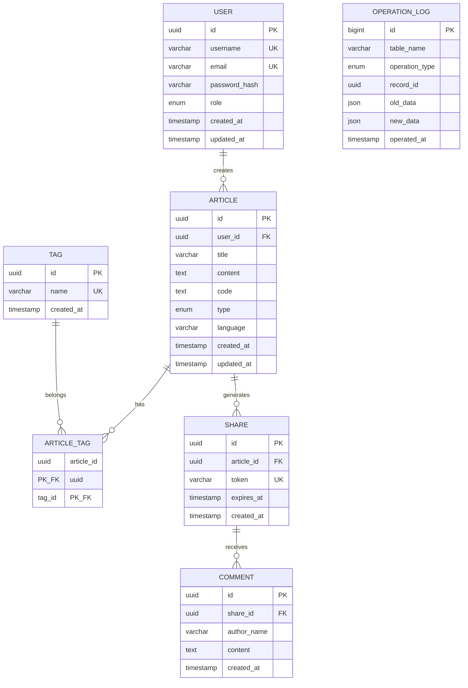

# QuillCode 代码笔记系统 - 数据库课程设计报告

---

## 目录

- 第一部分、开发前的设计和思考
  - 一、项目背景
  - 二、需求分析
  - 三、概念结构设计
  - 四、逻辑结构设计
  - 五、数据库实施
  - 六、系统总体设计
- 第二部分、开发编码与调试
  - 一、开发环境与技术
  - 二、源代码目录讲解
  - 三、示例代码讲解
  - 四、API接口说明
- 第三部分、系统演示和说明
  - 一、用户登录与注册
  - 二、笔记管理
  - 三、智能推荐
  - 四、模糊搜索
  - 五、分享与评论
  - 六、管理员功能
- 第四部分、总结与反思

---

# 第一部分、开发前的设计和思考

## 一、项目背景

### 1.1 项目概述

QuillCode 是一个面向程序员的在线代码笔记系统，旨在提供一个"随写、随存、随运行"的代码学习与管理环境。系统支持 Markdown 文档编写、多语言代码编辑与在线执行、标签分类管理、文章分享与评论等功能。

### 1.2 开发背景

随着编程学习的普及，程序员需要一个能够同时管理文档笔记和代码片段的工具。传统的笔记软件无法执行代码，而 IDE 又不适合做笔记管理。QuillCode 填补了这一空白，将 Markdown 文档与可执行代码完美结合。

### 1.3 项目目标

1. 提供 Markdown + 代码的统一管理平台
2. 支持 JavaScript、Python、Java 等多语言代码在线执行
3. 实现基于 Elasticsearch 的全文模糊搜索
4. 提供基于标签和 AI 的智能推荐功能
5. 支持文章分享与访客评论功能
6. 提供管理员统计与维护功能

---

## 二、需求分析

### 2.1 功能需求

#### 2.1.1 用户管理模块
- 用户注册：支持用户名、邮箱、密码注册
- 用户登录：JWT Token 认证机制
- 角色区分：普通用户与管理员

#### 2.1.2 文章管理模块
- 创建文章：支持标题、Markdown 内容、代码、类型、语言、标签
- 文章类型：算法题解(algorithm)、代码片段(snippet)、HTML页面(html)
- 编辑更新：支持实时保存和更新
- 删除文章：级联删除相关分享和标签关联

#### 2.1.3 标签管理模块
- 标签创建：支持自定义标签
- 标签关联：多对多关系，一篇文章可有多个标签
- 标签筛选：按标签查看文章列表

#### 2.1.4 搜索模块
- 全文搜索：基于 Elasticsearch 的模糊搜索
- 搜索范围：标题、内容、代码、标签
- 高亮显示：搜索结果关键词高亮

#### 2.1.5 推荐模块
- 标签推荐：基于共同标签的相似文章推荐
- AI 增强：集成 Ollama 本地大模型进行推荐理由生成

#### 2.1.6 分享模块
- 生成分享链接：带过期时间的唯一 Token
- 访客访问：无需登录即可查看分享内容
- 评论功能：访客可对分享内容进行评论

#### 2.1.7 管理员模块
- 全站统计：用户数、文章数、标签数等
- 用户管理：查看用户统计信息
- 操作日志：自动记录增删改操作
- 维护功能：清理过期分享

### 2.2 非功能需求

| 需求类型 | 描述 |
|---------|------|
| 性能 | 搜索响应时间 < 500ms |
| 安全 | 密码 bcrypt 加密，JWT 认证 |
| 可用性 | 支持 Docker 容器化部署 |
| 可扩展性 | 模块化设计，易于扩展 |

### 2.3 数据流图

```
┌─────────┐     注册/登录      ┌─────────────┐
│  用户   │ ───────────────→  │  认证模块   │
└─────────┘                    └─────────────┘
     │                               │
     │ CRUD操作                      │ JWT Token
     ↓                               ↓
┌─────────────┐              ┌─────────────┐
│  文章模块   │ ←──────────→ │  数据库     │
└─────────────┘              │  (MySQL)    │
     │                       └─────────────┘
     │ 索引/搜索                     ↑
     ↓                               │
┌─────────────┐              ┌─────────────┐
│ Elasticsearch│             │  触发器     │
│  搜索引擎   │              │  日志记录   │
└─────────────┘              └─────────────┘
```

---

## 三、概念结构设计

### 3.1 实体识别

通过需求分析，识别出以下核心实体：

| 实体名称 | 说明 |
|---------|------|
| User (用户) | 系统用户，包含普通用户和管理员 |
| Article (文章) | 代码笔记文章 |
| Tag (标签) | 文章分类标签 |
| Share (分享) | 文章分享链接 |
| Comment (评论) | 分享页面的访客评论 |
| OperationLog (操作日志) | 系统操作记录 |

### 3.2 实体属性

#### User 实体
- id (PK): UUID，用户唯一标识
- username: 用户名，唯一
- email: 邮箱，唯一
- password_hash: 密码哈希值
- role: 角色 (user/admin)
- created_at: 创建时间
- updated_at: 更新时间

#### Article 实体
- id (PK): UUID，文章唯一标识
- user_id (FK): 所属用户
- title: 标题
- content: Markdown 内容
- code: 代码内容
- type: 类型 (algorithm/snippet/html)
- language: 编程语言
- created_at: 创建时间
- updated_at: 更新时间

#### Tag 实体
- id (PK): UUID，标签唯一标识
- name: 标签名称，唯一
- created_at: 创建时间

#### Share 实体
- id (PK): UUID，分享唯一标识
- article_id (FK): 关联文章
- token: 分享令牌，唯一
- expires_at: 过期时间
- created_at: 创建时间

#### Comment 实体
- id (PK): UUID，评论唯一标识
- share_id (FK): 关联分享
- author_name: 评论者名称
- content: 评论内容
- created_at: 创建时间

### 3.3 实体间关系

| 关系 | 类型 | 说明 |
|-----|------|------|
| User - Article | 1:N | 一个用户可以有多篇文章 |
| Article - Tag | M:N | 文章和标签多对多关系 |
| Article - Share | 1:N | 一篇文章可以有多个分享链接 |
| Share - Comment | 1:N | 一个分享可以有多条评论 |

### 3.4 E-R 图

```
┌─────────────────┐
│      User       │
├─────────────────┤
│ PK id           │
│    username     │
│    email        │
│    password_hash│
│    role         │
│    created_at   │
│    updated_at   │
└────────┬────────┘
         │
         │ 1:N (拥有)
         ↓
┌─────────────────┐         ┌─────────────────┐
│    Article      │         │      Tag        │
├─────────────────┤         ├─────────────────┤
│ PK id           │         │ PK id           │
│ FK user_id      │←───M:N──│    name         │
│    title        │    ↓    │    created_at   │
│    content      │ ┌──────┐└─────────────────┘
│    code         │ │Article│
│    type         │ │ Tag   │
│    language     │ ├──────┤
│    created_at   │ │PK,FK  │
│    updated_at   │ │article│
└────────┬────────┘ │_id    │
         │          │PK,FK  │
         │ 1:N      │tag_id │
         ↓          └──────┘
┌─────────────────┐
│     Share       │
├─────────────────┤
│ PK id           │
│ FK article_id   │
│    token        │
│    expires_at   │
│    created_at   │
└────────┬────────┘
         │
         │ 1:N (包含)
         ↓
┌─────────────────┐
│    Comment      │
├─────────────────┤
│ PK id           │
│ FK share_id     │
│    author_name  │
│    content      │
│    created_at   │
└─────────────────┘


┌─────────────────┐
│ OperationLog    │
├─────────────────┤
│ PK id (AUTO)    │
│    table_name   │
│    operation    │
│    record_id    │
│    old_data     │
│    new_data     │
│    operated_at  │
└─────────────────┘
```

### 3.5 完整 E-R 图 (Mermaid 格式)



---

## 四、逻辑结构设计

### 4.1 关系模式

根据 E-R 图转换为以下关系模式：

#### 4.1.1 用户表 (users)
```
users (
    id: CHAR(36) PRIMARY KEY,
    username: VARCHAR(50) NOT NULL UNIQUE,
    email: VARCHAR(100) NOT NULL UNIQUE,
    password_hash: VARCHAR(255) NOT NULL,
    role: ENUM('user', 'admin') DEFAULT 'user',
    created_at: TIMESTAMP DEFAULT CURRENT_TIMESTAMP,
    updated_at: TIMESTAMP DEFAULT CURRENT_TIMESTAMP ON UPDATE CURRENT_TIMESTAMP
)
```

#### 4.1.2 文章表 (articles)
```
articles (
    id: CHAR(36) PRIMARY KEY,
    user_id: CHAR(36) NOT NULL REFERENCES users(id) ON DELETE CASCADE,
    title: VARCHAR(255) NOT NULL,
    content: TEXT,
    code: TEXT,
    type: ENUM('algorithm', 'snippet', 'html') DEFAULT 'snippet',
    language: VARCHAR(50) DEFAULT 'javascript',
    created_at: TIMESTAMP DEFAULT CURRENT_TIMESTAMP,
    updated_at: TIMESTAMP DEFAULT CURRENT_TIMESTAMP ON UPDATE CURRENT_TIMESTAMP
)
```

#### 4.1.3 标签表 (tags)
```
tags (
    id: CHAR(36) PRIMARY KEY,
    name: VARCHAR(50) NOT NULL UNIQUE,
    created_at: TIMESTAMP DEFAULT CURRENT_TIMESTAMP
)
```

#### 4.1.4 文章-标签关联表 (article_tags)
```
article_tags (
    article_id: CHAR(36) REFERENCES articles(id) ON DELETE CASCADE,
    tag_id: CHAR(36) REFERENCES tags(id) ON DELETE CASCADE,
    PRIMARY KEY (article_id, tag_id)
)
```

#### 4.1.5 分享表 (shares)
```
shares (
    id: CHAR(36) PRIMARY KEY,
    article_id: CHAR(36) NOT NULL REFERENCES articles(id) ON DELETE CASCADE,
    token: VARCHAR(64) NOT NULL UNIQUE,
    expires_at: TIMESTAMP NOT NULL,
    created_at: TIMESTAMP DEFAULT CURRENT_TIMESTAMP
)
```

#### 4.1.6 评论表 (comments)
```
comments (
    id: CHAR(36) PRIMARY KEY,
    share_id: CHAR(36) NOT NULL REFERENCES shares(id) ON DELETE CASCADE,
    author_name: VARCHAR(50) NOT NULL,
    content: TEXT NOT NULL,
    created_at: TIMESTAMP DEFAULT CURRENT_TIMESTAMP
)
```

#### 4.1.7 操作日志表 (operation_logs)
```
operation_logs (
    id: BIGINT AUTO_INCREMENT PRIMARY KEY,
    table_name: VARCHAR(50) NOT NULL,
    operation_type: ENUM('INSERT', 'UPDATE', 'DELETE') NOT NULL,
    record_id: CHAR(36) NOT NULL,
    old_data: JSON,
    new_data: JSON,
    operated_at: TIMESTAMP DEFAULT CURRENT_TIMESTAMP
)
```

### 4.2 关系模式规范化分析

#### 4.2.1 第一范式 (1NF) 验证
所有表的属性都是原子的，不可再分：
- ✅ users 表：所有字段都是单值属性
- ✅ articles 表：content 和 code 虽然是 TEXT 类型，但作为整体存储
- ✅ tags 表：name 是单值属性
- ✅ 所有表满足 1NF

#### 4.2.2 第二范式 (2NF) 验证
消除非主属性对候选键的部分函数依赖：
- ✅ article_tags 表：联合主键 (article_id, tag_id)，无其他非主属性
- ✅ 其他表都是单一主键，不存在部分依赖
- ✅ 所有表满足 2NF

#### 4.2.3 第三范式 (3NF) 验证
消除非主属性对候选键的传递函数依赖：
- ✅ articles 表：user_id → username 的依赖通过外键关联到 users 表
- ✅ shares 表：article_id → title 的依赖通过外键关联到 articles 表
- ✅ 所有表满足 3NF

### 4.3 索引设计

| 表名 | 索引名 | 索引字段 | 索引类型 | 用途 |
|-----|--------|---------|---------|------|
| users | uk_username | username | UNIQUE | 用户名唯一约束 |
| users | uk_email | email | UNIQUE | 邮箱唯一约束 |
| articles | idx_user_id | user_id | INDEX | 按用户查询文章 |
| articles | idx_type | type | INDEX | 按类型筛选 |
| articles | idx_language | language | INDEX | 按语言筛选 |
| articles | idx_created_at | created_at | INDEX | 按时间排序 |
| article_tags | idx_tag_id | tag_id | INDEX | 按标签查询文章 |
| shares | uk_token | token | UNIQUE | 分享令牌唯一 |
| shares | idx_article_id | article_id | INDEX | 按文章查询分享 |
| shares | idx_expires_at | expires_at | INDEX | 过期时间查询 |
| comments | idx_share_id | share_id | INDEX | 按分享查询评论 |
| operation_logs | idx_table_name | table_name | INDEX | 按表名查询日志 |
| operation_logs | idx_operated_at | operated_at | INDEX | 按时间查询日志 |

---

## 五、数据库实施

### 5.1 数据库创建

```sql
-- 创建数据库
CREATE DATABASE IF NOT EXISTS `code_notebook` 
  CHARACTER SET utf8mb4 
  COLLATE utf8mb4_unicode_ci;

USE `code_notebook`;
```

### 5.2 表创建语句

#### 5.2.1 用户表
```sql
CREATE TABLE IF NOT EXISTS `users` (
  `id` CHAR(36) NOT NULL COMMENT '用户UUID',
  `username` VARCHAR(50) NOT NULL COMMENT '用户名',
  `email` VARCHAR(100) NOT NULL COMMENT '邮箱',
  `password_hash` VARCHAR(255) NOT NULL COMMENT '密码哈希',
  `role` ENUM('user', 'admin') DEFAULT 'user' COMMENT '用户角色',
  `created_at` TIMESTAMP DEFAULT CURRENT_TIMESTAMP COMMENT '创建时间',
  `updated_at` TIMESTAMP DEFAULT CURRENT_TIMESTAMP ON UPDATE CURRENT_TIMESTAMP COMMENT '更新时间',
  PRIMARY KEY (`id`),
  UNIQUE KEY `uk_username` (`username`),
  UNIQUE KEY `uk_email` (`email`)
) ENGINE=InnoDB DEFAULT CHARSET=utf8mb4 COLLATE=utf8mb4_unicode_ci COMMENT='用户表';
```

#### 5.2.2 文章表
```sql
CREATE TABLE IF NOT EXISTS `articles` (
  `id` CHAR(36) NOT NULL COMMENT '文章UUID',
  `user_id` CHAR(36) NOT NULL COMMENT '用户ID',
  `title` VARCHAR(255) NOT NULL COMMENT '标题',
  `content` TEXT COMMENT 'Markdown内容',
  `code` TEXT COMMENT '代码内容',
  `type` ENUM('algorithm', 'snippet', 'html') DEFAULT 'snippet' COMMENT '文章类型',
  `language` VARCHAR(50) DEFAULT 'javascript' COMMENT '编程语言',
  `created_at` TIMESTAMP DEFAULT CURRENT_TIMESTAMP COMMENT '创建时间',
  `updated_at` TIMESTAMP DEFAULT CURRENT_TIMESTAMP ON UPDATE CURRENT_TIMESTAMP COMMENT '更新时间',
  PRIMARY KEY (`id`),
  KEY `idx_user_id` (`user_id`),
  KEY `idx_type` (`type`),
  KEY `idx_language` (`language`),
  KEY `idx_created_at` (`created_at`),
  CONSTRAINT `fk_articles_user` FOREIGN KEY (`user_id`) REFERENCES `users` (`id`) ON DELETE CASCADE
) ENGINE=InnoDB DEFAULT CHARSET=utf8mb4 COLLATE=utf8mb4_unicode_ci COMMENT='文章表';
```

#### 5.2.3 标签表
```sql
CREATE TABLE IF NOT EXISTS `tags` (
  `id` CHAR(36) NOT NULL COMMENT '标签UUID',
  `name` VARCHAR(50) NOT NULL COMMENT '标签名称',
  `created_at` TIMESTAMP DEFAULT CURRENT_TIMESTAMP COMMENT '创建时间',
  PRIMARY KEY (`id`),
  UNIQUE KEY `uk_name` (`name`)
) ENGINE=InnoDB DEFAULT CHARSET=utf8mb4 COLLATE=utf8mb4_unicode_ci COMMENT='标签表';
```

#### 5.2.4 文章-标签关联表
```sql
CREATE TABLE IF NOT EXISTS `article_tags` (
  `article_id` CHAR(36) NOT NULL COMMENT '文章ID',
  `tag_id` CHAR(36) NOT NULL COMMENT '标签ID',
  PRIMARY KEY (`article_id`, `tag_id`),
  KEY `idx_tag_id` (`tag_id`),
  CONSTRAINT `fk_article_tags_article` FOREIGN KEY (`article_id`) REFERENCES `articles` (`id`) ON DELETE CASCADE,
  CONSTRAINT `fk_article_tags_tag` FOREIGN KEY (`tag_id`) REFERENCES `tags` (`id`) ON DELETE CASCADE
) ENGINE=InnoDB DEFAULT CHARSET=utf8mb4 COLLATE=utf8mb4_unicode_ci COMMENT='文章标签关联表';
```

#### 5.2.5 分享表
```sql
CREATE TABLE IF NOT EXISTS `shares` (
  `id` CHAR(36) NOT NULL COMMENT '分享UUID',
  `article_id` CHAR(36) NOT NULL COMMENT '文章ID',
  `token` VARCHAR(64) NOT NULL COMMENT '分享令牌',
  `expires_at` TIMESTAMP NOT NULL COMMENT '过期时间',
  `created_at` TIMESTAMP DEFAULT CURRENT_TIMESTAMP COMMENT '创建时间',
  PRIMARY KEY (`id`),
  UNIQUE KEY `uk_token` (`token`),
  KEY `idx_article_id` (`article_id`),
  KEY `idx_expires_at` (`expires_at`),
  CONSTRAINT `fk_shares_article` FOREIGN KEY (`article_id`) REFERENCES `articles` (`id`) ON DELETE CASCADE
) ENGINE=InnoDB DEFAULT CHARSET=utf8mb4 COLLATE=utf8mb4_unicode_ci COMMENT='分享表';
```

#### 5.2.6 评论表
```sql
CREATE TABLE IF NOT EXISTS `comments` (
  `id` CHAR(36) NOT NULL COMMENT '评论UUID',
  `share_id` CHAR(36) NOT NULL COMMENT '分享ID',
  `author_name` VARCHAR(50) NOT NULL COMMENT '评论者名称',
  `content` TEXT NOT NULL COMMENT '评论内容',
  `created_at` TIMESTAMP DEFAULT CURRENT_TIMESTAMP COMMENT '创建时间',
  PRIMARY KEY (`id`),
  KEY `idx_share_id` (`share_id`),
  KEY `idx_created_at` (`created_at`),
  CONSTRAINT `fk_comments_share` FOREIGN KEY (`share_id`) REFERENCES `shares` (`id`) ON DELETE CASCADE
) ENGINE=InnoDB DEFAULT CHARSET=utf8mb4 COLLATE=utf8mb4_unicode_ci COMMENT='评论表';
```

#### 5.2.7 操作日志表
```sql
CREATE TABLE IF NOT EXISTS `operation_logs` (
  `id` BIGINT AUTO_INCREMENT NOT NULL COMMENT '日志ID',
  `table_name` VARCHAR(50) NOT NULL COMMENT '操作的表名',
  `operation_type` ENUM('INSERT', 'UPDATE', 'DELETE') NOT NULL COMMENT '操作类型',
  `record_id` CHAR(36) NOT NULL COMMENT '记录ID',
  `old_data` JSON COMMENT '旧数据',
  `new_data` JSON COMMENT '新数据',
  `operated_at` TIMESTAMP DEFAULT CURRENT_TIMESTAMP COMMENT '操作时间',
  PRIMARY KEY (`id`),
  KEY `idx_table_name` (`table_name`),
  KEY `idx_operation_type` (`operation_type`),
  KEY `idx_operated_at` (`operated_at`)
) ENGINE=InnoDB DEFAULT CHARSET=utf8mb4 COLLATE=utf8mb4_unicode_ci COMMENT='操作日志表';
```

### 5.3 视图设计

#### 5.3.1 文章详情视图 (v_article_details)
```sql
CREATE VIEW `v_article_details` AS
SELECT 
  a.id AS article_id,
  a.title,
  a.content,
  a.code,
  a.type,
  a.language,
  a.created_at,
  a.updated_at,
  u.id AS user_id,
  u.username AS author_name,
  u.email AS author_email,
  (SELECT COUNT(*) FROM shares s WHERE s.article_id = a.id) AS share_count,
  (SELECT GROUP_CONCAT(t.name SEPARATOR ', ') 
   FROM article_tags at 
   JOIN tags t ON at.tag_id = t.id 
   WHERE at.article_id = a.id) AS tag_names
FROM articles a
JOIN users u ON a.user_id = u.id;
```

**用途**：管理员查看文章详情列表，包含作者信息、分享数量和标签名称。

#### 5.3.2 用户统计视图 (v_user_statistics)
```sql
CREATE VIEW `v_user_statistics` AS
SELECT 
  u.id AS user_id,
  u.username,
  u.email,
  u.created_at AS registered_at,
  COUNT(DISTINCT a.id) AS article_count,
  COUNT(DISTINCT CASE WHEN a.type = 'algorithm' THEN a.id END) AS algorithm_count,
  COUNT(DISTINCT CASE WHEN a.type = 'snippet' THEN a.id END) AS snippet_count,
  COUNT(DISTINCT CASE WHEN a.type = 'html' THEN a.id END) AS html_count,
  COUNT(DISTINCT s.id) AS total_shares
FROM users u
LEFT JOIN articles a ON u.id = a.user_id
LEFT JOIN shares s ON a.id = s.article_id
GROUP BY u.id, u.username, u.email, u.created_at;
```

**用途**：管理员查看每个用户的文章统计，包括各类型文章数量和分享数量。

#### 5.3.3 热门标签视图 (v_popular_tags)
```sql
CREATE VIEW `v_popular_tags` AS
SELECT 
  t.id AS tag_id,
  t.name AS tag_name,
  COUNT(at.article_id) AS usage_count,
  t.created_at
FROM tags t
LEFT JOIN article_tags at ON t.id = at.tag_id
GROUP BY t.id, t.name, t.created_at
ORDER BY usage_count DESC;
```

**用途**：展示热门标签排行，按使用次数降序排列。

### 5.4 存储过程设计

#### 5.4.1 获取用户文章列表 (sp_get_user_articles)
```sql
DELIMITER //
CREATE PROCEDURE `sp_get_user_articles`(
  IN p_user_id CHAR(36),
  IN p_page INT,
  IN p_page_size INT,
  IN p_type VARCHAR(20)
)
BEGIN
  DECLARE v_offset INT;
  SET v_offset = (p_page - 1) * p_page_size;
  
  SELECT 
    a.id,
    a.title,
    a.type,
    a.language,
    a.created_at,
    a.updated_at,
    (SELECT GROUP_CONCAT(t.name) FROM article_tags at 
     JOIN tags t ON at.tag_id = t.id 
     WHERE at.article_id = a.id) AS tags
  FROM articles a
  WHERE a.user_id = p_user_id
    AND (p_type IS NULL OR p_type = '' OR a.type = p_type)
  ORDER BY a.updated_at DESC
  LIMIT v_offset, p_page_size;
END //
DELIMITER ;
```

**用途**：分页获取指定用户的文章列表，支持按类型筛选。

#### 5.4.2 创建文章并关联标签 (sp_create_article_with_tags)
```sql
DELIMITER //
CREATE PROCEDURE `sp_create_article_with_tags`(
  IN p_article_id CHAR(36),
  IN p_user_id CHAR(36),
  IN p_title VARCHAR(255),
  IN p_content TEXT,
  IN p_code TEXT,
  IN p_type VARCHAR(20),
  IN p_language VARCHAR(50),
  IN p_tag_ids TEXT
)
BEGIN
  DECLARE v_tag_id CHAR(36);
  DECLARE v_pos INT;
  DECLARE v_remaining TEXT;
  
  DECLARE EXIT HANDLER FOR SQLEXCEPTION
  BEGIN
    ROLLBACK;
    RESIGNAL;
  END;
  
  START TRANSACTION;
  
  -- 插入文章
  INSERT INTO articles (id, user_id, title, content, code, type, language)
  VALUES (p_article_id, p_user_id, p_title, p_content, p_code, p_type, p_language);
  
  -- 解析并插入标签关联
  IF p_tag_ids IS NOT NULL AND p_tag_ids != '' THEN
    SET v_remaining = p_tag_ids;
    
    WHILE LENGTH(v_remaining) > 0 DO
      SET v_pos = LOCATE(',', v_remaining);
      
      IF v_pos > 0 